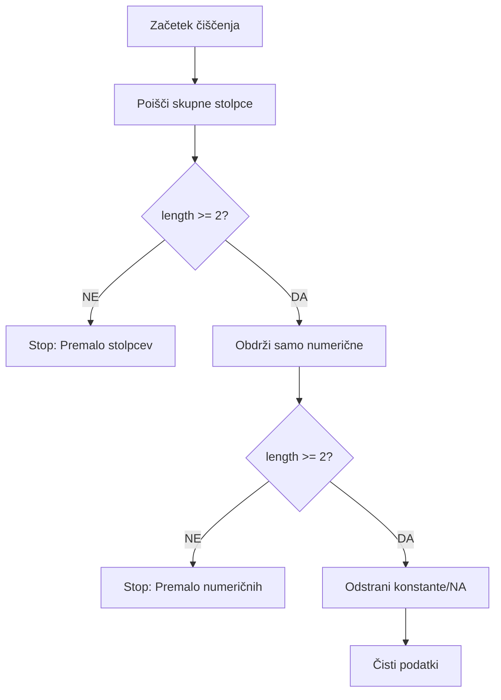
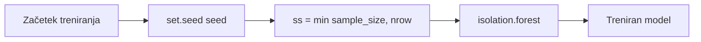
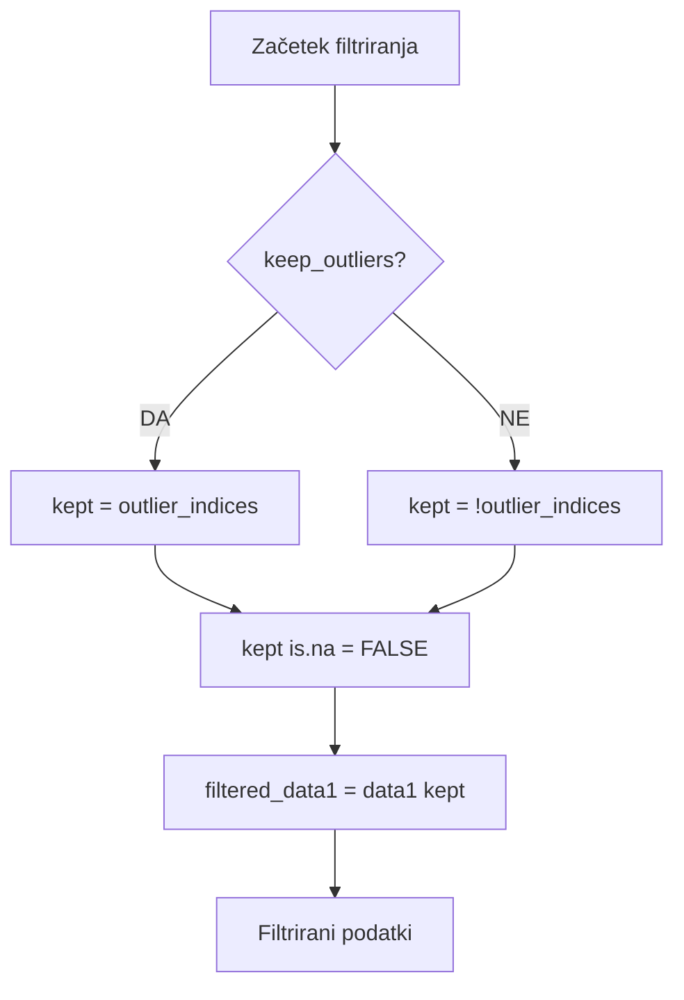

# ISOLATION FOREST - DETAJLNA IMPLEMENTACIJA

## Kompletna implementacija Isolation Forest filtriranja

```mermaid
flowchart TD
    START([compute_isolation_forest]) --> PARAMS[Prejmi parametre]
    PARAMS --> PARAMS1[data1: DataFrame]
    PARAMS --> PARAMS2[data2: DataFrame]
    PARAMS --> PARAMS3[selected_columns: Character]
    PARAMS --> PARAMS4[contamination: 0.10]
    PARAMS --> PARAMS5[keep_outliers: FALSE]
    PARAMS --> PARAMS6[ntrees: 200]
    PARAMS --> PARAMS7[sample_size: 256]
    PARAMS --> PARAMS8[score_type: 'score']
    PARAMS --> PARAMS9[seed: 42]
    
    PARAMS1 --> VALIDATE[Preveri vhodne podatke]
    PARAMS2 --> VALIDATE
    PARAMS3 --> VALIDATE
    PARAMS4 --> VALIDATE
    PARAMS5 --> VALIDATE
    PARAMS6 --> VALIDATE
    PARAMS7 --> VALIDATE
    PARAMS8 --> VALIDATE
    PARAMS9 --> VALIDATE
    
    VALIDATE --> VALIDATE1[stopifnot is.data.frame data1, data2]
    VALIDATE1 --> VALIDATE2[requireNamespace isotree]
    VALIDATE2 --> VALIDATE3[Preveri selected_columns]
    VALIDATE3 --> VALIDATE4[Preveri contamination 0-1]
    VALIDATE4 --> VALIDATE5[Preveri ostale parametre]
    
    VALIDATE5 --> CLEAN[1) Podnabor in čiščenje]
    CLEAN --> CLEAN1[common_cols = intersect selected_columns, colnames data1, data2]
    CLEAN1 --> CLEAN2{length common_cols >= 2?}
    CLEAN2 -->|NE| ERROR1[Stop: Premalo skupnih numeričnih spremenljivk]
    CLEAN2 -->|DA| CLEAN3[X1 = data1 common_cols]
    CLEAN3 --> CLEAN4[X2 = data2 common_cols]
    
    CLEAN4 --> CLEAN5[num_cols = names X1 vapply is.numeric]
    CLEAN5 --> CLEAN6[X1 = X1 num_cols]
    CLEAN6 --> CLEAN7[X2 = X2 num_cols]
    CLEAN7 --> CLEAN8{length X1 >= 2?}
    CLEAN8 -->|NE| ERROR2[Stop: Po filtriranju numeričnih je ostalo premalo stolpcev]
    CLEAN8 -->|DA| CLEAN9[nzv = vapply X2 length unique na.omit > 1]
    
    CLEAN9 --> CLEAN10[X1 = X1 nzv]
    CLEAN10 --> CLEAN11[X2 = X2 nzv]
    CLEAN11 --> CLEAN12[cc1 = complete.cases X1]
    CLEAN12 --> CLEAN13[cc2 = complete.cases X2]
    CLEAN13 --> CLEAN14[X1c = X1 cc1]
    CLEAN14 --> CLEAN15[X2c = X2 cc2]
    
    CLEAN15 --> TRAIN[2) Treniranje na referenci]
    TRAIN --> TRAIN1[set.seed seed]
    TRAIN1 --> TRAIN2[ss = min sample_size, nrow X2c]
    TRAIN2 --> TRAIN3[iso_model = isotree::isolation.forest X2c, ntrees, sample_size]
    
    TRAIN3 --> THRESH[3) Prag iz REFERENČNIH score-ov]
    THRESH --> THRESH1[scores_ref = predict iso_model, X2c, type = score_type]
    THRESH1 --> THRESH2[scores_ref = as.numeric scores_ref]
    THRESH2 --> THRESH3[threshold = quantile scores_ref, 1 - contamination]
    THRESH3 --> THRESH4[threshold = as.numeric threshold]
    
    THRESH4 --> PRED[4) Ocene za data1 + označevanje outlierjev]
    PRED --> PRED1[scores1_c = predict iso_model, X1c, type = score_type]
    PRED1 --> PRED2[scores1_c = as.numeric scores1_c]
    PRED2 --> PRED3[scores1 = rep NA_real_, nrow X1]
    PRED3 --> PRED4[scores1 cc1 = scores1_c]
    PRED4 --> PRED5[outlier_indices = !is.na scores1 & scores1 >= threshold]
    
    PRED5 --> FILTER[5) Izvoz filtriranih podatkov]
    FILTER --> FILTER1{keep_outliers?}
    FILTER1 -->|DA| FILTER2[kept = outlier_indices]
    FILTER1 -->|NE| FILTER3[kept = !outlier_indices]
    
    FILTER2 --> FILTER4[kept is.na = FALSE]
    FILTER3 --> FILTER4
    FILTER4 --> FILTER5[filtered_data1 = data1 kept]
    
    FILTER5 --> RETURN[Vrne rezultate]
    RETURN --> RETURN1[model = iso_model]
    RETURN --> RETURN2[columns_used = colnames X1c]
    RETURN --> RETURN3[threshold = threshold]
    RETURN --> RETURN4[contamination = contamination]
    RETURN --> RETURN5[scores = scores1]
    RETURN --> RETURN6[outlier_indices = outlier_indices]
    RETURN --> RETURN7[kept_mask = kept]
    RETURN --> RETURN8[filtered_data1 = filtered_data1]
    RETURN --> RETURN9[ref_scores_sum = summary scores_ref]
    
    RETURN1 --> END([Konec])
    RETURN2 --> END
    RETURN3 --> END
    RETURN4 --> END
    RETURN5 --> END
    RETURN6 --> END
    RETURN7 --> END
    RETURN8 --> END
    RETURN9 --> END
    
    ERROR1 --> END
    ERROR2 --> END
    
    %% Stili
    classDef startEnd fill:#e1f5fe,stroke:#01579b,stroke-width:3px
    classDef process fill:#f3e5f5,stroke:#4a148c,stroke-width:2px
    classDef decision fill:#fff3e0,stroke:#e65100,stroke-width:2px
    classDef data fill:#e8f5e8,stroke:#2e7d32,stroke-width:2px
    classDef error fill:#ffebee,stroke:#c62828,stroke-width:2px
    classDef result fill:#f3e5f5,stroke:#7b1fa2,stroke-width:2px
    
    class START,END startEnd
    class PARAMS,PARAMS1,PARAMS2,PARAMS3,PARAMS4,PARAMS5,PARAMS6,PARAMS7,PARAMS8,PARAMS9,VALIDATE,VALIDATE1,VALIDATE2,VALIDATE3,VALIDATE4,VALIDATE5,CLEAN,CLEAN1,CLEAN3,CLEAN4,CLEAN5,CLEAN6,CLEAN7,CLEAN9,CLEAN10,CLEAN11,CLEAN12,CLEAN13,CLEAN14,CLEAN15,TRAIN,TRAIN1,TRAIN2,TRAIN3,THRESH,THRESH1,THRESH2,THRESH3,THRESH4,PRED,PRED1,PRED2,PRED3,PRED4,PRED5,FILTER,FILTER2,FILTER3,FILTER4,FILTER5,RETURN,RETURN1,RETURN2,RETURN3,RETURN4,RETURN5,RETURN6,RETURN7,RETURN8,RETURN9 process
    class CLEAN2,CLEAN8,FILTER1 decision
    class CLEAN1,CLEAN3,CLEAN4,CLEAN5,CLEAN6,CLEAN7,CLEAN9,CLEAN10,CLEAN11,CLEAN12,CLEAN13,CLEAN14,CLEAN15,TRAIN3,THRESH1,PRED1,FILTER5 data
    class ERROR1,ERROR2 error
    class RETURN1,RETURN2,RETURN3,RETURN4,RETURN5,RETURN6,RETURN7,RETURN8,RETURN9 result
```

## Podroben opis korakov

### 1. PREVERJANJE VHODNIH PODATKOV


### 2. PODNABOR IN ČIŠČENJE


### 3. TRENIRANJE MODELA


### 4. IZRAČUN PRAGA


### 5. PREDIKCIJA IN OZNAČEVANJE


### 6. FILTRIRANJE PODATKOV


## Ključne funkcije v kodi

### Glavna funkcija
```r
compute_isolation_forest <- function(
  data1, data2, selected_columns,
  contamination = 0.10,
  keep_outliers = FALSE,
  ntrees = 200,
  sample_size = 256,
  score_type = "score",
  seed = 42
) {
  # 1) Preveri vhodne podatke
  stopifnot(is.data.frame(data1), is.data.frame(data2))
  
  if (!requireNamespace("isotree", quietly = TRUE)) {
    stop("Package 'isotree' is required for isolation forest outlier detection.")
  }
  
  # 2) Podnabor in čiščenje
  common_cols <- intersect(selected_columns, intersect(colnames(data1), colnames(data2)))
  if (length(common_cols) < 2L) stop("Premalo skupnih numeričnih spremenljivk.")
  
  X1 <- data1[, common_cols, drop = FALSE]
  X2 <- data2[, common_cols, drop = FALSE]
  
  # obdrži samo numerične stolpce
  num_cols <- names(X1)[vapply(X1, is.numeric, logical(1))]
  X1 <- X1[, num_cols, drop = FALSE]
  X2 <- X2[, num_cols, drop = FALSE]
  if (ncol(X1) < 2L) stop("Po filtriranju numeričnih je ostalo premalo stolpcev.")
  
  # odstrani konstante / NA vrstice
  nzv <- vapply(X2, function(v) length(unique(na.omit(v))) > 1L, logical(1))
  X1 <- X1[, nzv, drop = FALSE]
  X2 <- X2[, nzv, drop = FALSE]
  cc1 <- complete.cases(X1); cc2 <- complete.cases(X2)
  X1c <- X1[cc1, , drop = FALSE]
  X2c <- X2[cc2, , drop = FALSE]
  
  # 3) Treniranje na referenci
  set.seed(seed)
  ss <- min(sample_size, nrow(X2c))
  iso_model <- isotree::isolation.forest(
    X2c,
    ntrees = ntrees,
    sample_size = ss
  )
  
  # 4) Prag iz REFERENČNIH score-ov
  scores_ref <- as.numeric(predict(iso_model, X2c, type = score_type))
  threshold <- as.numeric(stats::quantile(scores_ref, 1 - contamination, na.rm = TRUE))
  
  # 5) Ocene za data1 + označevanje outlierjev
  scores1_c <- as.numeric(predict(iso_model, X1c, type = score_type))
  # mapiraj nazaj na originalni red
  scores1 <- rep(NA_real_, nrow(X1)); scores1[cc1] <- scores1_c
  outlier_indices <- !is.na(scores1) & (scores1 >= threshold)
  
  # 6) Izvoz filtriranih podatkov (po želji)
  kept <- if (keep_outliers) outlier_indices else !outlier_indices
  kept[is.na(kept)] <- FALSE
  
  return(list(
    model = iso_model,
    columns_used = colnames(X1c),
    threshold = threshold,
    contamination = contamination,
    scores = scores1,                  # dolžina = nrow(data1)
    outlier_indices = outlier_indices,  # logični vektor za data1
    kept_mask = kept,                   # kaj obdržiš glede na keep_outliers
    filtered_data1 = data1[kept, , drop = FALSE],
    ref_scores_sum = summary(scores_ref)  # za QC
  ))
}
```

### Varnostno preverjanje
```r
# Preveri vhodne podatke
stopifnot(is.data.frame(data1), is.data.frame(data2))

# Preveri paket
if (!requireNamespace("isotree", quietly = TRUE)) {
  stop("Package 'isotree' is required for isolation forest outlier detection.")
}

# Preveri stolpce
common_cols <- intersect(selected_columns, intersect(colnames(data1), colnames(data2)))
if (length(common_cols) < 2L) stop("Premalo skupnih numeričnih spremenljivk.")

# Preveri numeričnost
num_cols <- names(X1)[vapply(X1, is.numeric, logical(1))]
if (ncol(X1) < 2L) stop("Po filtriranju numeričnih je ostalo premalo stolpcev.")
```

### Treniranje modela
```r
# Nastavi seed za reprodukcijo
set.seed(seed)

# Prilagodi sample_size
ss <- min(sample_size, nrow(X2c))

# Treniraj model
iso_model <- isotree::isolation.forest(
  X2c,
  ntrees = ntrees,
  sample_size = ss
)
```

### Izračun praga
```r
# Izračunaj score za referenčne podatke
scores_ref <- as.numeric(predict(iso_model, X2c, type = score_type))

# Nastavi prag iz referenčnih score-ov
threshold <- as.numeric(stats::quantile(scores_ref, 1 - contamination, na.rm = TRUE))
```

### Predikcija in filtriranje
```r
# Izračunaj score za data1
scores1_c <- as.numeric(predict(iso_model, X1c, type = score_type))

# Mapiraj nazaj na originalni red
scores1 <- rep(NA_real_, nrow(X1)); scores1[cc1] <- scores1_c

# Označi outlierje
outlier_indices <- !is.na(scores1) & (scores1 >= threshold)

# Filtriranje glede na keep_outliers
kept <- if (keep_outliers) outlier_indices else !outlier_indices
kept[is.na(kept)] <- FALSE

# Filtrirani podatki
filtered_data1 <- data1[kept, , drop = FALSE]
```

## Prednosti implementacije

1. **Boljši parametri**: Več kontrolnih parametrov za fine-tuning
2. **Robustno filtriranje**: Boljše obravnavanje numeričnih stolpcev
3. **Pravilno mapiranje**: Score-i so pravilno mapirani nazaj na originalne podatke
4. **Kakovostni nadzor**: Vključuje summary statistike za preverjanje
5. **Fleksibilnost**: Možnost obdržati ali odstraniti outlierje
6. **Reprodukcija**: Nastavljiv seed za reprodukcijo rezultatov

## Uporaba flowchart-a

- **Razumevanje**: Sledite korakom za razumevanje algoritma
- **Debugiranje**: Preverite, kje se pojavi napaka
- **Optimizacija**: Identificirajte možne izboljšave
- **Dokumentacija**: Uporabite za razlago uporabnikom
- **Testiranje**: Preverite vse možne poti skozi kodo
