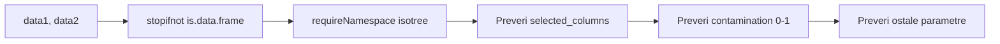
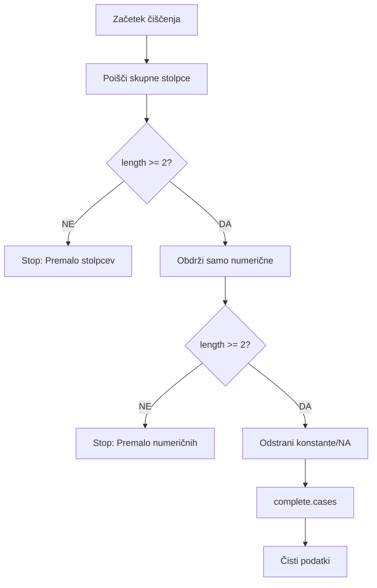
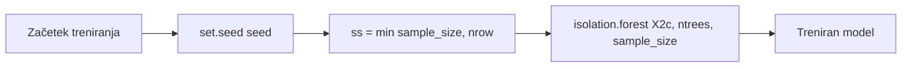
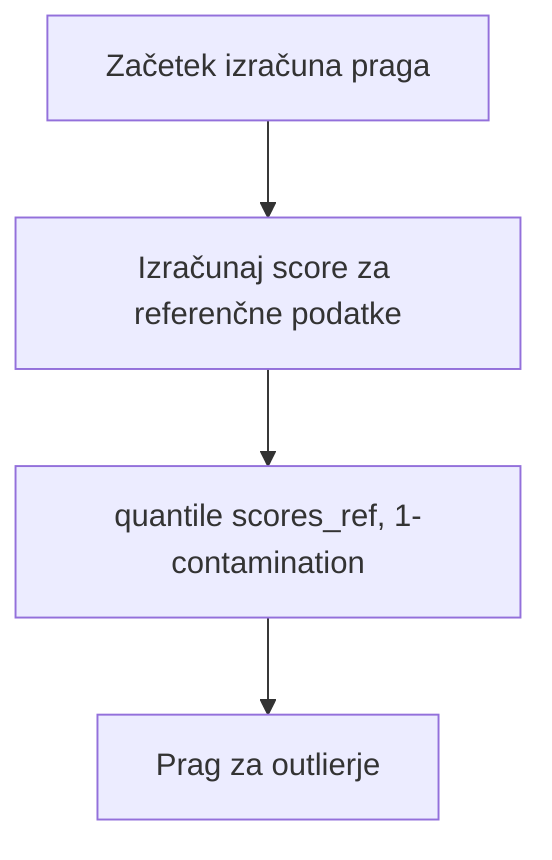
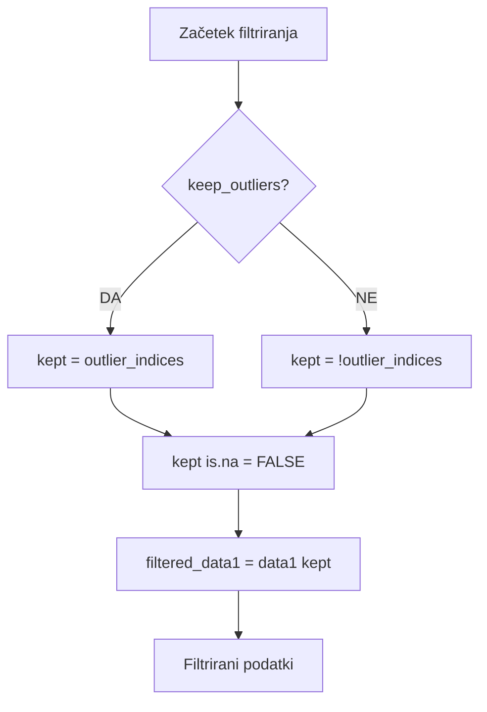

# ISOLATION FOREST - FLOWCHART IMPLEMENTACIJE

## Glavni proces Isolation Forest filtriranja

```mermaid
flowchart TD
    START([Začetek - compute_isolation_forest]) --> VALIDATE[Preveri vhodne podatke]
    VALIDATE --> VALIDATE1[stopifnot is.data.frame data1, data2]
    VALIDATE1 --> VALIDATE2[Preveri isotree paket]
    
    VALIDATE2 --> CLEAN[1) Podnabor in čiščenje]
    CLEAN --> CLEAN1[Poišči skupne stolpce]
    CLEAN1 --> CLEAN2[Preveri: length common_cols >= 2]
    CLEAN2 --> CLEAN3[Obdrži samo numerične stolpce]
    CLEAN3 --> CLEAN4[Odstrani konstante/NA vrstice]
    
    CLEAN4 --> TRAIN[2) Treniranje na referenci]
    TRAIN --> TRAIN1[set.seed seed]
    TRAIN1 --> TRAIN2[ss = min sample_size, nrow X2c]
    TRAIN2 --> TRAIN3[isotree::isolation.forest X2c, ntrees, sample_size]
    
    TRAIN3 --> THRESH[3) Prag iz REFERENČNIH score-ov]
    THRESH --> THRESH1[Izračunaj score za referenčne podatke]
    THRESH1 --> THRESH2[threshold = quantile scores_ref, 1-contamination]
    
    THRESH2 --> PRED[4) Ocene za data1 + označevanje outlierjev]
    PRED --> PRED1[Izračunaj score za data1]
    PRED1 --> PRED2[Mapiraj nazaj na originalni red]
    PRED2 --> PRED3[outlier_indices = scores >= threshold]
    
    PRED3 --> FILTER[5) Izvoz filtriranih podatkov]
    FILTER --> FILTER1[kept = if keep_outliers then outlier_indices else !outlier_indices]
    FILTER1 --> FILTER2[kept is.na = FALSE]
    FILTER2 --> FILTER3[filtered_data1 = data1 kept]
    
    FILTER3 --> RETURN[Vrne rezultate]
    RETURN --> RETURN1[model = iso_model]
    RETURN --> RETURN2[columns_used = colnames X1c]
    RETURN --> RETURN3[threshold = threshold]
    RETURN --> RETURN4[contamination = contamination]
    RETURN --> RETURN5[scores = scores1]
    RETURN --> RETURN6[outlier_indices = outlier_indices]
    RETURN --> RETURN7[kept_mask = kept]
    RETURN --> RETURN8[filtered_data1 = filtered_data1]
    RETURN --> RETURN9[ref_scores_sum = summary scores_ref]
    
    RETURN1 --> END([Konec])
    RETURN2 --> END
    RETURN3 --> END
    RETURN4 --> END
    RETURN5 --> END
    RETURN6 --> END
    RETURN7 --> END
    RETURN8 --> END
    RETURN9 --> END
    
    %% Napake
    VALIDATE2 -->|Paket manjka| ERROR1[Stop: isotree paket manjka]
    CLEAN2 -->|Premalo stolpcev| ERROR2[Stop: Premalo skupnih numeričnih spremenljivk]
    CLEAN3 -->|Premalo stolpcev| ERROR3[Stop: Po filtriranju numeričnih je ostalo premalo stolpcev]
    
    ERROR1 --> END
    ERROR2 --> END
    ERROR3 --> END
    
    %% Stili
    classDef startEnd fill:#e1f5fe,stroke:#01579b,stroke-width:3px
    classDef process fill:#f3e5f5,stroke:#4a148c,stroke-width:2px
    classDef data fill:#e8f5e8,stroke:#2e7d32,stroke-width:2px
    classDef error fill:#ffebee,stroke:#c62828,stroke-width:2px
    classDef result fill:#fff3e0,stroke:#e65100,stroke-width:2px
    
    class START,END startEnd
    class VALIDATE,VALIDATE1,VALIDATE2,CLEAN,CLEAN1,CLEAN2,CLEAN3,CLEAN4,TRAIN,TRAIN1,TRAIN2,TRAIN3,THRESH,THRESH1,THRESH2,PRED,PRED1,PRED2,PRED3,FILTER,FILTER1,FILTER2,FILTER3 process
    class CLEAN1,CLEAN3,TRAIN3,THRESH1,PRED1,FILTER3 data
    class ERROR1,ERROR2,ERROR3 error
    class RETURN,RETURN1,RETURN2,RETURN3,RETURN4,RETURN5,RETURN6,RETURN7,RETURN8,RETURN9 result
```

## Podroben opis korakov

### 1. PREVERJANJE VHODNIH PODATKOV


### 2. PODNABOR IN ČIŠČENJE


### 3. TRENIRANJE MODELA


### 4. IZRAČUN PRAGA


### 5. PREDIKCIJA IN OZNAČEVANJE


### 6. FILTRIRANJE PODATKOV


## Ključne funkcije v kodi

### Glavna funkcija
```r
compute_isolation_forest <- function(
  data1, data2, selected_columns,
  contamination = 0.10,
  keep_outliers = FALSE,
  ntrees = 200,
  sample_size = 256,
  score_type = "score",
  seed = 42
) {
  # Implementacija po korakih iz flowchart-a
}
```

### Varnostno preverjanje
```r
# 1) Podnabor in čiščenje
common_cols <- intersect(selected_columns, intersect(colnames(data1), colnames(data2)))
if (length(common_cols) < 2L) stop("Premalo skupnih numeričnih spremenljivk.")

# obdrži samo numerične stolpce
num_cols <- names(X1)[vapply(X1, is.numeric, logical(1))]
if (ncol(X1) < 2L) stop("Po filtriranju numeričnih je ostalo premalo stolpcev.")
```

### Treniranje modela
```r
# 2) Treniranje na referenci
set.seed(seed)
ss <- min(sample_size, nrow(X2c))
iso_model <- isotree::isolation.forest(
  X2c,
  ntrees = ntrees,
  sample_size = ss
)
```

### Izračun praga
```r
# 3) Prag iz REFERENČNIH score-ov
scores_ref <- as.numeric(predict(iso_model, X2c, type = score_type))
threshold <- as.numeric(stats::quantile(scores_ref, 1 - contamination, na.rm = TRUE))
```

### Predikcija in filtriranje
```r
# 4) Ocene za data1 + označevanje outlierjev
scores1_c <- as.numeric(predict(iso_model, X1c, type = score_type))
scores1 <- rep(NA_real_, nrow(X1)); scores1[cc1] <- scores1_c
outlier_indices <- !is.na(scores1) & (scores1 >= threshold)

# 5) Izvoz filtriranih podatkov
kept <- if (keep_outliers) outlier_indices else !outlier_indices
kept[is.na(kept)] <- FALSE
```

## Prednosti nove implementacije

1. **Boljši parametri**: Več kontrolnih parametrov za fine-tuning
2. **Robustno filtriranje**: Boljše obravnavanje numeričnih stolpcev
3. **Pravilno mapiranje**: Score-i so pravilno mapirani nazaj na originalne podatke
4. **Kakovostni nadzor**: Vključuje summary statistike za preverjanje
5. **Fleksibilnost**: Možnost obdržati ali odstraniti outlierje

## Uporaba flowchart-a

- **Razumevanje**: Sledite korakom za razumevanje algoritma
- **Debugiranje**: Preverite, kje se pojavi napaka
- **Optimizacija**: Identificirajte možne izboljšave
- **Dokumentacija**: Uporabite za razlago uporabnikom
