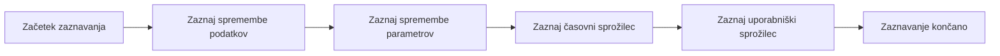
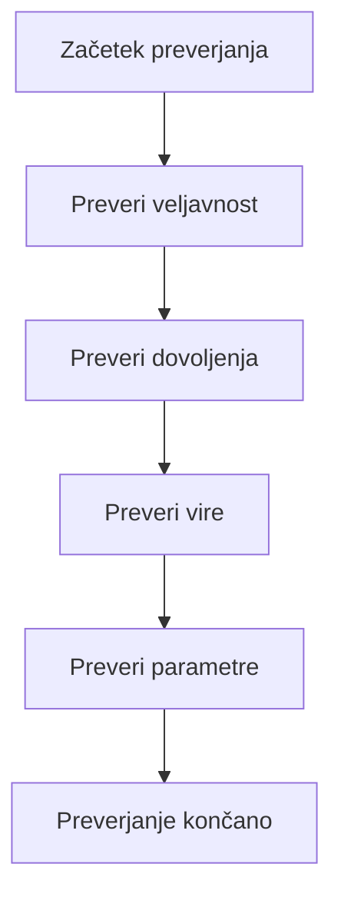
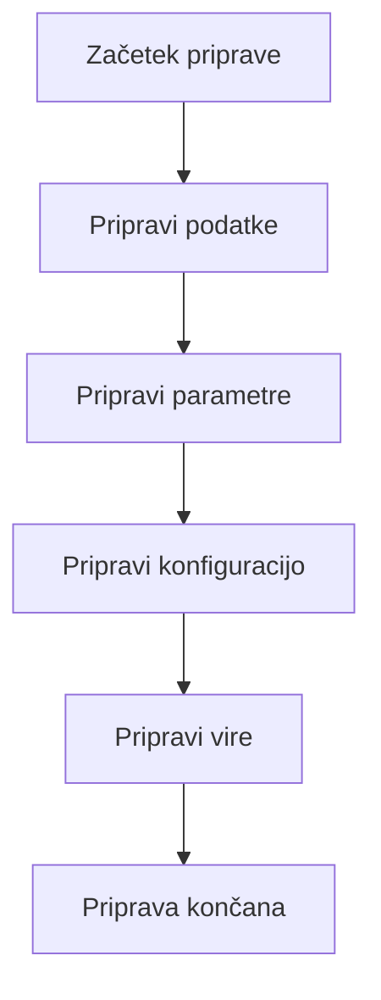
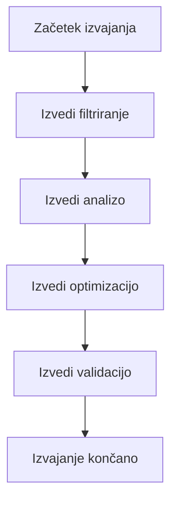
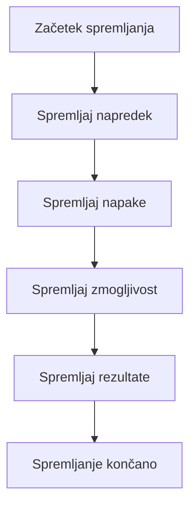
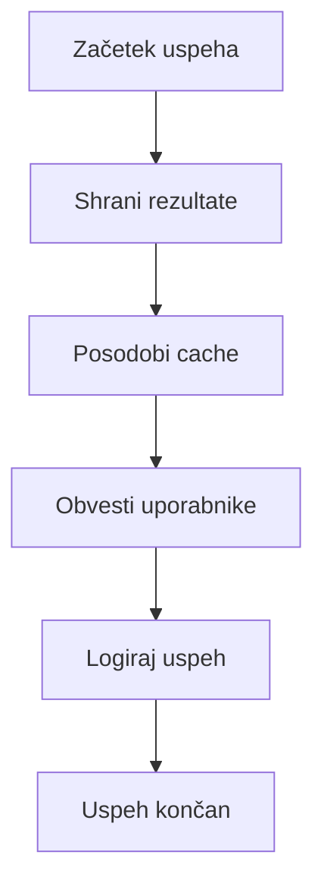
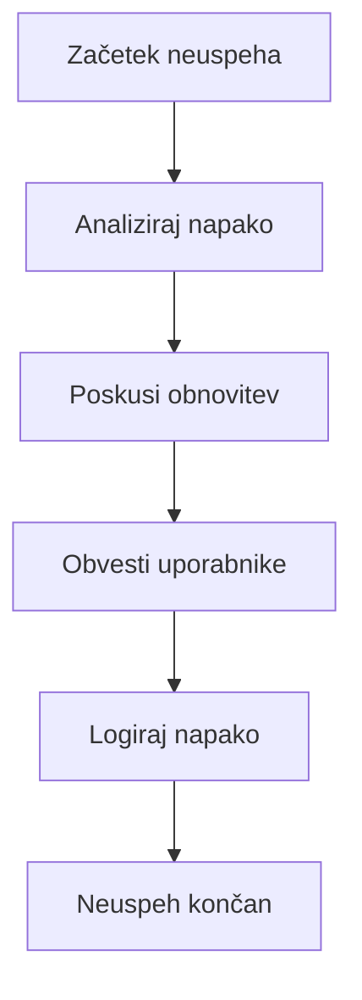
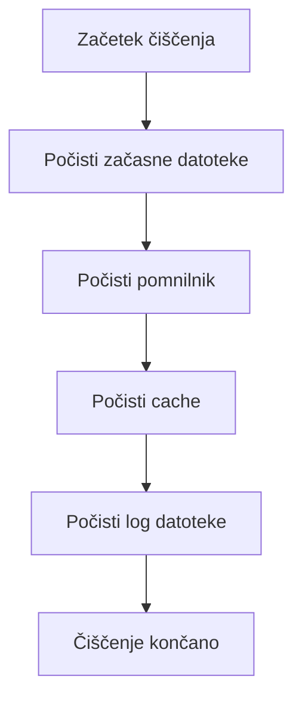
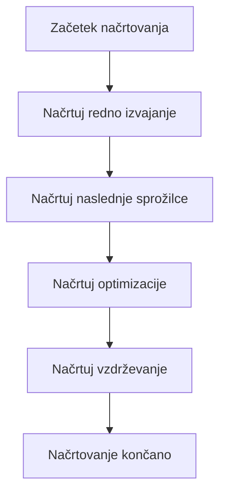

# VIDTERNARY - AVTOMATIZACIJA FILTRIRANJA

## Kompletni proces z avtomatizacijo

```mermaid
flowchart TD
    START([Začetek avtomatizacije]) --> TRIGGER[Zaznaj sprožilec]
    TRIGGER --> TRIGGER1[Zaznaj spremembe podatkov]
    TRIGGER1 --> TRIGGER2[Zaznaj spremembe parametrov]
    TRIGGER2 --> TRIGGER3[Zaznaj časovni sprožilec]
    TRIGGER3 --> TRIGGER4[Zaznaj uporabniški sprožilec]
    
    TRIGGER4 --> VALIDATE[Preveri sprožilec]
    VALIDATE --> VALIDATE1[Preveri veljavnost]
    VALIDATE1 --> VALIDATE2[Preveri dovoljenja]
    VALIDATE2 --> VALIDATE3[Preveri vire]
    VALIDATE3 --> VALIDATE4[Preveri parametre]
    
    VALIDATE4 --> PREPARE[Pripravi avtomatizacijo]
    PREPARE --> PREPARE1[Pripravi podatke]
    PREPARE1 --> PREPARE2[Pripravi parametre]
    PREPARE2 --> PREPARE3[Pripravi konfiguracijo]
    PREPARE3 --> PREPARE4[Pripravi vire]
    
    PREPARE4 --> EXECUTE[Izvedi avtomatizacijo]
    EXECUTE --> EXECUTE1[Izvedi filtriranje]
    EXECUTE1 --> EXECUTE2[Izvedi analizo]
    EXECUTE2 --> EXECUTE3[Izvedi optimizacijo]
    EXECUTE3 --> EXECUTE4[Izvedi validacijo]
    
    EXECUTE4 --> MONITOR[Spremljaj izvajanje]
    MONITOR --> MONITOR1[Spremljaj napredek]
    MONITOR1 --> MONITOR2[Spremljaj napake]
    MONITOR2 --> MONITOR3[Spremljaj zmogljivost]
    MONITOR3 --> MONITOR4[Spremljaj rezultate]
    
    MONITOR4 --> DECISION{Uspešno?}
    DECISION -->|DA| SUCCESS[Uspešno končano]
    DECISION -->|NE| FAILURE[Neuspešno]
    
    SUCCESS --> SUCCESS1[Shrani rezultate]
    SUCCESS1 --> SUCCESS2[Posodobi cache]
    SUCCESS2 --> SUCCESS3[Obvesti uporabnike]
    SUCCESS3 --> SUCCESS4[Logiraj uspeh]
    
    FAILURE --> FAILURE1[Analiziraj napako]
    FAILURE1 --> FAILURE2[Poskusi obnovitev]
    FAILURE2 --> FAILURE3[Obvesti uporabnike]
    FAILURE3 --> FAILURE4[Logiraj napako]
    
    SUCCESS4 --> CLEANUP[Počisti vire]
    FAILURE4 --> CLEANUP
    
    CLEANUP --> CLEANUP1[Počisti začasne datoteke]
    CLEANUP1 --> CLEANUP2[Počisti pomnilnik]
    CLEANUP2 --> CLEANUP3[Počisti cache]
    CLEANUP3 --> CLEANUP4[Počisti log datoteke]
    
    CLEANUP4 --> SCHEDULE[Načrtuj naslednje]
    SCHEDULE --> SCHEDULE1[Načrtuj redno izvajanje]
    SCHEDULE1 --> SCHEDULE2[Načrtuj naslednje sprožilce]
    SCHEDULE2 --> SCHEDULE3[Načrtuj optimizacije]
    SCHEDULE3 --> SCHEDULE4[Načrtuj vzdrževanje]
    
    SCHEDULE4 --> CONTINUE{Nadaljuj z avtomatizacijo?}
    CONTINUE -->|DA| TRIGGER
    CONTINUE -->|NE| END([Konec avtomatizacije])
    
    %% Stili
    classDef startEnd fill:#e1f5fe,stroke:#01579b,stroke-width:3px
    classDef process fill:#f3e5f5,stroke:#4a148c,stroke-width:2px
    classDef decision fill:#fff3e0,stroke:#e65100,stroke-width:2px
    classDef trigger fill:#e8f5e8,stroke:#2e7d32,stroke-width:2px
    classDef validate fill:#fff8e1,stroke:#f57f17,stroke-width:2px
    classDef prepare fill:#fce4ec,stroke:#c2185b,stroke-width:2px
    classDef execute fill:#f3e5f5,stroke:#7b1fa2,stroke-width:2px
    classDef monitor fill:#e8f5e8,stroke:#2e7d32,stroke-width:2px
    classDef success fill:#e8f5e8,stroke:#2e7d32,stroke-width:2px
    classDef failure fill:#ffebee,stroke:#c62828,stroke-width:2px
    classDef cleanup fill:#fff3e0,stroke:#e65100,stroke-width:2px
    classDef schedule fill:#fce4ec,stroke:#c2185b,stroke-width:2px
    
    class START,END startEnd
    class TRIGGER,TRIGGER1,TRIGGER2,TRIGGER3,TRIGGER4 trigger
    class VALIDATE,VALIDATE1,VALIDATE2,VALIDATE3,VALIDATE4 validate
    class PREPARE,PREPARE1,PREPARE2,PREPARE3,PREPARE4 prepare
    class EXECUTE,EXECUTE1,EXECUTE2,EXECUTE3,EXECUTE4 execute
    class MONITOR,MONITOR1,MONITOR2,MONITOR3,MONITOR4 monitor
    class SUCCESS,SUCCESS1,SUCCESS2,SUCCESS3,SUCCESS4 success
    class FAILURE,FAILURE1,FAILURE2,FAILURE3,FAILURE4 failure
    class CLEANUP,CLEANUP1,CLEANUP2,CLEANUP3,CLEANUP4 cleanup
    class SCHEDULE,SCHEDULE1,SCHEDULE2,SCHEDULE3,SCHEDULE4 schedule
    class DECISION,CONTINUE decision
```



## Podroben opis avtomatizacije

### 1. ZAZNAVANJE SPROŽILCEV


### 2. PREVERJANJE SPROŽILCEV


### 3. PRIPRAVA AVTOMATIZACIJE


### 4. IZVAJANJE AVTOMATIZACIJE


### 5. SPREMLJANJE IZVAJANJA


### 6. USPEŠNO KONČANJE


### 7. NEUSPEŠNO KONČANJE


### 8. ČIŠČENJE VIRОВ


### 9. NAČRTOVANJE NASLEDNJEGA


## Ključne funkcije avtomatizacije

### 1. Zaznavanje sprožilcev
```r
# trigger_detection.R
detect_triggers <- function() {
  triggers <- list()
  
  # Zaznaj spremembe podatkov
  data_triggers <- detect_data_changes()
  if (length(data_triggers) > 0) {
    triggers$data <- data_triggers
  }
  
  # Zaznaj spremembe parametrov
  param_triggers <- detect_parameter_changes()
  if (length(param_triggers) > 0) {
    triggers$parameters <- param_triggers
  }
  
  # Zaznaj časovne sprožilce
  time_triggers <- detect_time_triggers()
  if (length(time_triggers) > 0) {
    triggers$time <- time_triggers
  }
  
  # Zaznaj uporabniške sprožilce
  user_triggers <- detect_user_triggers()
  if (length(user_triggers) > 0) {
    triggers$user <- user_triggers
  }
  
  return(triggers)
}

detect_data_changes <- function() {
  # Preveri spremembe v podatkih
  current_hash <- calculate_data_hash()
  last_hash <- get_last_data_hash()
  
  if (current_hash != last_hash) {
    return(list(
      type = "data_change",
      hash = current_hash,
      timestamp = Sys.time()
    ))
  }
  
  return(NULL)
}

detect_parameter_changes <- function() {
  # Preveri spremembe v parametrih
  current_params <- get_current_parameters()
  last_params <- get_last_parameters()
  
  if (!identical(current_params, last_params)) {
    return(list(
      type = "parameter_change",
      params = current_params,
      timestamp = Sys.time()
    ))
  }
  
  return(NULL)
}

detect_time_triggers <- function() {
  # Preveri časovne sprožilce
  current_time <- Sys.time()
  last_run <- get_last_run_time()
  
  # Preveri redne sprožilce
  if (is_time_for_regular_run(current_time, last_run)) {
    return(list(
      type = "regular_run",
      time = current_time,
      interval = get_regular_interval()
    ))
  }
  
  # Preveri načrtovane sprožilce
  scheduled_triggers <- get_scheduled_triggers()
  for (trigger in scheduled_triggers) {
    if (is_time_for_trigger(current_time, trigger)) {
      return(list(
        type = "scheduled",
        time = current_time,
        trigger = trigger
      ))
    }
  }
  
  return(NULL)
}

detect_user_triggers <- function() {
  # Preveri uporabniške sprožilce
  user_requests <- get_user_requests()
  
  if (length(user_requests) > 0) {
    return(list(
      type = "user_request",
      requests = user_requests,
      timestamp = Sys.time()
    ))
  }
  
  return(NULL)
}
```

### 2. Preverjanje sprožilcev
```r
# trigger_validation.R
validate_triggers <- function(triggers) {
  validated_triggers <- list()
  
  for (trigger_type in names(triggers)) {
    trigger <- triggers[[trigger_type]]
    
    # Preveri veljavnost
    if (validate_trigger_validity(trigger)) {
      # Preveri dovoljenja
      if (validate_trigger_permissions(trigger)) {
        # Preveri vire
        if (validate_trigger_resources(trigger)) {
          # Preveri parametre
          if (validate_trigger_parameters(trigger)) {
            validated_triggers[[trigger_type]] <- trigger
          }
        }
      }
    }
  }
  
  return(validated_triggers)
}

validate_trigger_validity <- function(trigger) {
  # Preveri veljavnost sprožilca
  if (is.null(trigger)) return(FALSE)
  if (is.null(trigger$type)) return(FALSE)
  if (is.null(trigger$timestamp)) return(FALSE)
  
  # Preveri tip sprožilca
  valid_types <- c("data_change", "parameter_change", "time", "user_request")
  if (!trigger$type %in% valid_types) return(FALSE)
  
  # Preveri časovni žig
  if (trigger$timestamp > Sys.time()) return(FALSE)
  
  return(TRUE)
}

validate_trigger_permissions <- function(trigger) {
  # Preveri dovoljenja za sprožilec
  user_permissions <- get_user_permissions()
  
  if (trigger$type == "data_change") {
    return("data_read" %in% user_permissions)
  } else if (trigger$type == "parameter_change") {
    return("parameter_write" %in% user_permissions)
  } else if (trigger$type == "time") {
    return("scheduled_run" %in% user_permissions)
  } else if (trigger$type == "user_request") {
    return("user_request" %in% user_permissions)
  }
  
  return(FALSE)
}

validate_trigger_resources <- function(trigger) {
  # Preveri dostopnost virov
  required_resources <- get_required_resources(trigger)
  available_resources <- get_available_resources()
  
  for (resource in required_resources) {
    if (!resource %in% available_resources) {
      return(FALSE)
    }
  }
  
  return(TRUE)
}

validate_trigger_parameters <- function(trigger) {
  # Preveri parametre sprožilca
  if (trigger$type == "data_change") {
    return(validate_data_parameters(trigger))
  } else if (trigger$type == "parameter_change") {
    return(validate_parameter_parameters(trigger))
  } else if (trigger$type == "time") {
    return(validate_time_parameters(trigger))
  } else if (trigger$type == "user_request") {
    return(validate_user_parameters(trigger))
  }
  
  return(TRUE)
}
```

### 3. Priprava avtomatizacije
```r
# automation_preparation.R
prepare_automation <- function(triggers) {
  preparation <- list()
  
  # Pripravi podatke
  preparation$data <- prepare_automation_data(triggers)
  
  # Pripravi parametre
  preparation$parameters <- prepare_automation_parameters(triggers)
  
  # Pripravi konfiguracijo
  preparation$configuration <- prepare_automation_configuration(triggers)
  
  # Pripravi vire
  preparation$resources <- prepare_automation_resources(triggers)
  
  return(preparation)
}

prepare_automation_data <- function(triggers) {
  # Pripravi podatke za avtomatizacijo
  data <- list()
  
  if ("data_change" %in% names(triggers)) {
    data$source <- get_data_source()
    data$target <- get_data_target()
    data$format <- get_data_format()
  }
  
  if ("parameter_change" %in% names(triggers)) {
    data$parameters <- get_parameter_data()
  }
  
  if ("time" %in% names(triggers)) {
    data$schedule <- get_schedule_data()
  }
  
  if ("user_request" %in% names(triggers)) {
    data$user_data <- get_user_data()
  }
  
  return(data)
}

prepare_automation_parameters <- function(triggers) {
  # Pripravi parametre za avtomatizacijo
  parameters <- list()
  
  # Osnovni parametri
  parameters$method <- get_filtering_method()
  parameters$columns <- get_selected_columns()
  parameters$threshold <- get_filtering_threshold()
  
  # Napredni parametri
  if (parameters$method == "isolation_forest") {
    parameters$ntrees <- get_ntrees_parameter()
    parameters$sample_size <- get_sample_size_parameter()
    parameters$contamination <- get_contamination_parameter()
  }
  
  if (parameters$method == "mahalanobis") {
    parameters$lambda <- get_lambda_parameter()
    parameters$omega <- get_omega_parameter()
  }
  
  if (parameters$method == "statistical") {
    parameters$multiplier <- get_multiplier_parameter()
    parameters$threshold <- get_threshold_parameter()
  }
  
  return(parameters)
}

prepare_automation_configuration <- function(triggers) {
  # Pripravi konfiguracijo za avtomatizacijo
  configuration <- list()
  
  # Osnovna konfiguracija
  configuration$debug <- get_debug_mode()
  configuration$logging <- get_logging_mode()
  configuration$caching <- get_caching_mode()
  
  # Napredna konfiguracija
  configuration$optimization <- get_optimization_mode()
  configuration$parallel <- get_parallel_mode()
  configuration$memory_limit <- get_memory_limit()
  
  # Varnostna konfiguracija
  configuration$security <- get_security_mode()
  configuration$encryption <- get_encryption_mode()
  configuration$authentication <- get_authentication_mode()
  
  return(configuration)
}

prepare_automation_resources <- function(triggers) {
  # Pripravi vire za avtomatizacijo
  resources <- list()
  
  # Pomnilnik
  resources$memory <- get_available_memory()
  resources$memory_limit <- get_memory_limit()
  
  # Procesor
  resources$cpu <- get_available_cpu()
  resources$cpu_limit <- get_cpu_limit()
  
  # Disk
  resources$disk <- get_available_disk()
  resources$disk_limit <- get_disk_limit()
  
  # Mreža
  resources$network <- get_available_network()
  resources$network_limit <- get_network_limit()
  
  return(resources)
}
```

### 4. Izvajanje avtomatizacije
```r
# automation_execution.R
execute_automation <- function(preparation) {
  execution <- list()
  
  # Izvedi filtriranje
  execution$filtering <- execute_filtering(preparation)
  
  # Izvedi analizo
  execution$analysis <- execute_analysis(preparation, execution$filtering)
  
  # Izvedi optimizacijo
  execution$optimization <- execute_optimization(preparation, execution$analysis)
  
  # Izvedi validacijo
  execution$validation <- execute_validation(preparation, execution$optimization)
  
  return(execution)
}

execute_filtering <- function(preparation) {
  # Izvedi filtriranje
  data <- preparation$data
  parameters <- preparation$parameters
  
  # Uporabi izbrano metodo filtriranja
  method <- parameters$method
  
  if (method == "isolation_forest") {
    result <- execute_isolation_forest_filtering(data, parameters)
  } else if (method == "mahalanobis") {
    result <- execute_mahalanobis_filtering(data, parameters)
  } else if (method == "statistical") {
    result <- execute_statistical_filtering(data, parameters)
  } else {
    stop("Unknown filtering method: ", method)
  }
  
  return(result)
}

execute_analysis <- function(preparation, filtering_result) {
  # Izvedi analizo rezultatov
  analysis <- list()
  
  # Analiziraj outlierje
  analysis$outliers <- analyze_outliers(filtering_result)
  
  # Analiziraj scores
  analysis$scores <- analyze_scores(filtering_result)
  
  # Analiziraj pragove
  analysis$thresholds <- analyze_thresholds(filtering_result)
  
  # Analiziraj metode
  analysis$methods <- analyze_methods(filtering_result)
  
  return(analysis)
}

execute_optimization <- function(preparation, analysis_result) {
  # Izvedi optimizacijo
  optimization <- list()
  
  # Optimiziraj hitrost
  optimization$speed <- optimize_speed(analysis_result)
  
  # Optimiziraj pomnilnik
  optimization$memory <- optimize_memory(analysis_result)
  
  # Optimiziraj cache
  optimization$cache <- optimize_cache(analysis_result)
  
  # Optimiziraj vektorsko obdelavo
  optimization$vectorization <- optimize_vectorization(analysis_result)
  
  return(optimization)
}

execute_validation <- function(preparation, optimization_result) {
  # Izvedi validacijo
  validation <- list()
  
  # Preveri funkcionalnost
  validation$functionality <- validate_functionality(optimization_result)
  
  # Preveri zmogljivost
  validation$performance <- validate_performance(optimization_result)
  
  # Preveri stabilnost
  validation$stability <- validate_stability(optimization_result)
  
  # Preveri kompatibilnost
  validation$compatibility <- validate_compatibility(optimization_result)
  
  return(validation)
}
```

### 5. Spremljanje izvajanja
```r
# automation_monitoring.R
monitor_execution <- function(execution) {
  monitoring <- list()
  
  # Spremljaj napredek
  monitoring$progress <- monitor_progress(execution)
  
  # Spremljaj napake
  monitoring$errors <- monitor_errors(execution)
  
  # Spremljaj zmogljivost
  monitoring$performance <- monitor_performance(execution)
  
  # Spremljaj rezultate
  monitoring$results <- monitor_results(execution)
  
  return(monitoring)
}

monitor_progress <- function(execution) {
  # Spremljaj napredek izvajanja
  progress <- list()
  
  # Napredek filtriranja
  progress$filtering <- get_filtering_progress(execution$filtering)
  
  # Napredek analize
  progress$analysis <- get_analysis_progress(execution$analysis)
  
  # Napredek optimizacije
  progress$optimization <- get_optimization_progress(execution$optimization)
  
  # Napredek validacije
  progress$validation <- get_validation_progress(execution$validation)
  
  return(progress)
}

monitor_errors <- function(execution) {
  # Spremljaj napake v izvajanju
  errors <- list()
  
  # Napake filtriranja
  errors$filtering <- get_filtering_errors(execution$filtering)
  
  # Napake analize
  errors$analysis <- get_analysis_errors(execution$analysis)
  
  # Napake optimizacije
  errors$optimization <- get_optimization_errors(execution$optimization)
  
  # Napake validacije
  errors$validation <- get_validation_errors(execution$validation)
  
  return(errors)
}

monitor_performance <- function(execution) {
  # Spremljaj zmogljivost izvajanja
  performance <- list()
  
  # Hitrost filtriranja
  performance$filtering_speed <- get_filtering_speed(execution$filtering)
  
  # Hitrost analize
  performance$analysis_speed <- get_analysis_speed(execution$analysis)
  
  # Hitrost optimizacije
  performance$optimization_speed <- get_optimization_speed(execution$optimization)
  
  # Hitrost validacije
  performance$validation_speed <- get_validation_speed(execution$validation)
  
  return(performance)
}

monitor_results <- function(execution) {
  # Spremljaj rezultate izvajanja
  results <- list()
  
  # Rezultati filtriranja
  results$filtering <- get_filtering_results(execution$filtering)
  
  # Rezultati analize
  results$analysis <- get_analysis_results(execution$analysis)
  
  # Rezultati optimizacije
  results$optimization <- get_optimization_results(execution$optimization)
  
  # Rezultati validacije
  results$validation <- get_validation_results(execution$validation)
  
  return(results)
}
```

### 6. Obvеščanje uporabnikov
```r
# user_notification.R
notify_users <- function(execution, monitoring) {
  notification <- list()
  
  # Obvesti o uspehu
  if (monitoring$errors$total == 0) {
    notification$success <- notify_success(execution, monitoring)
  }
  
  # Obvesti o napakah
  if (monitoring$errors$total > 0) {
    notification$errors <- notify_errors(execution, monitoring)
  }
  
  # Obvesti o rezultatih
  notification$results <- notify_results(execution, monitoring)
  
  # Obvesti o optimizacijah
  notification$optimizations <- notify_optimizations(execution, monitoring)
  
  return(notification)
}

notify_success <- function(execution, monitoring) {
  # Obvesti uporabnike o uspešnem izvajanju
  message <- paste(
    "Avtomatizacija uspešno končana:",
    "- Filtriranje: ", monitoring$progress$filtering$percentage, "%",
    "- Analiza: ", monitoring$progress$analysis$percentage, "%",
    "- Optimizacija: ", monitoring$progress$optimization$percentage, "%",
    "- Validacija: ", monitoring$progress$validation$percentage, "%",
    sep = "\n"
  )
  
  # Pošlji obvestilo
  send_notification("success", message)
  
  return(message)
}

notify_errors <- function(execution, monitoring) {
  # Obvesti uporabnike o napakah
  message <- paste(
    "Avtomatizacija neuspešna:",
    "- Napake filtriranja: ", monitoring$errors$filtering$count,
    "- Napake analize: ", monitoring$errors$analysis$count,
    "- Napake optimizacije: ", monitoring$errors$optimization$count,
    "- Napake validacije: ", monitoring$errors$validation$count,
    sep = "\n"
  )
  
  # Pošlji obvestilo
  send_notification("error", message)
  
  return(message)
}

notify_results <- function(execution, monitoring) {
  # Obvesti uporabnike o rezultatih
  message <- paste(
    "Rezultati avtomatizacije:",
    "- Outlierji: ", monitoring$results$filtering$outlier_count,
    "- Scores: ", monitoring$results$analysis$score_count,
    "- Pragovi: ", monitoring$results$optimization$threshold_count,
    "- Metode: ", monitoring$results$validation$method_count,
    sep = "\n"
  )
  
  # Pošlji obvestilo
  send_notification("results", message)
  
  return(message)
}

notify_optimizations <- function(execution, monitoring) {
  # Obvesti uporabnike o optimizacijah
  message <- paste(
    "Optimizacije avtomatizacije:",
    "- Hitrost: ", monitoring$performance$total_speed,
    "- Pomnilnik: ", monitoring$performance$total_memory,
    "- Cache: ", monitoring$performance$total_cache,
    "- Vektorska obdelava: ", monitoring$performance$total_vectorization,
    sep = "\n"
  )
  
  # Pošlji obvestilo
  send_notification("optimizations", message)
  
  return(message)
}
```

### 7. Čiščenje virov
```r
# resource_cleanup.R
cleanup_resources <- function(execution, monitoring) {
  cleanup <- list()
  
  # Počisti začasne datoteke
  cleanup$temp_files <- cleanup_temp_files(execution)
  
  # Počisti pomnilnik
  cleanup$memory <- cleanup_memory(execution)
  
  # Počisti cache
  cleanup$cache <- cleanup_cache(execution)
  
  # Počisti log datoteke
  cleanup$logs <- cleanup_logs(execution)
  
  return(cleanup)
}

cleanup_temp_files <- function(execution) {
  # Počisti začasne datoteke
  temp_dir <- get_temp_directory()
  temp_files <- list.files(temp_dir, full.names = TRUE)
  
  for (file in temp_files) {
    if (file.exists(file)) {
      file.remove(file)
    }
  }
  
  return(length(temp_files))
}

cleanup_memory <- function(execution) {
  # Počisti pomnilnik
  gc()
  
  # Počisti velike objekte
  large_objects <- get_large_objects()
  for (obj in large_objects) {
    if (exists(obj)) {
      rm(list = obj)
    }
  }
  
  return(length(large_objects))
}

cleanup_cache <- function(execution) {
  # Počisti cache
  cache_dir <- get_cache_directory()
  cache_files <- list.files(cache_dir, full.names = TRUE)
  
  # Počisti stare cache datoteke
  for (file in cache_files) {
    if (file.exists(file)) {
      file_info <- file.info(file)
      if (file_info$mtime < Sys.time() - 3600) {  # Starejše od 1 ure
        file.remove(file)
      }
    }
  }
  
  return(length(cache_files))
}

cleanup_logs <- function(execution) {
  # Počisti log datoteke
  log_dir <- get_log_directory()
  log_files <- list.files(log_dir, full.names = TRUE)
  
  # Počisti stare log datoteke
  for (file in log_files) {
    if (file.exists(file)) {
      file_info <- file.info(file)
      if (file_info$mtime < Sys.time() - 86400) {  # Starejše od 1 dne
        file.remove(file)
      }
    }
  }
  
  return(length(log_files))
}
```

### 8. Načrtovanje naslednjega
```r
# next_scheduling.R
schedule_next <- function(execution, monitoring) {
  scheduling <- list()
  
  # Načrtuj redno izvajanje
  scheduling$regular <- schedule_regular_execution(execution, monitoring)
  
  # Načrtuj naslednje sprožilce
  scheduling$triggers <- schedule_next_triggers(execution, monitoring)
  
  # Načrtuj optimizacije
  scheduling$optimizations <- schedule_optimizations(execution, monitoring)
  
  # Načrtuj vzdrževanje
  scheduling$maintenance <- schedule_maintenance(execution, monitoring)
  
  return(scheduling)
}

schedule_regular_execution <- function(execution, monitoring) {
  # Načrtuj redno izvajanje
  interval <- get_regular_interval()
  next_run <- Sys.time() + interval
  
  # Shrani načrt
  save_schedule("regular", next_run, interval)
  
  return(list(
    type = "regular",
    next_run = next_run,
    interval = interval
  ))
}

schedule_next_triggers <- function(execution, monitoring) {
  # Načrtuj naslednje sprožilce
  triggers <- get_next_triggers()
  
  for (trigger in triggers) {
    next_run <- calculate_next_trigger_time(trigger)
    save_schedule("trigger", next_run, trigger)
  }
  
  return(triggers)
}

schedule_optimizations <- function(execution, monitoring) {
  # Načrtuj optimizacije
  optimizations <- get_required_optimizations(monitoring)
  
  for (optimization in optimizations) {
    next_run <- calculate_next_optimization_time(optimization)
    save_schedule("optimization", next_run, optimization)
  }
  
  return(optimizations)
}

schedule_maintenance <- function(execution, monitoring) {
  # Načrtuj vzdrževanje
  maintenance_tasks <- get_maintenance_tasks(monitoring)
  
  for (task in maintenance_tasks) {
    next_run <- calculate_next_maintenance_time(task)
    save_schedule("maintenance", next_run, task)
  }
  
  return(maintenance_tasks)
}
```

## Prednosti avtomatizacije

1. **Efektivnost**: Avtomatsko izvajanje brez ročnega posredovanja
2. **Zanesljivost**: Konsistentno izvajanje
3. **Hitrost**: Hitrejše izvajanje
4. **Spremljanje**: Avtomatsko spremljanje napredka
5. **Obvestila**: Avtomatsko obveščanje uporabnikov

## Uporaba flowchart-a

- **Razumevanje**: Sledite korakom za razumevanje avtomatizacije
- **Implementacija**: Implementirajte avtomatizacijo po vzoru
- **Optimizacija**: Optimizirajte proces avtomatizacije
- **Monitoring**: Spremljajte avtomatizacijo
- **Vzdrževanje**: Vzdržujte avtomatizacijo
