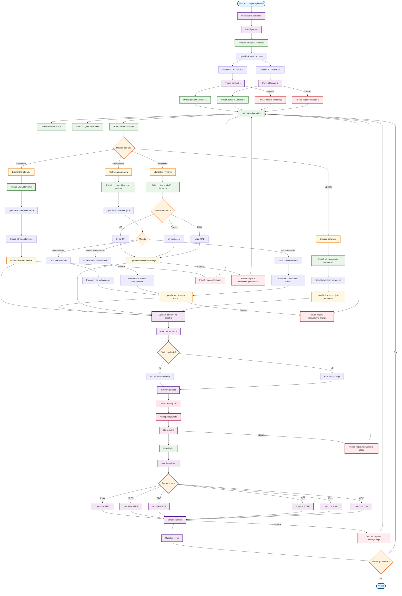
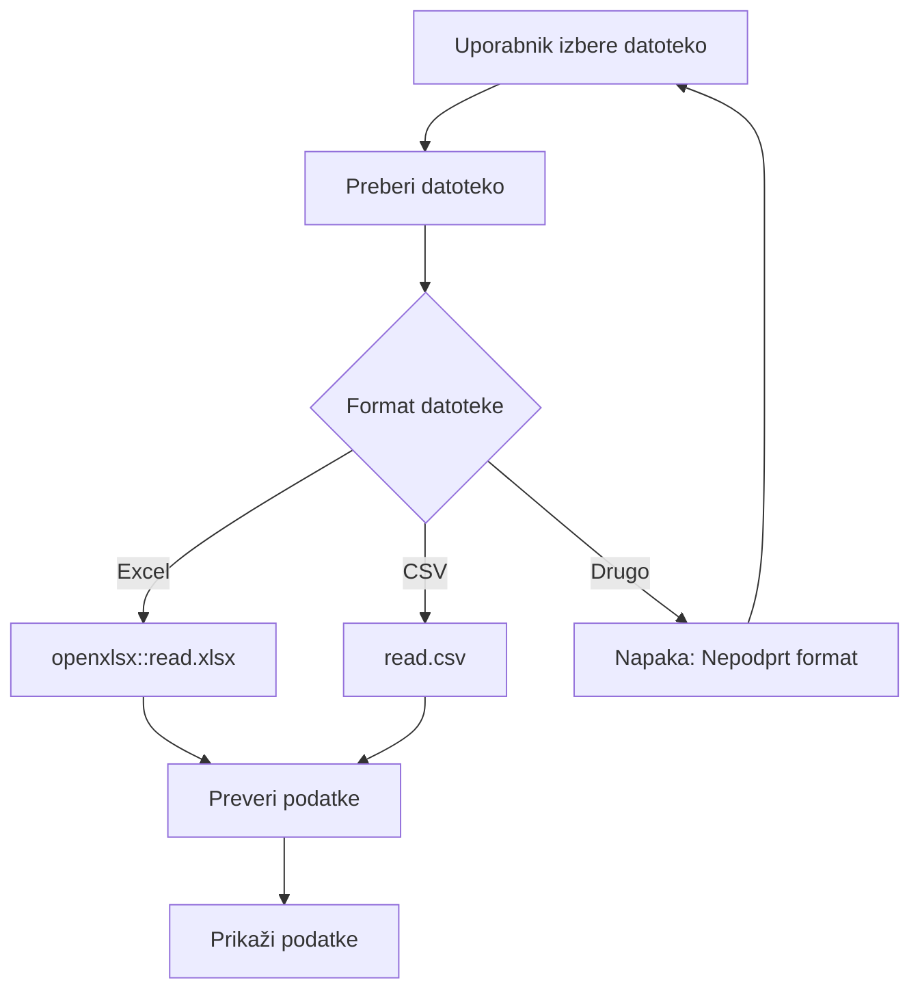
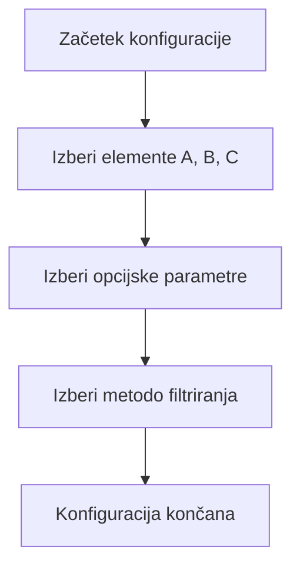
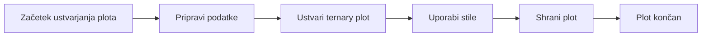
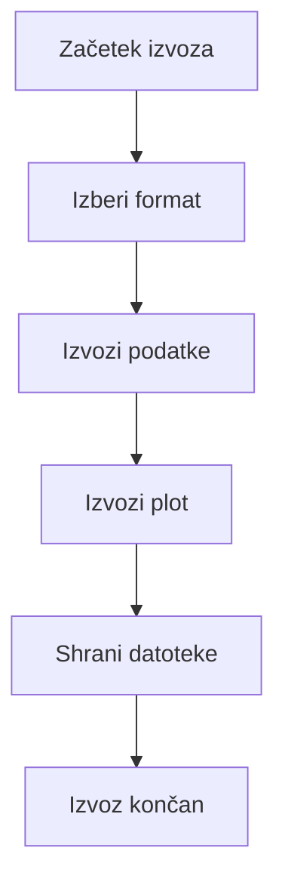

# VIDTERNARY - CELOTEN FLOWCHART APLIKACIJE

## Glavni proces aplikacije z filtriranjem



## Podroben opis komponent

### 1. INICIALIZACIJA APLIKACIJE


### 2. NALAGANJE PODATKOV


### 3. KONFIGURACIJA FILTRIRANJA


### 4. USTVARJANJE PLOTA


### 5. IZVOZ REZULTATOV


## Ključne funkcije aplikacije

### Glavna aplikacija
```r
# app.R
shinyApp(
  ui = create_ui(),
  server = create_server()
)
```

### Ustvarjanje UI
```r
# ui_components.R
create_ui <- function() {
  fluidPage(
    # Header
    # Sidebar za konfiguracijo
    # Main panel za prikaz rezultatov
  )
}
```

### Server logika
```r
# server_logic.R
create_server <- function(input, output, session) {
  # Reactive values
  # Event handlers
  # Output renderers
}
```

### Filtriranje podatkov
```r
# multivariate.R, statistical_filters.R, ternary_plot.R
# Različne metode filtriranja
```

## Uporaba flowchart-a

1. **Razumevanje aplikacije**: Sledite glavnemu toku za razumevanje, kako deluje aplikacija
2. **Debugiranje**: Identificirajte, kje se pojavi napaka
3. **Razvoj**: Dodajte nove funkcionalnosti po vzoru obstoječih
4. **Dokumentacija**: Uporabite za razlago uporabnikom
5. **Testiranje**: Preverite vse možne poti skozi aplikacijo

## Napake in obravnavanje

- **Nalaganje podatkov**: Preverjanje formata in veljavnosti
- **Filtriranje**: Preverjanje parametrov in podatkov
- **Ustvarjanje plota**: Preverjanje podatkov in konfiguracije
- **Izvoz**: Preverjanje dovoljenj in prostora

## Optimizacija

- **Cachiranje**: Shranjevanje vmesnih rezultatov
- **Asinhrono nalaganje**: Nalaganje podatkov v ozadju
- **Validacija**: Preverjanje vhodnih podatkov pred obdelavo
- **Napake**: Robustno obravnavanje napak z uporabnimi sporočili
