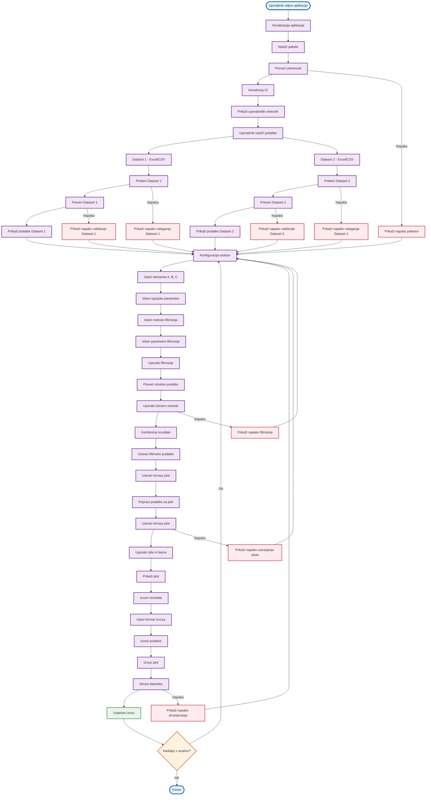
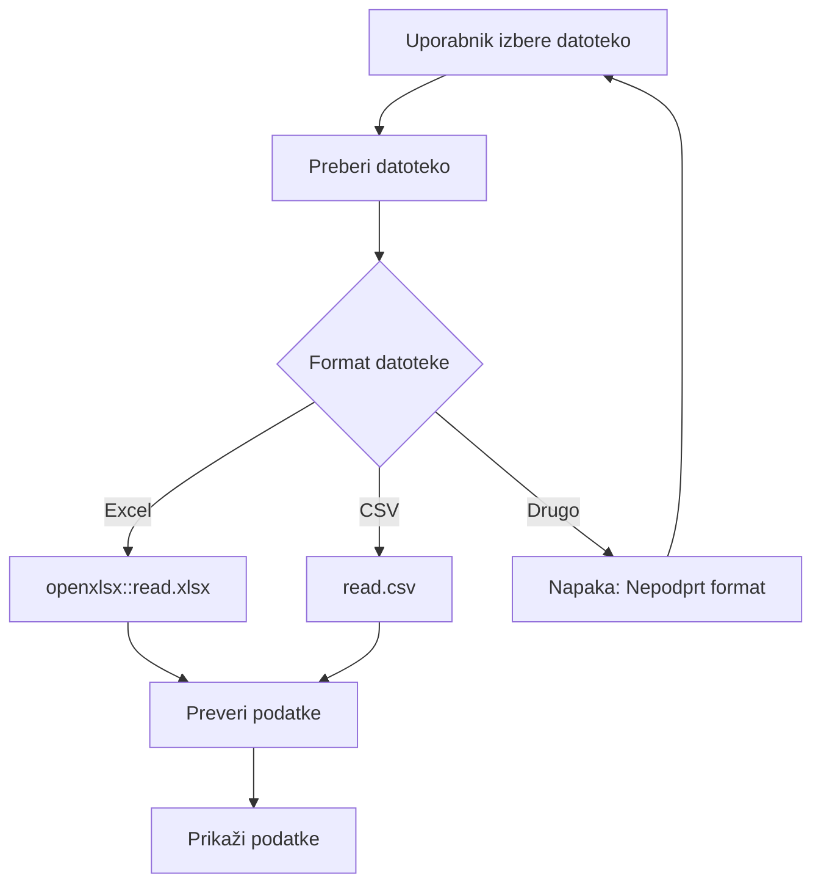
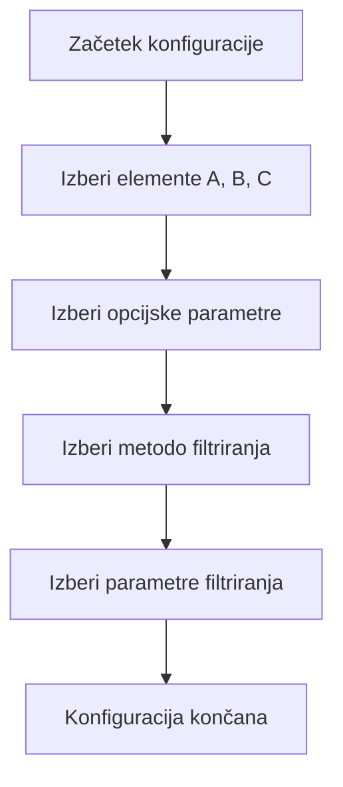
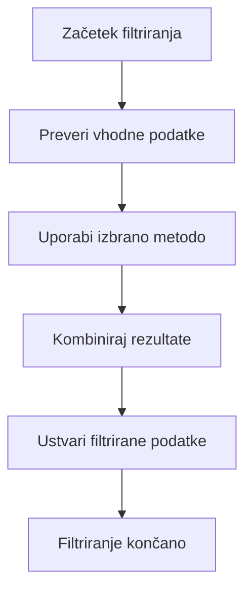
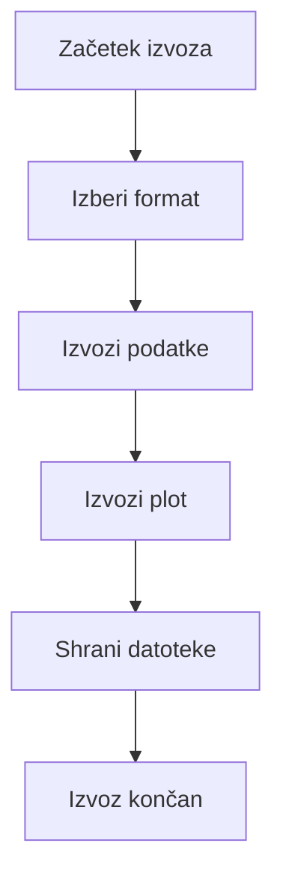

# VIDTERNARY - CELOTEN PROCES APLIKACIJE

## Kompletni proces aplikacije z vsemi komponentami



## Podroben opis komponent

### 1. INICIALIZACIJA APLIKACIJE


### 2. NALAGANJE PODATKOV


### 3. KONFIGURACIJA ANALIZE


### 4. FILTRIRANJE PODATKOV


### 5. USTVARJANJE PLOTA


### 6. IZVOZ REZULTATOV


## Ključne funkcije aplikacije

### Glavna aplikacija
```r
# app.R
shinyApp(
  ui = create_ui(),
  server = create_server()
)
```

### Ustvarjanje UI
```r
# ui_components.R
create_ui <- function() {
  fluidPage(
    # Header
    titlePanel("VIDTERNARY - Ternary Plot Analysis"),
    
    # Sidebar za konfiguracijo
    sidebarLayout(
      sidebarPanel(
        # Nalaganje podatkov
        fileInput("file1", "Dataset 1", accept = c(".xlsx", ".csv")),
        fileInput("file2", "Dataset 2", accept = c(".xlsx", ".csv")),
        
        # Konfiguracija elementov
        selectInput("element_A", "Element A", choices = NULL),
        selectInput("element_B", "Element B", choices = NULL),
        selectInput("element_C", "Element C", choices = NULL),
        
        # Metode filtriranja
        selectInput("filter_method", "Metoda filtriranja", 
                   choices = c("Elementno", "Multivariatna", "Statistično")),
        
        # Parametri filtriranja
        uiOutput("filter_params_ui"),
        
        # Gumbi za analizo
        actionButton("analyze", "Analiziraj"),
        actionButton("export", "Izvozi rezultate")
      ),
      
      # Main panel za prikaz rezultatov
      mainPanel(
        # Prikaz podatkov
        tabsetPanel(
          tabPanel("Podatki", 
                   dataTableOutput("data1_table"),
                   dataTableOutput("data2_table")),
          tabPanel("Plot", 
                   plotOutput("ternary_plot")),
          tabPanel("Rezultati", 
                   verbatimTextOutput("analysis_results")),
          tabPanel("Izvoz", 
                   downloadButton("download_data", "Prenesi podatke"),
                   downloadButton("download_plot", "Prenesi plot"))
        )
      )
    )
  )
}
```

### Server logika
```r
# server_logic.R
create_server <- function(input, output, session) {
  # Reactive values
  rv <- reactiveValues(
    data1 = NULL,
    data2 = NULL,
    filtered_data1 = NULL,
    filtered_data2 = NULL,
    plot = NULL,
    results = NULL
  )
  
  # Event handlers
  observeEvent(input$file1, {
    rv$data1 <- read_dataset_file(input$file1$datapath)
  })
  
  observeEvent(input$file2, {
    rv$data2 <- read_dataset_file(input$file2$datapath)
  })
  
  observeEvent(input$analyze, {
    # Uporabi filtriranje
    rv$filtered_data1 <- apply_filtering(rv$data1, input$filter_method, input$filter_params)
    rv$filtered_data2 <- apply_filtering(rv$data2, input$filter_method, input$filter_params)
    
    # Ustvari plot
    rv$plot <- create_ternary_plot(rv$filtered_data1, rv$filtered_data2, input$elements)
    
    # Shrani rezultate
    rv$results <- list(
      filtered_data1 = rv$filtered_data1,
      filtered_data2 = rv$filtered_data2,
      plot = rv$plot,
      method = input$filter_method,
      params = input$filter_params
    )
  })
  
  # Output renderers
  output$data1_table <- renderDataTable({
    rv$data1
  })
  
  output$data2_table <- renderDataTable({
    rv$data2
  })
  
  output$ternary_plot <- renderPlot({
    rv$plot
  })
  
  output$analysis_results <- renderPrint({
    rv$results
  })
  
  # Download handlers
  output$download_data <- downloadHandler(
    filename = function() {
      paste("filtered_data_", Sys.Date(), ".xlsx", sep = "")
    },
    content = function(file) {
      write.xlsx(rv$results$filtered_data1, file, sheetName = "Dataset1")
      write.xlsx(rv$results$filtered_data2, file, sheetName = "Dataset2", append = TRUE)
    }
  )
  
  output$download_plot <- downloadHandler(
    filename = function() {
      paste("ternary_plot_", Sys.Date(), ".png", sep = "")
    },
    content = function(file) {
      ggsave(file, rv$plot, width = 12, height = 10, dpi = 300)
    }
  )
}
```

### Filtriranje podatkov
```r
# multivariate.R, statistical_filters.R, ternary_plot.R
apply_filtering <- function(data, method, params) {
  switch(method,
    "Elementno" = apply_element_filtering(data, params),
    "Multivariatna" = apply_multivariate_filtering(data, params),
    "Statistično" = apply_statistical_filtering(data, params),
    stop("Unknown filtering method: ", method)
  )
}
```

## Uporaba flowchart-a

1. **Razumevanje aplikacije**: Sledite glavnemu toku za razumevanje, kako deluje aplikacija
2. **Debugiranje**: Identificirajte, kje se pojavi napaka
3. **Razvoj**: Dodajte nove funkcionalnosti po vzoru obstoječih
4. **Dokumentacija**: Uporabite za razlago uporabnikom
5. **Testiranje**: Preverite vse možne poti skozi aplikacijo

## Napake in obravnavanje

- **Nalaganje podatkov**: Preverjanje formata in veljavnosti
- **Filtriranje**: Preverjanje parametrov in podatkov
- **Ustvarjanje plota**: Preverjanje podatkov in konfiguracije
- **Izvoz**: Preverjanje dovoljenj in prostora

## Optimizacija

- **Cachiranje**: Shranjevanje vmesnih rezultatov
- **Asinhrono nalaganje**: Nalaganje podatkov v ozadju
- **Validacija**: Preverjanje vhodnih podatkov pred obdelavo
- **Napake**: Robustno obravnavanje napak z uporabnimi sporočili
