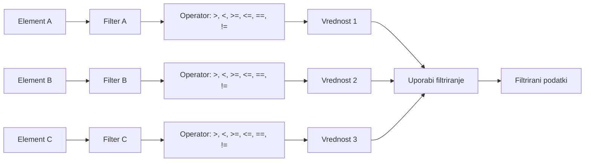
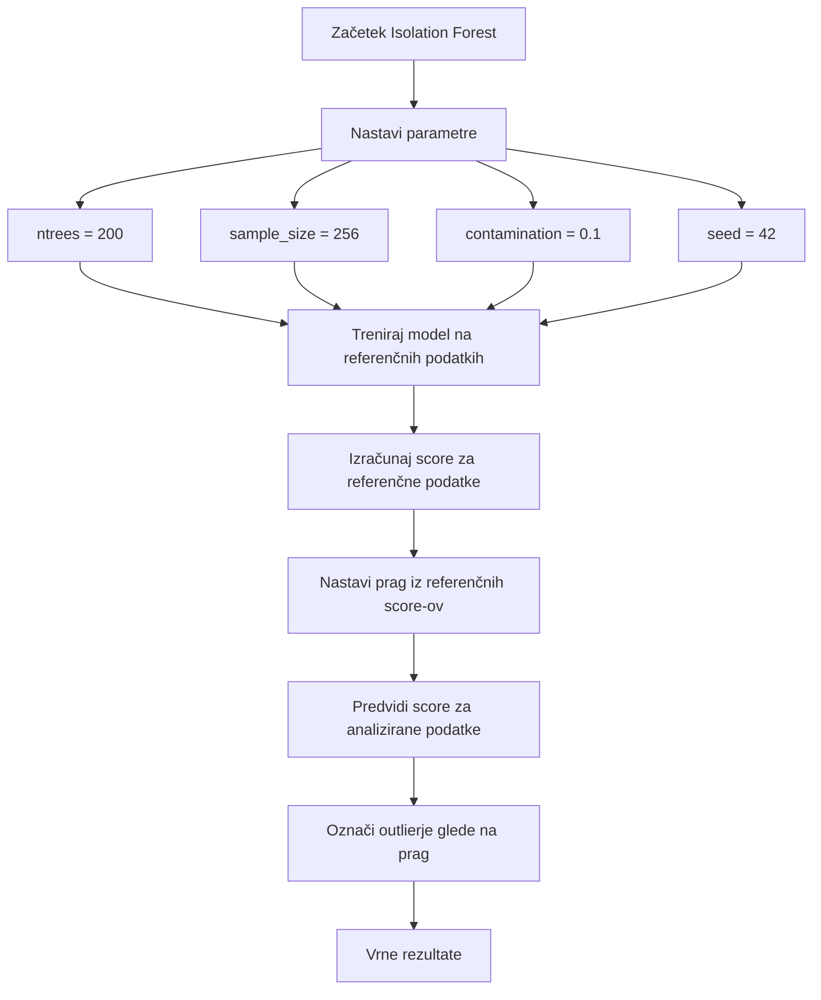
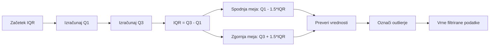

# VIDTERNARY - PODROBNI FLOWCHART ZA FILTRIRANJE

## Glavni proces filtriranja

```mermaid
flowchart TD
    START([Začetek - Naloženi podatki]) --> LOAD{Preveri podatke}
    LOAD -->|Uspešno| VALIDATE[Preveri veljavnost podatkov]
    LOAD -->|Napaka| ERROR1[Prikaži napako nalaganja]
    
    VALIDATE --> CHECK{Tip filtriranja}
    
    %% Elementno filtriranje
    CHECK -->|Elementno| ELEM[Elementno filtriranje]
    ELEM --> ELEM1[Izberi elemente A, B, C]
    ELEM1 --> ELEM2{Posamezni filtri?}
    ELEM2 -->|DA| ELEM3[Za vsak element posebej]
    ELEM2 -->|NE| ELEM4[En filter za vse]
    
    ELEM3 --> ELEM5[Preveri operator: >, <, >=, <=, ==, !=]
    ELEM4 --> ELEM5
    ELEM5 --> ELEM6[Pretvori v numerične vrednosti]
    ELEM6 --> ELEM7[Uporabi filtriranje]
    ELEM7 --> ELEM8[Vrne filtrirane podatke]
    
    %% Multivariatna analiza
    CHECK -->|Multivariatna| MULTI[Multivariatna analiza]
    MULTI --> MULTI1[Izberi stolpce za analizo]
    MULTI1 --> MULTI2{Metoda}
    
    MULTI2 -->|Mahalanobis| MAH[Standardna Mahalanobis]
    MULTI2 -->|Robust Mahalanobis| ROB[Robust Mahalanobis]
    MULTI2 -->|Isolation Forest| ISO[Isolation Forest]
    
    MAH --> MAH1[Izračunaj kovarianco]
    MAH1 --> MAH2[Preveri singularnost]
    MAH2 --> MAH3[Izračunaj razdalje]
    MAH3 --> MAH4[Nastavi prag]
    MAH4 --> MAH5[Označi outlierje]
    
    ROB --> ROB1[Uporabi MCD/MVE]
    ROB1 --> ROB2[Robustna kovarianca]
    ROB2 --> ROB3[Robustne razdalje]
    ROB3 --> ROB4[Robustni prag]
    ROB4 --> ROB5[Označi outlierje]
    
    ISO --> ISO1[Nastavi parametre]
    ISO1 --> ISO2[Treniraj model]
    ISO2 --> ISO3[Izračunaj score]
    ISO3 --> ISO4[Nastavi prag iz referenčnih podatkov]
    ISO4 --> ISO5[Označi outlierje]
    
    MAH5 --> MULTI_RES[Rezultati multivariatne analize]
    ROB5 --> MULTI_RES
    ISO5 --> MULTI_RES
    
    %% Statistično filtriranje
    CHECK -->|Statistično| STAT[Statistično filtriranje]
    STAT --> STAT1{Metoda}
    
    STAT1 -->|IQR| IQR[Interquartile Range]
    STAT1 -->|Z-score| ZSC[Z-score]
    STAT1 -->|MAD| MAD[MAD]
    
    IQR --> IQR1[Q1, Q3, IQR]
    IQR1 --> IQR2[Meje: Q1-1.5*IQR, Q3+1.5*IQR]
    IQR2 --> IQR3[Označi outlierje]
    
    ZSC --> ZSC1[Povprečje, standardni odklon]
    ZSC1 --> ZSC2[Z-score = (x-μ)/σ]
    ZSC2 --> ZSC3[|Z-score| > prag]
    
    MAD --> MAD1[Mediana, MAD]
    MAD1 --> MAD2[Meje: mediana ± prag*MAD]
    MAD2 --> MAD3[Označi outlierje]
    
    IQR3 --> STAT_RES[Rezultati statističnega filtriranja]
    ZSC3 --> STAT_RES
    MAD3 --> STAT_RES
    
    %% Opcijski parametri
    CHECK -->|Opcijski| OPT[Opcijski parametri]
    OPT --> OPT1[Parameter 1: velikost/tip točk]
    OPT1 --> OPT2[Parameter 2: barva točk]
    OPT2 --> OPT3[Uporabi filtre]
    OPT3 --> OPT4[Vrne filtrirane podatke]
    
    %% Kombiniranje rezultatov
    ELEM8 --> COMBINE[Kombiniraj rezultate]
    MULTI_RES --> COMBINE
    STAT_RES --> COMBINE
    OPT4 --> COMBINE
    
    COMBINE --> CHOICE{Obdrži outlierje?}
    CHOICE -->|DA| KEEP[Obdrži samo outlierje]
    CHOICE -->|NE| REMOVE[Odstrani outlierje]
    
    KEEP --> FINAL[Končni filtrirani podatki]
    REMOVE --> FINAL
    
    FINAL --> EXPORT[Izvozi rezultate]
    EXPORT --> END([Konec])
    
    ERROR1 --> END
    
    %% Stili
    classDef startEnd fill:#e1f5fe,stroke:#01579b,stroke-width:3px
    classDef process fill:#f3e5f5,stroke:#4a148c,stroke-width:2px
    classDef decision fill:#fff3e0,stroke:#e65100,stroke-width:2px
    classDef multivariate fill:#e8f5e8,stroke:#2e7d32,stroke-width:2px
    classDef statistical fill:#fff8e1,stroke:#f57f17,stroke-width:2px
    classDef element fill:#fce4ec,stroke:#c2185b,stroke-width:2px
    classDef error fill:#ffebee,stroke:#c62828,stroke-width:2px
    
    class START,END startEnd
    class ELEM1,ELEM3,ELEM4,ELEM5,ELEM6,ELEM7,ELEM8,OPT1,OPT2,OPT3,OPT4 process
    class LOAD,CHECK,ELEM2,MULTI2,STAT1,CHOICE decision
    class MULTI1,MAH,ROB,ISO,MAH1,MAH2,MAH3,MAH4,MAH5,ROB1,ROB2,ROB3,ROB4,ROB5,ISO1,ISO2,ISO3,ISO4,ISO5,MULTI_RES multivariate
    class STAT,IQR,ZSC,MAD,IQR1,IQR2,IQR3,ZSC1,ZSC2,ZSC3,MAD1,MAD2,MAD3,STAT_RES statistical
    class ELEM element
    class ERROR1 error
```

## Podroben opis komponent

### 1. ELEMENTNO FILTRIRANJE


### 2. MULTIVARIATNA ANALIZA - Isolation Forest


### 3. STATISTIČNO FILTRIRANJE - IQR


## Ključne funkcije v kodi

### Varnostno filtriranje
```r
apply_filter <- function(df, col, filter) {
  if (is.null(filter)) return(df)
  
  # Varno filtriranje brez eval()
  if (grepl("^[><=!]+", filter)) {
    operator <- gsub("^([><=!]+).*", "\\1", filter)
    value_str <- gsub("^[><=!]+\\s*", "", filter)
    value <- as.numeric(value_str)
    
    if (operator == ">") return(df[df[[col]] > value, ])
    else if (operator == "<") return(df[df[[col]] < value, ])
    # ... ostali operatorji
  }
}
```

### Multivariatna validacija
```r
validate_multivariate_data <- function(data1, data2, selected_columns) {
  # Preveri obstoj stolpcev
  # Preveri numeričnost
  # Preveri minimalno število opazovanj
  # Preveri korelacije
  # Preveri numerično stabilnost
}
```

### Robustno obravnavanje napak
```r
tryCatch({
  # Glavna logika
}, error = function(e) {
  # Fallback logika
  warning("Napaka: ", e$message)
})
```

## Uporaba flowchart-a

1. **Za razumevanje**: Uporabite flowchart za razumevanje, kako deluje filtriranje
2. **Za razvoj**: Dodajte nove tipe filtriranja po vzoru obstoječih
3. **Za debugiranje**: Sledite poti skozi flowchart, da najdete kje je problem
4. **Za dokumentacijo**: Uporabite kot dokumentacijo za uporabnike
