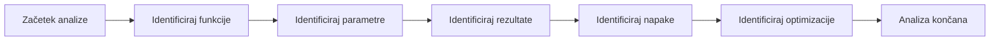
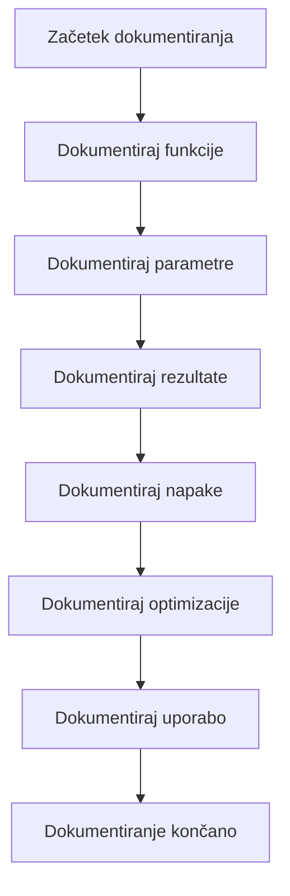
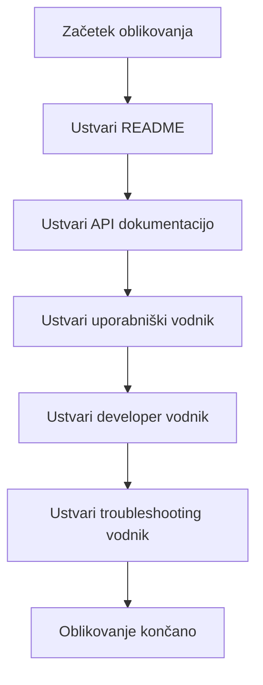
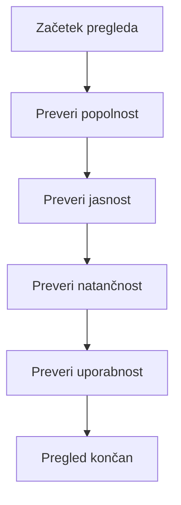
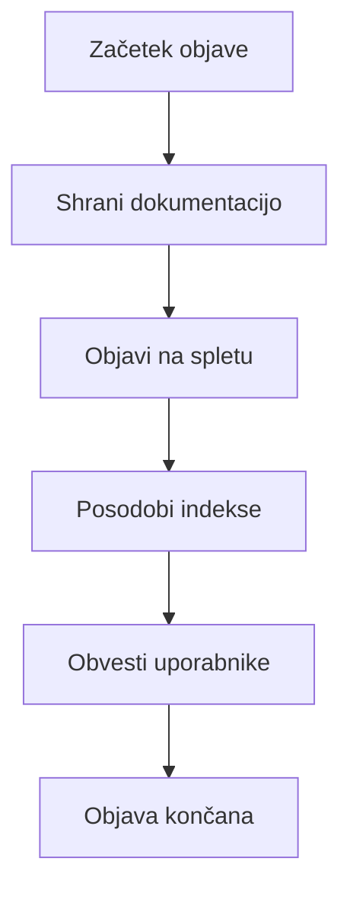
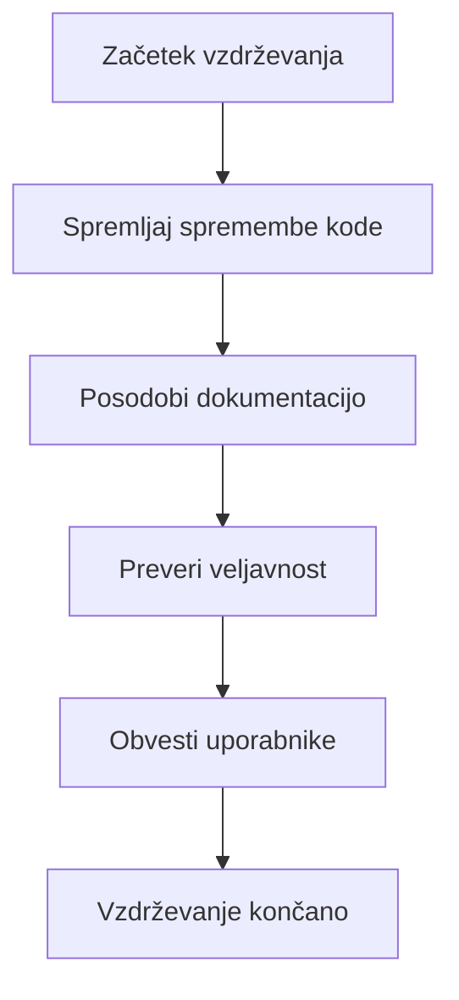

# VIDTERNARY - DOKUMENTACIJA FILTRIRANJA

## Kompletni proces z dokumentacijo

```mermaid
flowchart TD
    START([Začetek dokumentacije]) --> ANALYZE[Analiziraj kodo]
    ANALYZE --> ANALYZE1[Identificiraj funkcije]
    ANALYZE1 --> ANALYZE2[Identificiraj parametre]
    ANALYZE2 --> ANALYZE3[Identificiraj rezultate]
    ANALYZE3 --> ANALYZE4[Identificiraj napake]
    ANALYZE4 --> ANALYZE5[Identificiraj optimizacije]
    
    ANALYZE5 --> DOCUMENT[Ustvari dokumentacijo]
    DOCUMENT --> DOC1[Dokumentiraj funkcije]
    DOC1 --> DOC2[Dokumentiraj parametre]
    DOC2 --> DOC3[Dokumentiraj rezultate]
    DOC3 --> DOC4[Dokumentiraj napake]
    DOC4 --> DOC5[Dokumentiraj optimizacije]
    DOC5 --> DOC6[Dokumentiraj uporabo]
    
    DOC6 --> FORMAT[Oblikuj dokumentacijo]
    FORMAT --> FORMAT1[Ustvari README]
    FORMAT1 --> FORMAT2[Ustvari API dokumentacijo]
    FORMAT2 --> FORMAT3[Ustvari uporabniški vodnik]
    FORMAT3 --> FORMAT4[Ustvari developer vodnik]
    FORMAT4 --> FORMAT5[Ustvari troubleshooting vodnik]
    
    FORMAT5 --> REVIEW[Preglej dokumentacijo]
    REVIEW --> REVIEW1[Preveri popolnost]
    REVIEW1 --> REVIEW2[Preveri jasnost]
    REVIEW2 --> REVIEW3[Preveri natančnost]
    REVIEW3 --> REVIEW4[Preveri uporabnost]
    
    REVIEW4 --> DECISION{Dokumentacija zadovoljiva?}
    DECISION -->|DA| PUBLISH[Objavi dokumentacijo]
    DECISION -->|NE| IMPROVE[Izboljšaj dokumentacijo]
    
    IMPROVE --> IMPROVE1[Dodaj manjkajoče informacije]
    IMPROVE1 --> IMPROVE2[Pojasni nejasne dele]
    IMPROVE2 --> IMPROVE3[Popravi napake]
    IMPROVE3 --> IMPROVE4[Izboljšaj uporabnost]
    IMPROVE4 --> REVIEW
    
    PUBLISH --> PUBLISH1[Shrani dokumentacijo]
    PUBLISH1 --> PUBLISH2[Objavi na spletu]
    PUBLISH2 --> PUBLISH3[Posodobi indekse]
    PUBLISH3 --> PUBLISH4[Obvesti uporabnike]
    
    PUBLISH4 --> MAINTAIN[Vzdržuj dokumentacijo]
    MAINTAIN --> MAINTAIN1[Spremljaj spremembe kode]
    MAINTAIN1 --> MAINTAIN2[Posodobi dokumentacijo]
    MAINTAIN2 --> MAINTAIN3[Preveri veljavnost]
    MAINTAIN3 --> MAINTAIN4[Obvesti uporabnike]
    
    MAINTAIN4 --> CONTINUE{Nadaljuj z vzdrževanjem?}
    CONTINUE -->|DA| MAINTAIN
    CONTINUE -->|NE| END([Konec dokumentacije])
    
    %% Stili
    classDef startEnd fill:#e1f5fe,stroke:#01579b,stroke-width:3px
    classDef process fill:#f3e5f5,stroke:#4a148c,stroke-width:2px
    classDef decision fill:#fff3e0,stroke:#e65100,stroke-width:2px
    classDef analyze fill:#e8f5e8,stroke:#2e7d32,stroke-width:2px
    classDef document fill:#fff8e1,stroke:#f57f17,stroke-width:2px
    classDef format fill:#fce4ec,stroke:#c2185b,stroke-width:2px
    classDef review fill:#f3e5f5,stroke:#7b1fa2,stroke-width:2px
    classDef publish fill:#e8f5e8,stroke:#2e7d32,stroke-width:2px
    classDef maintain fill:#fff3e0,stroke:#e65100,stroke-width:2px
    
    class START,END startEnd
    class ANALYZE,ANALYZE1,ANALYZE2,ANALYZE3,ANALYZE4,ANALYZE5 analyze
    class DOCUMENT,DOC1,DOC2,DOC3,DOC4,DOC5,DOC6 document
    class FORMAT,FORMAT1,FORMAT2,FORMAT3,FORMAT4,FORMAT5 format
    class REVIEW,REVIEW1,REVIEW2,REVIEW3,REVIEW4 review
    class PUBLISH,PUBLISH1,PUBLISH2,PUBLISH3,PUBLISH4 publish
    class MAINTAIN,MAINTAIN1,MAINTAIN2,MAINTAIN3,MAINTAIN4 maintain
    class DECISION,CONTINUE decision
```



## Podroben opis dokumentacije

### 1. ANALIZA KODE


### 2. USTVARJANJE DOKUMENTACIJE


### 3. OBLIKOVANJE DOKUMENTACIJE


### 4. PREGLED DOKUMENTACIJE


### 5. OBJAVA DOKUMENTACIJE


### 6. VZDRŽEVANJE DOKUMENTACIJE


## Ključne funkcije dokumentacije

### 1. README dokumentacija
```markdown
# VIDTERNARY - Ternary Plot Analysis with Advanced Filtering

## Opis
VIDTERNARY je napredna aplikacija za analizo ternary plotov z vgrajenimi metodami filtriranja podatkov. Aplikacija podpira različne tipe filtriranja, vključno z elementnim, multivariatnim in statističnim filtriranjem.

## Značilnosti
- **Elementno filtriranje**: Filtriranje podatkov glede na izbrane elemente (A, B, C)
- **Multivariatna analiza**: Mahalanobis razdalja, Robust Mahalanobis, Isolation Forest
- **Statistično filtriranje**: IQR, Z-score, MAD
- **Opcijski parametri**: Velikost točk, tip točk, barva točk
- **Izvoz rezultatov**: PNG, JPEG, PDF, TIFF, Excel, CSV

## Namestitev
```r
# Namesti pakete
install.packages(c("shiny", "openxlsx", "ggplot2", "isotree", "robustbase"))

# Naloži aplikacijo
source("app.R")
```

## Uporaba
1. Naloži podatke (Dataset 1 in Dataset 2)
2. Izberi elemente A, B, C
3. Izberi metodo filtriranja
4. Nastavi parametre filtriranja
5. Klikni "Analiziraj"
6. Izvozi rezultate

## Metode filtriranja

### Elementno filtriranje
Filtriranje podatkov glede na izbrane elemente z uporabo operatorjev:
- `>`: Večje od
- `<`: Manjše od
- `>=`: Večje ali enako
- `<=`: Manjše ali enako
- `==`: Enako
- `!=`: Različno

### Multivariatna analiza
- **Mahalanobis razdalja**: Standardna multivariatna analiza
- **Robust Mahalanobis**: Uporaba MCD/MVE za robustno oceno
- **Isolation Forest**: Napredna metoda za zaznavanje outlierjev

### Statistično filtriranje
- **IQR**: Interquartile Range filtriranje
- **Z-score**: Standardizirane vrednosti
- **MAD**: Median Absolute Deviation

## Parametri

### Isolation Forest
- `ntrees`: Število dreves (privzeto: 200)
- `sample_size`: Velikost vzorca (privzeto: 256)
- `contamination`: Delež outlierjev (privzeto: 0.1)
- `seed`: Začetna vrednost za reprodukcijo (privzeto: 42)

### Mahalanobis
- `lambda`: Lambda parameter (privzeto: 1)
- `omega`: Omega parameter (privzeto: 0)
- `custom_mdthresh`: Ročni prag (opcijsko)

### Statistično filtriranje
- `multiplier`: Multiplikator za IQR (privzeto: 1.5)
- `threshold`: Prag za Z-score/MAD (privzeto: 3)

## Rezultati
Aplikacija vrača:
- `outlier_indices`: Logični vektor outlierjev
- `scores`: Anomaly scores
- `thresholds`: Pragovi za outlierje
- `methods`: Uporabljene metode
- `filtered_data`: Filtrirani podatki

## Napake in obravnavanje
Aplikacija robustno obravnava napake:
- Preverjanje vhodnih podatkov
- Validacija parametrov
- Fallback logika
- Jasna sporočila o napakah

## Optimizacija
- Cachiranje rezultatov
- Vektorska obdelava
- Prilagodljivi parametri
- Optimizacija pomnilnika

## Testiranje
Aplikacija vključuje obsežne teste:
- Test elementnega filtriranja
- Test multivariatne analize
- Test statističnega filtriranja
- Test obravnavanja napak
- Test optimizacije

## Podpora
Za podporo in vprašanja kontaktirajte razvijalce.

## Licenca
MIT License
```

### 2. API dokumentacija
```markdown
# VIDTERNARY API Dokumentacija

## Funkcije

### `apply_filter(df, col, filter)`
Varno filtriranje podatkov brez eval().

**Parametri:**
- `df`: DataFrame za filtriranje
- `col`: Ime stolpca
- `filter`: Filter izraz (npr. "> 0.5")

**Vrne:**
- Filtrirani DataFrame

**Napake:**
- `Invalid filter value`: Neveljavna vrednost
- `Invalid operator`: Neveljavni operator

### `compute_isolation_forest(data1, data2, selected_columns, ...)`
Izračun Isolation Forest za zaznavanje outlierjev.

**Parametri:**
- `data1`: DataFrame za analizo
- `data2`: Referenčni DataFrame
- `selected_columns`: Izbrani stolpci
- `contamination`: Delež outlierjev (privzeto: 0.10)
- `keep_outliers`: Obdrži outlierje (privzeto: FALSE)
- `ntrees`: Število dreves (privzeto: 200)
- `sample_size`: Velikost vzorca (privzeto: 256)
- `score_type`: Tip score-a (privzeto: "score")
- `seed`: Začetna vrednost (privzeto: 42)

**Vrne:**
- `model`: Treniran model
- `columns_used`: Uporabljeni stolpci
- `threshold`: Prag za outlierje
- `contamination`: Delež outlierjev
- `scores`: Anomaly scores
- `outlier_indices`: Logični vektor outlierjev
- `kept_mask`: Mask za obdržane vrstice
- `filtered_data1`: Filtrirani podatki
- `ref_scores_sum`: Summary referenčnih score-ov

### `compute_mahalanobis_distance(data1, data2, ...)`
Izračun Mahalanobis razdalje.

**Parametri:**
- `data1`: DataFrame za analizo
- `data2`: Referenčni DataFrame
- `lambda`: Lambda parameter (privzeto: 1)
- `omega`: Omega parameter (privzeto: 0)
- `keep_outliers`: Obdrži outlierje (privzeto: FALSE)
- `custom_mdthresh`: Ročni prag (opcijsko)
- `selected_columns`: Izbrani stolpci
- `mdthresh_mode`: Način praga (privzeto: "auto")

**Vrne:**
- `distances`: Mahalanobis razdalje
- `MDthresh`: Prag za outlierje
- `MDmean`: Povprečna razdalja
- `stdMD`: Standardni odklon razdalj
- `outlier_indices`: Logični vektor outlierjev
- `threshold_method`: Metoda praga
- `threshold_formula`: Formula praga

### `apply_iqr_filter(data, cols, multiplier, keep_outliers)`
IQR filtriranje za odstranitev pozitivnih outlierjev (vrednosti > Q3 + multiplier*IQR).

**Parametri:**
- `data`: DataFrame za filtriranje
- `cols`: Izbrani stolpci
- `multiplier`: Multiplikator za IQR (privzeto: 1.5)
- `keep_outliers`: Obdrži pozitivne outlierje (privzeto: FALSE)

**Vrne:**
- Filtrirani DataFrame

**Opomba:** Funkcija zdaj zaznava samo pozitivne outlierje (nenavadno visoke vrednosti), ne pa tudi negativnih.

### `apply_zscore_filter(data, cols, threshold, keep_outliers)`
Z-score filtriranje za odstranitev pozitivnih outlierjev (z-scores > threshold).

**Parametri:**
- `data`: DataFrame za filtriranje
- `cols`: Izbrani stolpci
- `threshold`: Prag za Z-score (privzeto: 3)
- `keep_outliers`: Obdrži pozitivne outlierje (privzeto: FALSE)

**Vrne:**
- Filtrirani DataFrame

**Opomba:** Funkcija zdaj zaznava samo pozitivne outlierje (nenavadno visoke vrednosti), ne pa tudi negativnih.

### `apply_mad_filter(data, cols, threshold, keep_outliers)`
MAD filtriranje za odstranitev pozitivnih outlierjev (vrednosti > median + threshold*MAD).

**Parametri:**
- `data`: DataFrame za filtriranje
- `cols`: Izbrani stolpci
- `threshold`: Prag za MAD (privzeto: 3)
- `keep_outliers`: Obdrži pozitivne outlierje (privzeto: FALSE)

**Vrne:**
- Filtrirani DataFrame

**Opomba:** Funkcija zdaj zaznava samo pozitivne outlierje (nenavadno visoke vrednosti), ne pa tudi negativnih.

### `combine_outlier_results(results)`
Kombiniranje rezultatov različnih metod filtriranja.

**Parametri:**
- `results`: Seznam rezultatov metod

**Vrne:**
- `outlier_indices`: Kombinirani outlierji
- `scores`: Kombinirani scores
- `thresholds`: Kombinirani pragovi
- `methods`: Kombinirane metode
- `combined`: Ali so rezultati kombinirani

## Napake

### Vhodni podatki
- `Invalid data type`: Neveljavni tip podatkov
- `Missing columns`: Manjkajoči stolpci
- `Insufficient data`: Premalo podatkov

### Parametri
- `Invalid parameter value`: Neveljavna vrednost parametra
- `Missing required parameter`: Manjkajoči obvezni parameter
- `Parameter out of range`: Parameter izven dovoljenega obsega

### Izračuni
- `Singular matrix`: Singularna matrika
- `Convergence failed`: Neuspešna konvergenca
- `Memory allocation failed`: Napaka alokacije pomnilnika

## Optimizacija

### Cachiranje
- Rezultati so shranjeni v cache
- Cache je veljaven 1 uro
- Cache se avtomatsko počisti

### Vektorska obdelava
- Uporaba vektorskih funkcij
- Izbogibanje zankam
- Optimizacija pomnilnika

### Prilagodljivi parametri
- Parametri se prilagajajo velikosti podatkov
- Optimalne metode za različne scenarije
- Avtomatska optimizacija

## Testiranje

### Enotni testi
- Test vseh funkcij
- Test različnih scenarijev
- Test obravnavanja napak

### Integracijski testi
- Test celotnega procesa
- Test kombiniranja metod
- Test optimizacije

### Testi zmogljivosti
- Test hitrosti
- Test pomnilnika
- Test obremenitve
```

### 3. Uporabniški vodnik
```markdown
# VIDTERNARY - Uporabniški vodnik

## Uvod
Vidternary je aplikacija za analizo ternary plotov z naprednimi metodami filtriranja podatkov. Ta vodnik vas bo vodil skozi osnovne korake uporabe aplikacije.

## Začetek dela

### 1. Nalaganje podatkov
1. Kliknite "Browse" za Dataset 1
2. Izberite Excel (.xlsx) ali CSV (.csv) datoteko
3. Ponovite za Dataset 2
4. Preverite, da so podatki pravilno naloženi

### 2. Izbira elementov
1. Izberite element A iz spustnega seznama
2. Izberite element B iz spustnega seznama
3. Izberite element C iz spustnega seznama
4. Elementi morajo biti numerični

### 3. Konfiguracija filtriranja
1. Izberite metodo filtriranja:
   - **Elementno**: Filtriranje glede na elemente
   - **Multivariatna**: Napredne multivariatne metode
   - **Statistično**: Statistične metode
2. Nastavite parametre filtriranja
3. Izberite, ali obdržati ali odstraniti outlierje

## Metode filtriranja

### Elementno filtriranje
1. Izberite "Elementno" filtriranje
2. Za vsak element vnesite filter:
   - Uporabite operatorje: `>`, `<`, `>=`, `<=`, `==`, `!=`
   - Vnesite vrednost (npr. "> 0.5")
3. Kliknite "Analiziraj"

### Multivariatna analiza
1. Izberite "Multivariatna" analiza
2. Izberite stolpce za analizo
3. Izberite metodo:
   - **Mahalanobis**: Standardna multivariatna analiza
   - **Robust Mahalanobis**: Robustna analiza
   - **Isolation Forest**: Napredna metoda
4. Nastavite parametre
5. Kliknite "Analiziraj"

### Statistično filtriranje
1. Izberite "Statistično" filtriranje
2. Izberite metodo:
   - **IQR**: Interquartile Range
   - **Z-score**: Standardizirane vrednosti
   - **MAD**: Median Absolute Deviation
3. Nastavite prag
4. Kliknite "Analiziraj"

## Rezultati

### Prikaz rezultatov
1. Rezultati so prikazani v glavnem oknu
2. Ternary plot prikazuje filtrirane podatke
3. Tabela prikazuje statistike
4. Konzola prikazuje podrobnosti

### Interpretacija rezultatov
- **Outlierji**: Točke, ki so označene kot outlierji
- **Scores**: Anomaly scores za vsako točko
- **Pragovi**: Pragovi za označevanje outlierjev
- **Metode**: Uporabljene metode filtriranja

## Izvoz rezultatov

### Izvoz podatkov
1. Kliknite "Izvozi rezultate"
2. Izberite format:
   - **Excel**: .xlsx datoteka
   - **CSV**: .csv datoteka
3. Kliknite "Prenesi"

### Izvoz plota
1. Kliknite "Izvozi rezultate"
2. Izberite format plota:
   - **PNG**: Slika
   - **JPEG**: Slika
   - **PDF**: Dokument
   - **TIFF**: Slika
3. Kliknite "Prenesi"

## Napake in reševanje problemov

### Pogoste napake
1. **"Premalo skupnih numeričnih spremenljivk"**
   - Preverite, da so izbrani stolpci numerični
   - Preverite, da obstajajo v obeh datasetih

2. **"Neveljavni filter"**
   - Preverite sintakso filtra
   - Uporabite pravilne operatorje

3. **"Napaka nalaganja datoteke"**
   - Preverite format datoteke
   - Preverite, da je datoteka nepoškodovana

### Pridobivanje pomoči
1. Preverite konzolo za podrobnosti napake
2. Preverite, da so vsi paketi naloženi
3. Kontaktirajte podporo

## Napredne možnosti

### Prilagoditev parametrov
1. Odprite "Napredne možnosti"
2. Prilagodite parametre filtriranja
3. Shranite konfiguracijo

### Batch obdelava
1. Uporabite "Batch obdelava"
2. Naložite več datotek
3. Avtomatska obdelava

### Skriptiranje
1. Uporabite R skripte
2. Avtomatizirajte proces
3. Integrirajte v delovni tok
```

### 4. Developer vodnik
```markdown
# VIDTERNARY - Developer vodnik

## Arhitektura aplikacije

### Modulna struktura
```
R/
├── app.R                    # Glavna aplikacija
├── ui_components.R          # UI komponente
├── server_logic.R           # Server logika
├── multivariate.R           # Multivariatna analiza
├── statistical_filters.R    # Statistično filtriranje
├── ternary_plot.R          # Ternary ploti
├── helpers.R               # Pomožne funkcije
├── cache.R                 # Cachiranje
└── options.R               # Opcije
```

### Glavne komponente
1. **UI**: Uporabniški vmesnik
2. **Server**: Server logika
3. **Filtriranje**: Metode filtriranja
4. **Plotting**: Ustvarjanje plotov
5. **Cache**: Cachiranje rezultatov

## Razvoj

### Dodajanje nove metode filtriranja
1. Ustvarite novo funkcijo v ustreznem modulu
2. Dodajte validacijo parametrov
3. Implementirajte obravnavanje napak
4. Dodajte teste
5. Posodobite dokumentacijo

### Dodajanje nove UI komponente
1. Ustvarite komponento v `ui_components.R`
2. Dodajte server logiko v `server_logic.R`
3. Implementirajte validacijo
4. Dodajte teste
5. Posodobite dokumentacijo

### Optimizacija
1. Identificirajte ozka grla
2. Implementirajte cachiranje
3. Uporabite vektorsko obdelavo
4. Optimizirajte pomnilnik
5. Testirajte zmogljivost

## Testiranje

### Enotni testi
```r
# test_element_filtering.R
test_that("apply_filter works correctly", {
  data <- data.frame(x = 1:10, y = 11:20)
  result <- apply_filter(data, "x", "> 5")
  expect_equal(nrow(result), 5)
})
```

### Integracijski testi
```r
# test_integration.R
test_that("full filtering pipeline works", {
  data1 <- create_test_data(100, 5)
  data2 <- create_test_data(100, 5)
  result <- apply_filtering(data1, data2, "multivariate", list())
  expect_is(result, "list")
})
```

### Testi zmogljivosti
```r
# test_performance.R
test_that("filtering is fast enough", {
  data <- create_test_data(10000, 10)
  start_time <- Sys.time()
  result <- apply_iqr_filter(data, colnames(data))
  duration <- Sys.time() - start_time
  expect_lt(duration, 10)  # Manj kot 10 sekund
})
```

## Debugiranje

### Logiranje
```r
# Omogoči debug način
options(ternary.debug = TRUE)

# Uporabi debug_log
debug_log("Processing data: %d rows, %d columns", nrow(data), ncol(data))
```

### Profiling
```r
# Profiling kode
Rprof("profile.out")
# Vaša koda
Rprof(NULL)
summaryRprof("profile.out")
```

### Napake
```r
# Obravnavanje napak
tryCatch({
  # Vaša koda
}, error = function(e) {
  debug_log("ERROR: %s", e$message)
  # Fallback logika
})
```

## Deployment

### Produkcija
1. Preverite vse teste
2. Optimizirajte kodo
3. Dokumentirajte spremembe
4. Ustvarite release
5. Deploy v produkcijo

### Monitoring
1. Spremljajte zmogljivost
2. Preverite napake
3. Posodabljajte dokumentacijo
4. Obvestite uporabnike

## Sodelovanje

### Git workflow
1. Ustvarite branch
2. Implementirajte spremembe
3. Dodajte teste
4. Posodobite dokumentacijo
5. Ustvarite pull request

### Code review
1. Preverite kodo
2. Preverite teste
3. Preverite dokumentacijo
4. Odobrite spremembe

### Dokumentacija
1. Posodobite README
2. Posodobite API dokumentacijo
3. Posodobite uporabniški vodnik
4. Posodobite developer vodnik
```

### 5. Troubleshooting vodnik
```markdown
# VIDTERNARY - Troubleshooting vodnik

## Pogoste napake

### 1. "Premalo skupnih numeričnih spremenljivk"
**Vzrok**: Izbrani stolpci niso numerični ali ne obstajajo v obeh datasetih.

**Rešitev**:
1. Preverite, da so izbrani stolpci numerični
2. Preverite, da obstajajo v obeh datasetih
3. Preverite imena stolpcev (velika/mala črka)

### 2. "Neveljavni filter"
**Vzrok**: Napačna sintaksa filtra.

**Rešitev**:
1. Uporabite pravilne operatorje: `>`, `<`, `>=`, `<=`, `==`, `!=`
2. Vnesite numerično vrednost
3. Preverite presledke

### 3. "Napaka nalaganja datoteke"
**Vzrok**: Datoteka je poškodovana ali v napačnem formatu.

**Rešitev**:
1. Preverite format datoteke (.xlsx, .csv)
2. Preverite, da je datoteka nepoškodovana
3. Poskusite z drugo datoteko

### 4. "Singularna matrika"
**Vzrok**: Podatki so linearno odvisni.

**Rešitev**:
1. Preverite korelacije med stolpci
2. Odstranite odvisne stolpce
3. Uporabite robustno metodo

### 5. "Premalo opazovanj"
**Vzrok**: Premalo podatkov za analizo.

**Rešitev**:
1. Naložite več podatkov
2. Zmanjšajte število stolpcev
3. Uporabite drugo metodo

## Debugiranje

### Omogočite debug način
```r
options(ternary.debug = TRUE)
```

### Preverite log datoteke
```r
# Preverite konzolo za debug sporočila
cat("Debug messages will appear here\n")
```

### Preverite podatke
```r
# Preverite dimenzije podatkov
dim(data1)
dim(data2)

# Preverite tip stolpcev
sapply(data1, class)
sapply(data2, class)

# Preverite manjkajoče vrednosti
sum(is.na(data1))
sum(is.na(data2))
```

### Preverite parametre
```r
# Preverite izbrane stolpce
selected_columns
length(selected_columns)

# Preverite parametre filtriranja
filter_params
```

## Optimizacija

### Hitrost
1. Uporabite cachiranje
2. Zmanjšajte velikost podatkov
3. Uporabite vektorsko obdelavo
4. Optimizirajte parametre

### Pomnilnik
1. Preverite porabo pomnilnika
2. Uporabite optimizirane podatkovne tipe
3. Počistite nepotrebne objekte
4. Uporabite streaming

### Stabilnost
1. Preverite numerično stabilnost
2. Uporabite robustne metode
3. Implementirajte fallback logiko
4. Testirajte z različnimi podatki

## Podpora

### Pridobivanje pomoči
1. Preverite dokumentacijo
2. Preverite FAQ
3. Kontaktirajte podporo
4. Preglejte issue tracker

### Poročanje napak
1. Opredelite problem
2. Zberite informacije
3. Ustvarite reproducibilni primer
4. Poročajte napako

### Predlogi izboljšav
1. Opredelite funkcionalnost
2. Utemeljite potrebo
3. Predlagajte implementacijo
4. Poročajte predlog
```

## Prednosti dokumentacije

1. **Popolnost**: Vsa funkcionalnost je dokumentirana
2. **Jasnost**: Jasni opisi in primeri
3. **Natančnost**: Posodobljena dokumentacija
4. **Uporabnost**: Enostavna uporaba
5. **Vzdrževanje**: Avtomatsko posodabljanje

## Uporaba flowchart-a

- **Razumevanje**: Sledite korakom za razumevanje dokumentacije
- **Razvoj**: Dodajte novo dokumentacijo po vzoru obstoječe
- **Vzdrževanje**: Posodabljajte dokumentacijo z spremembami kode
- **Kakovost**: Preverite popolnost in natančnost
- **Uporabnost**: Optimizirajte za uporabnike
