# VIDTERNARY - OBRAVNAVANJE NAPAK V FILTRIRANJU

## Kompletni proces z obravnavanjem napak

```mermaid
flowchart TD
    START([Začetek filtriranja]) --> INPUT[Prejmi vhodne podatke]
    INPUT --> VALIDATE[Preveri vhodne podatke]
    
    VALIDATE --> VALIDATE1[Preveri data.frame]
    VALIDATE1 --> VALIDATE2[Preveri selected_columns]
    VALIDATE2 --> VALIDATE3[Preveri filter_params]
    VALIDATE3 --> VALIDATE4[Preveri numeričnost stolpcev]
    
    VALIDATE1 -->|Napaka| ERROR1[Stop: Neveljavni podatki]
    VALIDATE2 -->|Napaka| ERROR2[Stop: Neveljavni stolpci]
    VALIDATE3 -->|Napaka| ERROR3[Stop: Neveljavni parametri]
    VALIDATE4 -->|Napaka| ERROR4[Stop: Nenumerični stolpci]
    
    VALIDATE4 --> FILTER_TYPE{Metoda filtriranja}
    
    %% Elementno filtriranje
    FILTER_TYPE -->|Elementno| ELEM[Elementno filtriranje]
    ELEM --> ELEM1[apply_individual_filters]
    ELEM1 --> ELEM2[Preveri element A]
    ELEM2 --> ELEM3[Preveri element B]
    ELEM3 --> ELEM4[Preveri element C]
    
    ELEM4 --> ELEM5{Posamezni filtri?}
    ELEM5 -->|DA| ELEM6[Uporabi individual_filters]
    ELEM5 -->|NE| ELEM7[Uporabi element$filter]
    
    ELEM6 --> ELEM8[apply_filter za vsak element]
    ELEM7 --> ELEM8
    ELEM8 --> ELEM9[Preveri operatorje]
    ELEM9 --> ELEM10[Pretvori v numerične vrednosti]
    ELEM10 --> ELEM11[Uporabi filtriranje]
    ELEM11 --> ELEM12[Vrne filtrirane podatke]
    
    ELEM9 -->|Napaka| ERROR5[Stop: Neveljavni operatorji]
    ELEM10 -->|Napaka| ERROR6[Stop: Neveljavne vrednosti]
    ELEM11 -->|Napaka| ERROR7[Stop: Napaka filtriranja]
    
    %% Multivariatna analiza
    FILTER_TYPE -->|Multivariatna| MULTI[Multivariatna analiza]
    MULTI --> MULTI1[validate_multivariate_data]
    MULTI1 --> MULTI2[Preveri stolpce]
    MULTI2 --> MULTI3[Preveri opazovanja]
    MULTI3 --> MULTI4[Preveri korelacije]
    MULTI4 --> MULTI5[Preveri numerično stabilnost]
    
    MULTI2 -->|Napaka| ERROR8[Stop: Neveljavni stolpci]
    MULTI3 -->|Napaka| ERROR9[Stop: Premalo opazovanj]
    MULTI4 -->|Napaka| ERROR10[Stop: Visoke korelacije]
    MULTI5 -->|Napaka| ERROR11[Stop: Numerična nestabilnost]
    
    MULTI5 --> MULTI_METHOD{Metoda}
    MULTI_METHOD -->|Mahalanobis| MAH[compute_mahalanobis_distance]
    MULTI_METHOD -->|Robust Mahalanobis| ROB[compute_robust_mahalanobis]
    MULTI_METHOD -->|Isolation Forest| ISO[compute_isolation_forest]
    
    MAH --> MAH1[Izračunaj kovarianco]
    MAH1 --> MAH2[Preveri singularnost]
    MAH2 --> MAH3[Izračunaj razdalje]
    MAH3 --> MAH4[Nastavi prag]
    MAH4 --> MAH5[Označi outlierje]
    
    MAH2 -->|Napaka| ERROR12[Stop: Singularna matrika]
    MAH3 -->|Napaka| ERROR13[Stop: Napaka izračuna razdalj]
    MAH4 -->|Napaka| ERROR14[Stop: Napaka nastavitve praga]
    
    ROB --> ROB1[Uporabi MCD/MVE]
    ROB1 --> ROB2[Robustna kovarianca]
    ROB2 --> ROB3[Robustne razdalje]
    ROB3 --> ROB4[Robustni prag]
    ROB4 --> ROB5[Označi outlierje]
    
    ROB2 -->|Napaka| ERROR15[Stop: Napaka robustne kovariance]
    ROB3 -->|Napaka| ERROR16[Stop: Napaka robustnih razdalj]
    ROB4 -->|Napaka| ERROR17[Stop: Napaka robustnega praga]
    
    ISO --> ISO1[Nastavi parametre]
    ISO1 --> ISO2[Treniraj model]
    ISO2 --> ISO3[Izračunaj score]
    ISO3 --> ISO4[Nastavi prag]
    ISO4 --> ISO5[Označi outlierje]
    
    ISO2 -->|Napaka| ERROR18[Stop: Napaka treniranja modela]
    ISO3 -->|Napaka| ERROR19[Stop: Napaka izračuna score-ov]
    ISO4 -->|Napaka| ERROR20[Stop: Napaka nastavitve praga]
    
    MAH5 --> MULTI_RES[Rezultati multivariatne analize]
    ROB5 --> MULTI_RES
    ISO5 --> MULTI_RES
    
    %% Statistično filtriranje
    FILTER_TYPE -->|Statistično| STAT[Statistično filtriranje]
    STAT --> STAT_METHOD{Statistična metoda}
    
    STAT_METHOD -->|IQR| IQR[apply_iqr_filter]
    STAT_METHOD -->|Z-score| ZSC[apply_zscore_filter]
    STAT_METHOD -->|MAD| MAD[apply_mad_filter]
    
    IQR --> IQR1[Izračunaj Q1, Q3]
    IQR1 --> IQR2[Izračunaj IQR]
    IQR2 --> IQR3[Nastavi meje]
    IQR3 --> IQR4[Označi outlierje]
    
    IQR1 -->|Napaka| ERROR21[Stop: Napaka izračuna kvantilov]
    IQR2 -->|Napaka| ERROR22[Stop: Napaka izračuna IQR]
    IQR3 -->|Napaka| ERROR23[Stop: Napaka nastavitve mej]
    
    ZSC --> ZSC1[Izračunaj povprečje, std]
    ZSC1 --> ZSC2[Izračunaj Z-score]
    ZSC2 --> ZSC3[Preveri prag]
    ZSC3 --> ZSC4[Označi outlierje]
    
    ZSC1 -->|Napaka| ERROR24[Stop: Napaka izračuna statistike]
    ZSC2 -->|Napaka| ERROR25[Stop: Napaka izračuna Z-score]
    ZSC3 -->|Napaka| ERROR26[Stop: Napaka preverjanja praga]
    
    MAD --> MAD1[Izračunaj mediano]
    MAD1 --> MAD2[Izračunaj MAD]
    MAD2 --> MAD3[Nastavi meje]
    MAD3 --> MAD4[Označi outlierje]
    
    MAD1 -->|Napaka| ERROR27[Stop: Napaka izračuna mediane]
    MAD2 -->|Napaka| ERROR28[Stop: Napaka izračuna MAD]
    MAD3 -->|Napaka| ERROR29[Stop: Napaka nastavitve mej]
    
    IQR4 --> STAT_RES[Rezultati statističnega filtriranja]
    ZSC4 --> STAT_RES
    MAD4 --> STAT_RES
    
    %% Kombiniranje rezultatov
    ELEM12 --> COMBINE[Kombiniraj rezultate]
    MULTI_RES --> COMBINE
    STAT_RES --> COMBINE
    
    COMBINE --> COMBINE1[Združi outlier_indices]
    COMBINE1 --> COMBINE2[Združi scores]
    COMBINE2 --> COMBINE3[Združi thresholds]
    COMBINE3 --> COMBINE4[Združi metode]
    
    COMBINE1 -->|Napaka| ERROR30[Stop: Napaka kombiniranja rezultatov]
    COMBINE2 -->|Napaka| ERROR31[Stop: Napaka kombiniranja score-ov]
    COMBINE3 -->|Napaka| ERROR32[Stop: Napaka kombiniranja pragov]
    COMBINE4 -->|Napaka| ERROR33[Stop: Napaka kombiniranja metod]
    
    COMBINE4 --> FINAL_CHOICE{Obdrži outlierje?}
    FINAL_CHOICE -->|DA| KEEP[Obdrži samo outlierje]
    FINAL_CHOICE -->|NE| REMOVE[Odstrani outlierje]
    
    KEEP --> FINAL_DATA[Končni filtrirani podatki]
    REMOVE --> FINAL_DATA
    
    FINAL_DATA --> RETURN[Vrne rezultate]
    RETURN --> RETURN1[outlier_indices]
    RETURN --> RETURN2[scores]
    RETURN --> RETURN3[thresholds]
    RETURN --> RETURN4[methods]
    RETURN --> RETURN5[filtered_data]
    
    RETURN1 --> END([Konec])
    RETURN2 --> END
    RETURN3 --> END
    RETURN4 --> END
    RETURN5 --> END
    
    %% Napake
    ERROR1 --> ERROR_HANDLER[Obravnavaj napako]
    ERROR2 --> ERROR_HANDLER
    ERROR3 --> ERROR_HANDLER
    ERROR4 --> ERROR_HANDLER
    ERROR5 --> ERROR_HANDLER
    ERROR6 --> ERROR_HANDLER
    ERROR7 --> ERROR_HANDLER
    ERROR8 --> ERROR_HANDLER
    ERROR9 --> ERROR_HANDLER
    ERROR10 --> ERROR_HANDLER
    ERROR11 --> ERROR_HANDLER
    ERROR12 --> ERROR_HANDLER
    ERROR13 --> ERROR_HANDLER
    ERROR14 --> ERROR_HANDLER
    ERROR15 --> ERROR_HANDLER
    ERROR16 --> ERROR_HANDLER
    ERROR17 --> ERROR_HANDLER
    ERROR18 --> ERROR_HANDLER
    ERROR19 --> ERROR_HANDLER
    ERROR20 --> ERROR_HANDLER
    ERROR21 --> ERROR_HANDLER
    ERROR22 --> ERROR_HANDLER
    ERROR23 --> ERROR_HANDLER
    ERROR24 --> ERROR_HANDLER
    ERROR25 --> ERROR_HANDLER
    ERROR26 --> ERROR_HANDLER
    ERROR27 --> ERROR_HANDLER
    ERROR28 --> ERROR_HANDLER
    ERROR29 --> ERROR_HANDLER
    ERROR30 --> ERROR_HANDLER
    ERROR31 --> ERROR_HANDLER
    ERROR32 --> ERROR_HANDLER
    ERROR33 --> ERROR_HANDLER
    
    ERROR_HANDLER --> ERROR_LOG[Zabeleži napako]
    ERROR_LOG --> ERROR_MSG[Prikaži sporočilo uporabniku]
    ERROR_MSG --> ERROR_RECOVER[Poskusi obnovitev]
    ERROR_RECOVER --> ERROR_END[Konec z napako]
    
    ERROR_END --> END
    
    %% Stili
    classDef startEnd fill:#e1f5fe,stroke:#01579b,stroke-width:3px
    classDef process fill:#f3e5f5,stroke:#4a148c,stroke-width:2px
    classDef decision fill:#fff3e0,stroke:#e65100,stroke-width:2px
    classDef element fill:#fce4ec,stroke:#c2185b,stroke-width:2px
    classDef multivariate fill:#e8f5e8,stroke:#2e7d32,stroke-width:2px
    classDef statistical fill:#fff8e1,stroke:#f57f17,stroke-width:2px
    classDef error fill:#ffebee,stroke:#c62828,stroke-width:2px
    classDef result fill:#f3e5f5,stroke:#7b1fa2,stroke-width:2px
    classDef errorHandler fill:#fce4ec,stroke:#c2185b,stroke-width:2px
    
    class START,END startEnd
    class INPUT,VALIDATE,VALIDATE1,VALIDATE2,VALIDATE3,VALIDATE4,COMBINE,COMBINE1,COMBINE2,COMBINE3,COMBINE4,FINAL_DATA,RETURN,RETURN1,RETURN2,RETURN3,RETURN4,RETURN5 process
    class FILTER_TYPE,ELEM5,MULTI_METHOD,STAT_METHOD,FINAL_CHOICE decision
    class ELEM,ELEM1,ELEM2,ELEM3,ELEM4,ELEM6,ELEM7,ELEM8,ELEM9,ELEM10,ELEM11,ELEM12 element
    class MULTI,MULTI1,MULTI2,MULTI3,MULTI4,MULTI5,MAH,ROB,ISO,MAH1,MAH2,MAH3,MAH4,MAH5,ROB1,ROB2,ROB3,ROB4,ROB5,ISO1,ISO2,ISO3,ISO4,ISO5,MULTI_RES multivariate
    class STAT,IQR,ZSC,MAD,IQR1,IQR2,IQR3,IQR4,ZSC1,ZSC2,ZSC3,ZSC4,MAD1,MAD2,MAD3,MAD4,STAT_RES statistical
    class ERROR1,ERROR2,ERROR3,ERROR4,ERROR5,ERROR6,ERROR7,ERROR8,ERROR9,ERROR10,ERROR11,ERROR12,ERROR13,ERROR14,ERROR15,ERROR16,ERROR17,ERROR18,ERROR19,ERROR20,ERROR21,ERROR22,ERROR23,ERROR24,ERROR25,ERROR26,ERROR27,ERROR28,ERROR29,ERROR30,ERROR31,ERROR32,ERROR33 error
    class KEEP,REMOVE result
    class ERROR_HANDLER,ERROR_LOG,ERROR_MSG,ERROR_RECOVER,ERROR_END errorHandler
```



## Obravnavanje napak v kodi

### 1. Varno filtriranje z obravnavanjem napak
```r
apply_filter <- function(df, col, filter) {
  if (is.null(filter)) return(df)
  
  tryCatch({
    # Varno filtriranje brez eval()
    if (grepl("^[><=!]+", filter)) {
      operator <- gsub("^([><=!]+).*", "\\1", filter)
      value_str <- gsub("^([><=!]+)\\s*", "", filter)
      value <- as.numeric(value_str)
      
      if (is.na(value)) {
        stop("Invalid filter value: ", value_str)
      }
      
      switch(operator,
        ">" = df[df[[col]] > value, ],
        "<" = df[df[[col]] < value, ],
        ">=" = df[df[[col]] >= value, ],
        "<=" = df[df[[col]] <= value, ],
        "==" = df[df[[col]] == value, ],
        "!=" = df[df[[col]] != value, ],
        stop("Invalid operator: ", operator)
      )
    } else {
      stop("Invalid filter format")
    }
  }, error = function(e) {
    warning("Filtering failed for column ", col, ": ", e$message)
    return(df)  # Vrne originalne podatke v primeru napake
  })
}
```

### 2. Validacija multivariatnih podatkov z obravnavanjem napak
```r
validate_multivariate_data <- function(data1, data2, selected_columns, method, min_obs_ratio) {
  tryCatch({
    # Preveri obstoj stolpcev
    missing_in_data1 <- setdiff(selected_columns, colnames(data1))
    missing_in_data2 <- setdiff(selected_columns, colnames(data2))
    
    if (length(missing_in_data1) > 0) {
      stop("Selected columns missing in data1: ", paste(missing_in_data1, collapse = ", "))
    }
    if (length(missing_in_data2) > 0) {
      stop("Selected columns missing in data2: ", paste(missing_in_data2, collapse = ", "))
    }
    
    # Preveri numeričnost
    non_numeric_in_data1 <- selected_columns[!sapply(data1[, selected_columns, drop = FALSE], is.numeric)]
    non_numeric_in_data2 <- selected_columns[!sapply(data2[, selected_columns, drop = FALSE], is.numeric)]
    
    if (length(non_numeric_in_data1) > 0) {
      stop("Non-numeric selected columns in data1: ", paste(non_numeric_in_data1, collapse = ", "))
    }
    if (length(non_numeric_in_data2) > 0) {
      stop("Non-numeric selected columns in data2: ", paste(non_numeric_in_data2, collapse = ", "))
    }
    
    # Preveri minimalno število opazovanj
    n_vars <- length(selected_columns)
    n_obs1 <- nrow(data1_clean)
    n_obs2 <- nrow(data2_clean)
    
    if (n_obs1 < n_vars * min_obs_ratio) {
      stop(sprintf("Insufficient observations in data1: %d observations for %d variables", n_obs1, n_vars))
    }
    if (n_obs2 < n_vars * min_obs_ratio) {
      stop(sprintf("Insufficient observations in data2: %d observations for %d variables", n_obs2, n_vars))
    }
    
    # Preveri korelacije
    if (n_vars > 2) {
      cor_matrix1 <- cor(data1_clean, use = "pairwise.complete.obs")
      cor_matrix2 <- cor(data2_clean, use = "pairwise.complete.obs")
      
      high_cor1 <- which(abs(cor_matrix1) > 0.9 & cor_matrix1 != 1, arr.ind = TRUE)
      high_cor2 <- which(abs(cor_matrix2) > 0.9 & cor_matrix2 != 1, arr.ind = TRUE)
      
      if (nrow(high_cor1) > 0 || nrow(high_cor2) > 0) {
        warning("High correlations (>0.9) detected. This may cause multicollinearity issues.")
      }
    }
    
    # Preveri numerično stabilnost
    tryCatch({
      cov_matrix <- cov(data2_clean)
      eigenvals <- eigen(cov_matrix, only.values = TRUE)$values
      condition_number <- max(eigenvals) / min(eigenvals)
      
      if (condition_number > 1e10) {
        warning("High condition number detected. This may indicate numerical instability.")
      }
    }, error = function(e) {
      warning("Could not calculate condition number: ", e$message)
    })
    
    return(list(
      data1_clean = data1_clean,
      data2_clean = data2_clean,
      common_cols = selected_columns,
      n_vars = n_vars,
      n_obs1 = n_obs1,
      n_obs2 = n_obs2,
      condition_number = condition_number,
      high_correlations = high_correlations
    ))
  }, error = function(e) {
    # Logiranje napake
    debug_log("ERROR in validate_multivariate_data: %s", e$message)
    
    # Vrne varni rezultat
    return(list(
      data1_clean = data1,
      data2_clean = data2,
      common_cols = selected_columns,
      n_vars = length(selected_columns),
      n_obs1 = nrow(data1),
      n_obs2 = nrow(data2),
      condition_number = NA,
      high_correlations = NULL,
      error = e$message
    ))
  })
}
```

### 3. Robustno obravnavanje napak v Isolation Forest
```r
compute_isolation_forest <- function(data1, data2, selected_columns, contamination = 0.10, keep_outliers = FALSE, ntrees = 200, sample_size = 256, score_type = "score", seed = 42) {
  tryCatch({
    # Glavna logika
    stopifnot(is.data.frame(data1), is.data.frame(data2))
    
    if (!requireNamespace("isotree", quietly = TRUE)) {
      stop("Package 'isotree' is required for isolation forest outlier detection.")
    }
    
    # 1) Podnabor in čiščenje
    common_cols <- intersect(selected_columns, intersect(colnames(data1), colnames(data2)))
    if (length(common_cols) < 2L) stop("Premalo skupnih numeričnih spremenljivk.")
    
    X1 <- data1[, common_cols, drop = FALSE]
    X2 <- data2[, common_cols, drop = FALSE]
    
    # obdrži samo numerične stolpce
    num_cols <- names(X1)[vapply(X1, is.numeric, logical(1))]
    X1 <- X1[, num_cols, drop = FALSE]
    X2 <- X2[, num_cols, drop = FALSE]
    if (ncol(X1) < 2L) stop("Po filtriranju numeričnih je ostalo premalo stolpcev.")
    
    # odstrani konstante / NA vrstice
    nzv <- vapply(X2, function(v) length(unique(na.omit(v))) > 1L, logical(1))
    X1 <- X1[, nzv, drop = FALSE]
    X2 <- X2[, nzv, drop = FALSE]
    cc1 <- complete.cases(X1); cc2 <- complete.cases(X2)
    X1c <- X1[cc1, , drop = FALSE]
    X2c <- X2[cc2, , drop = FALSE]
    
    # 2) Treniranje na referenci
    set.seed(seed)
    ss <- min(sample_size, nrow(X2c))
    iso_model <- isotree::isolation.forest(
      X2c,
      ntrees = ntrees,
      sample_size = ss
    )
    
    # 3) Prag iz REFERENČNIH score-ov
    scores_ref <- as.numeric(predict(iso_model, X2c, type = score_type))
    threshold <- as.numeric(stats::quantile(scores_ref, 1 - contamination, na.rm = TRUE))
    
    # 4) Ocene za data1 + označevanje outlierjev
    scores1_c <- as.numeric(predict(iso_model, X1c, type = score_type))
    # mapiraj nazaj na originalni red
    scores1 <- rep(NA_real_, nrow(X1)); scores1[cc1] <- scores1_c
    outlier_indices <- !is.na(scores1) & (scores1 >= threshold)
    
    # 5) Izvoz filtriranih podatkov (po želji)
    kept <- if (keep_outliers) outlier_indices else !outlier_indices
    kept[is.na(kept)] <- FALSE
    
    return(list(
      model = iso_model,
      columns_used = colnames(X1c),
      threshold = threshold,
      contamination = contamination,
      scores = scores1,
      outlier_indices = outlier_indices,
      kept_mask = kept,
      filtered_data1 = data1[kept, , drop = FALSE],
      ref_scores_sum = summary(scores_ref)
    ))
  }, error = function(e) {
    # Logiranje napake
    debug_log("ERROR in compute_isolation_forest: %s", e$message)
    
    # Vrne varni rezultat
    return(list(
      model = NULL,
      columns_used = selected_columns,
      threshold = NA,
      contamination = contamination,
      scores = rep(NA, nrow(data1)),
      outlier_indices = rep(FALSE, nrow(data1)),
      kept_mask = rep(TRUE, nrow(data1)),
      filtered_data1 = data1,
      ref_scores_sum = NULL,
      error = e$message
    ))
  })
}
```

### 4. Kombiniranje rezultatov z obravnavanjem napak
```r
combine_outlier_results <- function(results) {
  if (is.null(results) || length(results) == 0) {
    return(NULL)
  }
  
  tryCatch({
    # Združi outlier_indices
    outlier_indices <- Reduce(`|`, lapply(results, function(x) x$outlier_indices))
    
    # Združi scores
    scores <- do.call(cbind, lapply(results, function(x) x$scores))
    colnames(scores) <- names(results)
    
    # Združi thresholds
    thresholds <- sapply(results, function(x) x$threshold)
    names(thresholds) <- names(results)
    
    # Združi metode
    methods <- sapply(results, function(x) x$method)
    names(methods) <- names(results)
    
    return(list(
      outlier_indices = outlier_indices,
      scores = scores,
      thresholds = thresholds,
      methods = methods,
      combined = TRUE
    ))
  }, error = function(e) {
    # Logiranje napake
    debug_log("ERROR in combine_outlier_results: %s", e$message)
    
    # Vrne varni rezultat
    return(list(
      outlier_indices = rep(FALSE, nrow(results[[1]]$filtered_data1)),
      scores = matrix(NA, nrow = nrow(results[[1]]$filtered_data1), ncol = length(results)),
      thresholds = rep(NA, length(results)),
      methods = rep("Unknown", length(results)),
      combined = FALSE,
      error = e$message
    ))
  })
}
```

## Prednosti obravnavanja napak

1. **Robustnost**: Aplikacija se ne sesuje ob napakah
2. **Uporabnost**: Jasna sporočila o napakah
3. **Debugiranje**: Logiranje napak za lažje debugiranje
4. **Fallback**: Varni rezultati v primeru napak
5. **Kontinuiteta**: Aplikacija lahko nadaljuje z delom

## Uporaba flowchart-a

- **Razumevanje**: Sledite korakom za razumevanje obravnavanja napak
- **Debugiranje**: Identificirajte, kje se pojavi napaka
- **Razvoj**: Dodajte novo obravnavanje napak po vzoru obstoječih
- **Testiranje**: Preverite vse možne poti skozi kodo
- **Dokumentacija**: Uporabite za razlago uporabnikom
