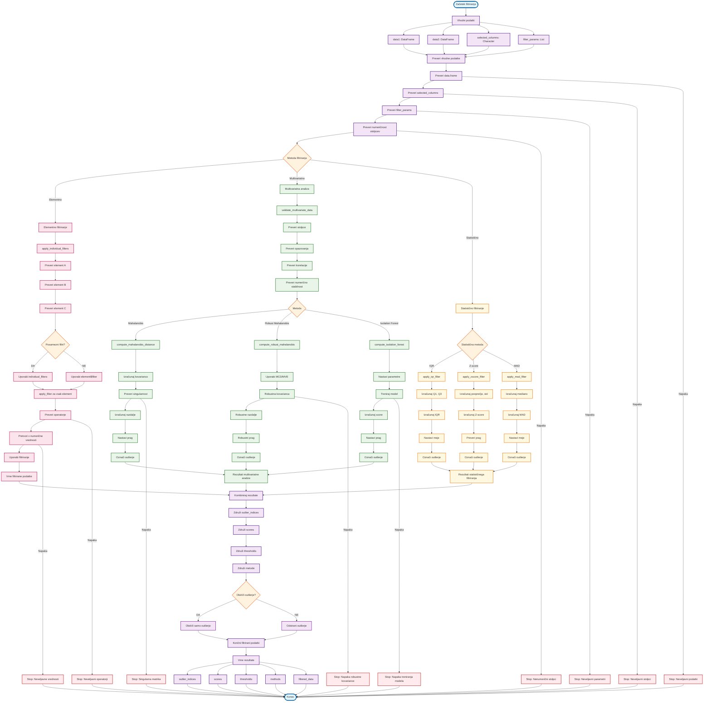

# VIDTERNARY - IMPLEMENTACIJA FILTRIRANJA

## Detajlna implementacija filtriranja



## Ključne funkcije v implementaciji

### 1. Varno filtriranje
```r
apply_filter <- function(df, col, filter) {
  if (is.null(filter)) return(df)
  
  # Varno filtriranje brez eval()
  if (grepl("^[><=!]+", filter)) {
    operator <- gsub("^([><=!]+).*", "\\1", filter)
    value_str <- gsub("^[><=!]+\\s*", "", filter)
    value <- as.numeric(value_str)
    
    if (is.na(value)) {
      stop("Invalid filter value: ", value_str)
    }
    
    switch(operator,
      ">" = df[df[[col]] > value, ],
      "<" = df[df[[col]] < value, ],
      ">=" = df[df[[col]] >= value, ],
      "<=" = df[df[[col]] <= value, ],
      "==" = df[df[[col]] == value, ],
      "!=" = df[df[[col]] != value, ],
      stop("Invalid operator: ", operator)
    )
  } else {
    stop("Invalid filter format")
  }
}
```

### 2. Validacija multivariatnih podatkov
```r
validate_multivariate_data <- function(data1, data2, selected_columns, method, min_obs_ratio) {
  # Preveri obstoj stolpcev
  missing_in_data1 <- setdiff(selected_columns, colnames(data1))
  missing_in_data2 <- setdiff(selected_columns, colnames(data2))
  
  if (length(missing_in_data1) > 0) {
    stop("Selected columns missing in data1: ", paste(missing_in_data1, collapse = ", "))
  }
  if (length(missing_in_data2) > 0) {
    stop("Selected columns missing in data2: ", paste(missing_in_data2, collapse = ", "))
  }
  
  # Preveri numeričnost
  non_numeric_in_data1 <- selected_columns[!sapply(data1[, selected_columns, drop = FALSE], is.numeric)]
  non_numeric_in_data2 <- selected_columns[!sapply(data2[, selected_columns, drop = FALSE], is.numeric)]
  
  if (length(non_numeric_in_data1) > 0) {
    stop("Non-numeric selected columns in data1: ", paste(non_numeric_in_data1, collapse = ", "))
  }
  if (length(non_numeric_in_data2) > 0) {
    stop("Non-numeric selected columns in data2: ", paste(non_numeric_in_data2, collapse = ", "))
  }
  
  # Preveri minimalno število opazovanj
  n_vars <- length(selected_columns)
  n_obs1 <- nrow(data1_clean)
  n_obs2 <- nrow(data2_clean)
  
  if (n_obs1 < n_vars * min_obs_ratio) {
    stop(sprintf("Insufficient observations in data1: %d observations for %d variables", n_obs1, n_vars))
  }
  if (n_obs2 < n_vars * min_obs_ratio) {
    stop(sprintf("Insufficient observations in data2: %d observations for %d variables", n_obs2, n_vars))
  }
  
  # Preveri korelacije
  if (n_vars > 2) {
    cor_matrix1 <- cor(data1_clean, use = "pairwise.complete.obs")
    cor_matrix2 <- cor(data2_clean, use = "pairwise.complete.obs")
    
    high_cor1 <- which(abs(cor_matrix1) > 0.9 & cor_matrix1 != 1, arr.ind = TRUE)
    high_cor2 <- which(abs(cor_matrix2) > 0.9 & cor_matrix2 != 1, arr.ind = TRUE)
    
    if (nrow(high_cor1) > 0 || nrow(high_cor2) > 0) {
      warning("High correlations (>0.9) detected. This may cause multicollinearity issues.")
    }
  }
  
  # Preveri numerično stabilnost
  tryCatch({
    cov_matrix <- cov(data2_clean)
    eigenvals <- eigen(cov_matrix, only.values = TRUE)$values
    condition_number <- max(eigenvals) / min(eigenvals)
    
    if (condition_number > 1e10) {
      warning("High condition number detected. This may indicate numerical instability.")
    }
  }, error = function(e) {
    warning("Could not calculate condition number: ", e$message)
  })
  
  return(list(
    data1_clean = data1_clean,
    data2_clean = data2_clean,
    common_cols = selected_columns,
    n_vars = n_vars,
    n_obs1 = n_obs1,
    n_obs2 = n_obs2,
    condition_number = condition_number,
    high_correlations = high_correlations
  ))
}
```

### 3. Robustno obravnavanje napak
```r
tryCatch({
  # Glavna logika
  result <- main_function()
  return(result)
}, error = function(e) {
  # Logiranje napake
  debug_log("ERROR: %s", e$message)
  
  # Fallback logika
  warning("Operation failed, using fallback: ", e$message)
  
  # Vrne varni rezultat
  return(safe_fallback())
})
```

### 4. Kombiniranje rezultatov
```r
combine_outlier_results <- function(results) {
  if (is.null(results) || length(results) == 0) {
    return(NULL)
  }
  
  # Združi outlier_indices
  outlier_indices <- Reduce(`|`, lapply(results, function(x) x$outlier_indices))
  
  # Združi scores
  scores <- do.call(cbind, lapply(results, function(x) x$scores))
  colnames(scores) <- names(results)
  
  # Združi thresholds
  thresholds <- sapply(results, function(x) x$threshold)
  names(thresholds) <- names(results)
  
  # Združi metode
  methods <- sapply(results, function(x) x$method)
  names(methods) <- names(results)
  
  return(list(
    outlier_indices = outlier_indices,
    scores = scores,
    thresholds = thresholds,
    methods = methods,
    combined = TRUE
  ))
}
```

## Prednosti implementacije

1. **Varnost**: Varno filtriranje brez eval()
2. **Robustnost**: Robustno obravnavanje napak
3. **Fleksibilnost**: Podpora za različne tipe filtriranja
4. **Validacija**: Preverjanje vhodnih podatkov
5. **Kombiniranje**: Možnost kombiniranja različnih metod
6. **Dokumentacija**: Jasna dokumentacija in opisi

## Uporaba flowchart-a

- **Razumevanje**: Sledite korakom za razumevanje implementacije
- **Debugiranje**: Identificirajte, kje se pojavi napaka
- **Razvoj**: Dodajte nove metode po vzoru obstoječih
- **Optimizacija**: Identificirajte možne izboljšave
- **Testiranje**: Preverite vse možne poti skozi kodo
