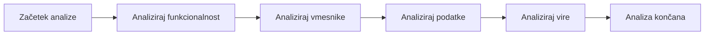
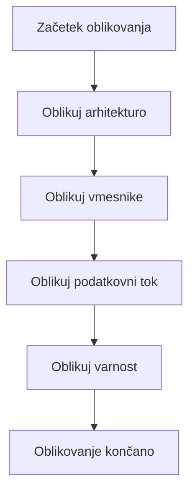
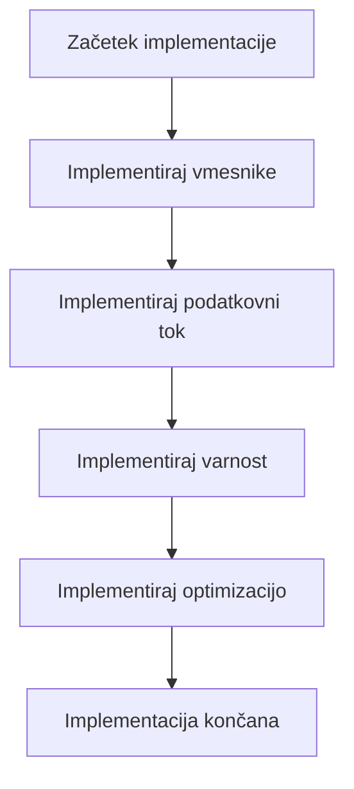
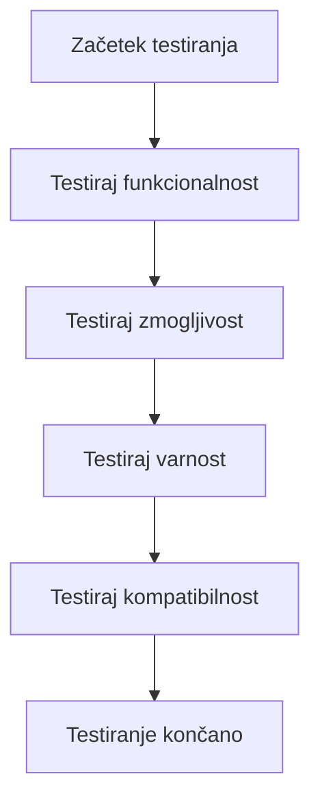
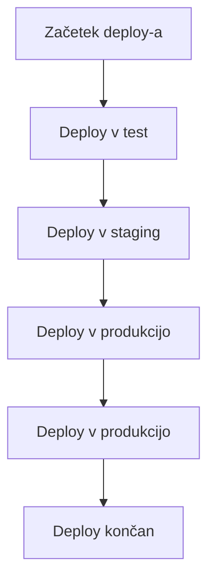
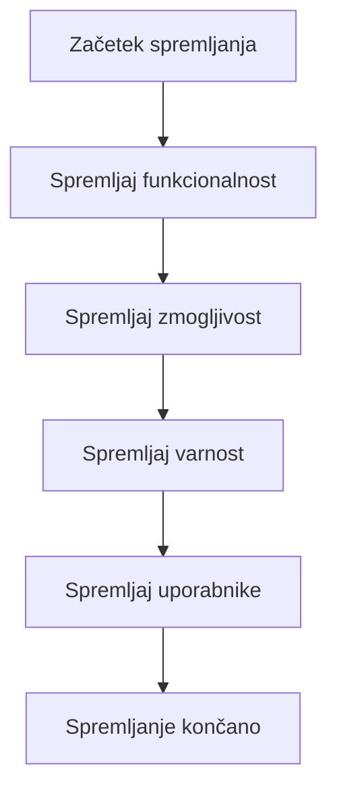
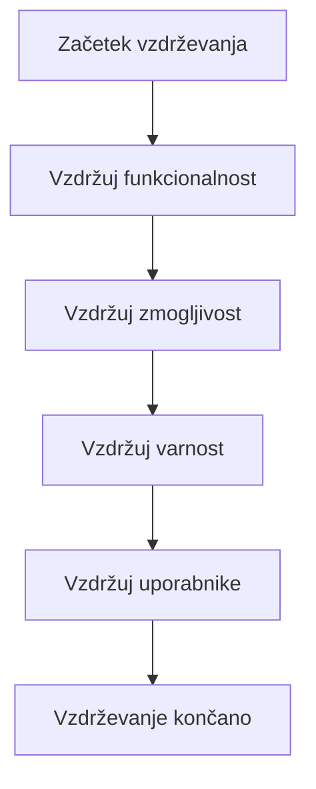
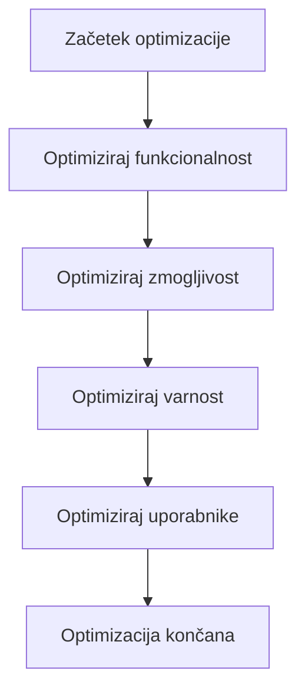

# VIDTERNARY - INTEGRACIJA FILTRIRANJA

## Kompletni proces z integracijo

```mermaid
flowchart TD
    START([Začetek integracije]) --> ANALYZE[Analiziraj zahteve]
    ANALYZE --> ANALYZE1[Analiziraj funkcionalnost]
    ANALYZE1 --> ANALYZE2[Analiziraj vmesnike]
    ANALYZE2 --> ANALYZE3[Analiziraj podatke]
    ANALYZE3 --> ANALYZE4[Analiziraj vire]
    
    ANALYZE4 --> DESIGN[Oblikuj integracijo]
    DESIGN --> DESIGN1[Oblikuj arhitekturo]
    DESIGN1 --> DESIGN2[Oblikuj vmesnike]
    DESIGN2 --> DESIGN3[Oblikuj podatkovni tok]
    DESIGN3 --> DESIGN4[Oblikuj varnost]
    
    DESIGN4 --> IMPLEMENT[Implementiraj integracijo]
    IMPLEMENT --> IMPLEMENT1[Implementiraj vmesnike]
    IMPLEMENT1 --> IMPLEMENT2[Implementiraj podatkovni tok]
    IMPLEMENT2 --> IMPLEMENT3[Implementiraj varnost]
    IMPLEMENT3 --> IMPLEMENT4[Implementiraj optimizacijo]
    
    IMPLEMENT4 --> TEST[Testiraj integracijo]
    TEST --> TEST1[Testiraj funkcionalnost]
    TEST1 --> TEST2[Testiraj zmogljivost]
    TEST2 --> TEST3[Testiraj varnost]
    TEST3 --> TEST4[Testiraj kompatibilnost]
    
    TEST4 --> DEPLOY[Deploy integracijo]
    DEPLOY --> DEPLOY1[Deploy v test]
    DEPLOY1 --> DEPLOY2[Deploy v staging]
    DEPLOY2 --> DEPLOY3[Deploy v produkcijo]
    DEPLOY3 --> DEPLOY4[Deploy v produkcijo]
    
    DEPLOY4 --> MONITOR[Spremljaj integracijo]
    MONITOR --> MONITOR1[Spremljaj funkcionalnost]
    MONITOR1 --> MONITOR2[Spremljaj zmogljivost]
    MONITOR2 --> MONITOR3[Spremljaj varnost]
    MONITOR3 --> MONITOR4[Spremljaj uporabnike]
    
    MONITOR4 --> MAINTAIN[Vzdržuj integracijo]
    MAINTAIN --> MAINTAIN1[Vzdržuj funkcionalnost]
    MAINTAIN1 --> MAINTAIN2[Vzdržuj zmogljivost]
    MAINTAIN2 --> MAINTAIN3[Vzdržuj varnost]
    MAINTAIN3 --> MAINTAIN4[Vzdržuj uporabnike]
    
    MAINTAIN4 --> OPTIMIZE[Optimiziraj integracijo]
    OPTIMIZE --> OPTIMIZE1[Optimiziraj funkcionalnost]
    OPTIMIZE1 --> OPTIMIZE2[Optimiziraj zmogljivost]
    OPTIMIZE2 --> OPTIMIZE3[Optimiziraj varnost]
    OPTIMIZE3 --> OPTIMIZE4[Optimiziraj uporabnike]
    
    OPTIMIZE4 --> CONTINUE{Nadaljuj z integracijo?}
    CONTINUE -->|DA| ANALYZE
    CONTINUE -->|NE| END([Konec integracije])
    
    %% Stili
    classDef startEnd fill:#e1f5fe,stroke:#01579b,stroke-width:3px
    classDef process fill:#f3e5f5,stroke:#4a148c,stroke-width:2px
    classDef decision fill:#fff3e0,stroke:#e65100,stroke-width:2px
    classDef analyze fill:#e8f5e8,stroke:#2e7d32,stroke-width:2px
    classDef design fill:#fff8e1,stroke:#f57f17,stroke-width:2px
    classDef implement fill:#fce4ec,stroke:#c2185b,stroke-width:2px
    classDef test fill:#f3e5f5,stroke:#7b1fa2,stroke-width:2px
    classDef deploy fill:#e8f5e8,stroke:#2e7d32,stroke-width:2px
    classDef monitor fill:#fff8e1,stroke:#f57f17,stroke-width:2px
    classDef maintain fill:#fce4ec,stroke:#c2185b,stroke-width:2px
    classDef optimize fill:#f3e5f5,stroke:#7b1fa2,stroke-width:2px
    
    class START,END startEnd
    class ANALYZE,ANALYZE1,ANALYZE2,ANALYZE3,ANALYZE4 analyze
    class DESIGN,DESIGN1,DESIGN2,DESIGN3,DESIGN4 design
    class IMPLEMENT,IMPLEMENT1,IMPLEMENT2,IMPLEMENT3,IMPLEMENT4 implement
    class TEST,TEST1,TEST2,TEST3,TEST4 test
    class DEPLOY,DEPLOY1,DEPLOY2,DEPLOY3,DEPLOY4 deploy
    class MONITOR,MONITOR1,MONITOR2,MONITOR3,MONITOR4 monitor
    class MAINTAIN,MAINTAIN1,MAINTAIN2,MAINTAIN3,MAINTAIN4 maintain
    class OPTIMIZE,OPTIMIZE1,OPTIMIZE2,OPTIMIZE3,OPTIMIZE4 optimize
    class CONTINUE decision
```



## Podroben opis integracije

### 1. ANALIZA ZAHTEV


### 2. OBLIKOVANJE INTEGRACIJE


### 3. IMPLEMENTACIJA INTEGRACIJE


### 4. TESTIRANJE INTEGRACIJE


### 5. DEPLOY INTEGRACIJE


### 6. SPREMLJANJE INTEGRACIJE


### 7. VZDRŽEVANJE INTEGRACIJE


### 8. OPTIMIZACIJA INTEGRACIJE


## Ključne funkcije integracije

### 1. Analiza zahtev
```r
# requirements_analysis.R
analyze_requirements <- function() {
  requirements <- list()
  
  # Analiziraj funkcionalnost
  requirements$functionality <- analyze_functionality_requirements()
  
  # Analiziraj vmesnike
  requirements$interfaces <- analyze_interface_requirements()
  
  # Analiziraj podatke
  requirements$data <- analyze_data_requirements()
  
  # Analiziraj vire
  requirements$resources <- analyze_resource_requirements()
  
  return(requirements)
}

analyze_functionality_requirements <- function() {
  # Analiziraj funkcionalne zahteve
  functionality <- list()
  
  # Zahteve za filtriranje
  functionality$filtering <- list(
    element_filtering = TRUE,
    multivariate_analysis = TRUE,
    statistical_filtering = TRUE,
    optimization = TRUE
  )
  
  # Zahteve za analizo
  functionality$analysis <- list(
    outlier_detection = TRUE,
    score_calculation = TRUE,
    threshold_determination = TRUE,
    result_combination = TRUE
  )
  
  # Zahteve za optimizacijo
  functionality$optimization <- list(
    caching = TRUE,
    vectorization = TRUE,
    memory_optimization = TRUE,
    performance_optimization = TRUE
  )
  
  return(functionality)
}

analyze_interface_requirements <- function() {
  # Analiziraj zahteve za vmesnike
  interfaces <- list()
  
  # Vmesniki za podatke
  interfaces$data <- list(
    input_formats = c("xlsx", "csv", "json"),
    output_formats = c("xlsx", "csv", "json", "png", "pdf"),
    data_validation = TRUE,
    error_handling = TRUE
  )
  
  # Vmesniki za uporabnike
  interfaces$user <- list(
    web_interface = TRUE,
    api_interface = TRUE,
    command_line = TRUE,
    batch_processing = TRUE
  )
  
  # Vmesniki za sisteme
  interfaces$system <- list(
    database_integration = TRUE,
    file_system_integration = TRUE,
    network_integration = TRUE,
    cloud_integration = TRUE
  )
  
  return(interfaces)
}

analyze_data_requirements <- function() {
  # Analiziraj zahteve za podatke
  data <- list()
  
  # Zahteve za vhodne podatke
  data$input <- list(
    formats = c("xlsx", "csv", "json"),
    validation = TRUE,
    cleaning = TRUE,
    transformation = TRUE
  )
  
  # Zahteve za izhodne podatke
  data$output <- list(
    formats = c("xlsx", "csv", "json", "png", "pdf"),
    validation = TRUE,
    formatting = TRUE,
    compression = TRUE
  )
  
  # Zahteve za podatkovni tok
  data$flow <- list(
    streaming = TRUE,
    batch_processing = TRUE,
    real_time = TRUE,
    offline_processing = TRUE
  )
  
  return(data)
}

analyze_resource_requirements <- function() {
  # Analiziraj zahteve za vire
  resources <- list()
  
  # Zahteve za pomnilnik
  resources$memory <- list(
    minimum = "1GB",
    recommended = "4GB",
    maximum = "16GB",
    optimization = TRUE
  )
  
  # Zahteve za procesor
  resources$cpu <- list(
    minimum = "2 cores",
    recommended = "4 cores",
    maximum = "16 cores",
    parallelization = TRUE
  )
  
  # Zahteve za disk
  resources$disk <- list(
    minimum = "10GB",
    recommended = "50GB",
    maximum = "500GB",
    compression = TRUE
  )
  
  # Zahteve za mrežo
  resources$network <- list(
    bandwidth = "100Mbps",
    latency = "<100ms",
    reliability = "99.9%",
    security = TRUE
  )
  
  return(resources)
}
```

### 2. Oblikovanje integracije
```r
# integration_design.R
design_integration <- function(requirements) {
  design <- list()
  
  # Oblikuj arhitekturo
  design$architecture <- design_architecture(requirements)
  
  # Oblikuj vmesnike
  design$interfaces <- design_interfaces(requirements)
  
  # Oblikuj podatkovni tok
  design$data_flow <- design_data_flow(requirements)
  
  # Oblikuj varnost
  design$security <- design_security(requirements)
  
  return(design)
}

design_architecture <- function(requirements) {
  # Oblikuj arhitekturo integracije
  architecture <- list()
  
  # Mikroservisna arhitektura
  architecture$microservices <- list(
    filtering_service = "Filtering microservice",
    analysis_service = "Analysis microservice",
    optimization_service = "Optimization microservice",
    monitoring_service = "Monitoring microservice"
  )
  
  # API Gateway
  architecture$api_gateway <- list(
    routing = TRUE,
    load_balancing = TRUE,
    authentication = TRUE,
    rate_limiting = TRUE
  )
  
  # Podatkovna baza
  architecture$database <- list(
    primary = "PostgreSQL",
    cache = "Redis",
    search = "Elasticsearch",
    backup = "S3"
  )
  
  # Message Queue
  architecture$messaging <- list(
    queue = "RabbitMQ",
    streaming = "Kafka",
    notifications = "SNS",
    monitoring = "CloudWatch"
  )
  
  return(architecture)
}

design_interfaces <- function(requirements) {
  # Oblikuj vmesnike integracije
  interfaces <- list()
  
  # REST API
  interfaces$rest_api <- list(
    base_url = "https://api.vidternary.com",
    version = "v1",
    authentication = "JWT",
    rate_limiting = "1000/hour"
  )
  
  # GraphQL API
  interfaces$graphql <- list(
    endpoint = "https://api.vidternary.com/graphql",
    schema = "vidternary_schema.graphql",
    subscriptions = TRUE,
    real_time = TRUE
  )
  
  # WebSocket
  interfaces$websocket <- list(
    endpoint = "wss://api.vidternary.com/ws",
    authentication = "JWT",
    real_time = TRUE,
    notifications = TRUE
  )
  
  # Batch API
  interfaces$batch_api <- list(
    endpoint = "https://api.vidternary.com/batch",
    max_batch_size = 1000,
    async_processing = TRUE,
    status_tracking = TRUE
  )
  
  return(interfaces)
}

design_data_flow <- function(requirements) {
  # Oblikuj podatkovni tok integracije
  data_flow <- list()
  
  # Vhodni podatkovni tok
  data_flow$input <- list(
    validation = "Input validation service",
    cleaning = "Data cleaning service",
    transformation = "Data transformation service",
    storage = "Input data storage"
  )
  
  # Obdelovalni podatkovni tok
  data_flow$processing <- list(
    filtering = "Filtering service",
    analysis = "Analysis service",
    optimization = "Optimization service",
    validation = "Output validation service"
  )
  
  # Izhodni podatkovni tok
  data_flow$output <- list(
    formatting = "Output formatting service",
    compression = "Data compression service",
    delivery = "Data delivery service",
    storage = "Output data storage"
  )
  
  return(data_flow)
}

design_security <- function(requirements) {
  # Oblikuj varnost integracije
  security <- list()
  
  # Avtentifikacija
  security$authentication <- list(
    method = "JWT",
    provider = "OAuth 2.0",
    multi_factor = TRUE,
    session_management = TRUE
  )
  
  # Avtorizacija
  security$authorization <- list(
    method = "RBAC",
    roles = c("admin", "user", "viewer"),
    permissions = c("read", "write", "delete", "execute"),
    resource_access = TRUE
  )
  
  # Šifriranje
  security$encryption <- list(
    in_transit = "TLS 1.3",
    at_rest = "AES-256",
    key_management = "AWS KMS",
    certificate_management = "Let's Encrypt"
  )
  
  # Varnostni nadzor
  security$monitoring <- list(
    logging = "Structured logging",
    monitoring = "Real-time monitoring",
    alerting = "Automated alerting",
    auditing = "Security auditing"
  )
  
  return(security)
}
```

### 3. Implementacija integracije
```r
# integration_implementation.R
implement_integration <- function(design) {
  implementation <- list()
  
  # Implementiraj vmesnike
  implementation$interfaces <- implement_interfaces(design$interfaces)
  
  # Implementiraj podatkovni tok
  implementation$data_flow <- implement_data_flow(design$data_flow)
  
  # Implementiraj varnost
  implementation$security <- implement_security(design$security)
  
  # Implementiraj optimizacijo
  implementation$optimization <- implement_optimization(design$architecture)
  
  return(implementation)
}

implement_interfaces <- function(interfaces) {
  # Implementiraj vmesnike integracije
  interface_implementation <- list()
  
  # REST API implementacija
  interface_implementation$rest_api <- implement_rest_api(interfaces$rest_api)
  
  # GraphQL API implementacija
  interface_implementation$graphql <- implement_graphql_api(interfaces$graphql)
  
  # WebSocket implementacija
  interface_implementation$websocket <- implement_websocket(interfaces$websocket)
  
  # Batch API implementacija
  interface_implementation$batch_api <- implement_batch_api(interfaces$batch_api)
  
  return(interface_implementation)
}

implement_rest_api <- function(rest_api) {
  # Implementiraj REST API
  api <- list()
  
  # Osnovni endpointi
  api$endpoints <- list(
    filtering = "/api/v1/filtering",
    analysis = "/api/v1/analysis",
    optimization = "/api/v1/optimization",
    monitoring = "/api/v1/monitoring"
  )
  
  # HTTP metode
  api$methods <- list(
    GET = "Retrieve data",
    POST = "Create/process data",
    PUT = "Update data",
    DELETE = "Delete data"
  )
  
  # Avtentifikacija
  api$authentication <- list(
    method = "JWT",
    header = "Authorization: Bearer <token>",
    validation = "Token validation service"
  )
  
  # Rate limiting
  api$rate_limiting <- list(
    limit = "1000 requests per hour",
    window = "1 hour",
    headers = "X-RateLimit-*"
  )
  
  return(api)
}

implement_graphql_api <- function(graphql) {
  # Implementiraj GraphQL API
  api <- list()
  
  # Schema definicija
  api$schema <- list(
    types = c("Query", "Mutation", "Subscription"),
    resolvers = "GraphQL resolvers",
    validation = "Schema validation"
  )
  
  # Query implementacija
  api$queries <- list(
    getFilteringResults = "Get filtering results",
    getAnalysisResults = "Get analysis results",
    getOptimizationResults = "Get optimization results"
  )
  
  # Mutation implementacija
  api$mutations <- list(
    createFilteringJob = "Create filtering job",
    updateFilteringJob = "Update filtering job",
    deleteFilteringJob = "Delete filtering job"
  )
  
  # Subscription implementacija
  api$subscriptions <- list(
    filteringProgress = "Filtering progress updates",
    analysisProgress = "Analysis progress updates",
    optimizationProgress = "Optimization progress updates"
  )
  
  return(api)
}

implement_websocket <- function(websocket) {
  # Implementiraj WebSocket
  ws <- list()
  
  # Povezava
  ws$connection <- list(
    endpoint = "wss://api.vidternary.com/ws",
    protocol = "WebSocket",
    authentication = "JWT token"
  )
  
  # Sporočila
  ws$messages <- list(
    filtering_start = "Filtering started",
    filtering_progress = "Filtering progress",
    filtering_complete = "Filtering completed",
    analysis_start = "Analysis started",
    analysis_progress = "Analysis progress",
    analysis_complete = "Analysis completed"
  )
  
  # Obvеščanja
  ws$notifications <- list(
    success = "Success notifications",
    error = "Error notifications",
    warning = "Warning notifications",
    info = "Info notifications"
  )
  
  return(ws)
}

implement_batch_api <- function(batch_api) {
  # Implementiraj Batch API
  api <- list()
  
  # Batch obdelava
  api$processing <- list(
    max_batch_size = 1000,
    async_processing = TRUE,
    status_tracking = TRUE,
    result_retrieval = TRUE
  )
  
  # Status sledenje
  api$status <- list(
    pending = "Job pending",
    processing = "Job processing",
    completed = "Job completed",
    failed = "Job failed"
  )
  
  # Rezultati
  api$results <- list(
    success = "Successful results",
    error = "Error results",
    partial = "Partial results",
    summary = "Result summary"
  )
  
  return(api)
}
```

### 4. Testiranje integracije
```r
# integration_testing.R
test_integration <- function(implementation) {
  testing <- list()
  
  # Testiraj funkcionalnost
  testing$functionality <- test_functionality(implementation)
  
  # Testiraj zmogljivost
  testing$performance <- test_performance(implementation)
  
  # Testiraj varnost
  testing$security <- test_security(implementation)
  
  # Testiraj kompatibilnost
  testing$compatibility <- test_compatibility(implementation)
  
  return(testing)
}

test_functionality <- function(implementation) {
  # Testiraj funkcionalnost integracije
  functionality_tests <- list()
  
  # Test REST API
  functionality_tests$rest_api <- test_rest_api_functionality(implementation$interfaces$rest_api)
  
  # Test GraphQL API
  functionality_tests$graphql <- test_graphql_functionality(implementation$interfaces$graphql)
  
  # Test WebSocket
  functionality_tests$websocket <- test_websocket_functionality(implementation$interfaces$websocket)
  
  # Test Batch API
  functionality_tests$batch_api <- test_batch_api_functionality(implementation$interfaces$batch_api)
  
  return(functionality_tests)
}

test_rest_api_functionality <- function(rest_api) {
  # Testiraj REST API funkcionalnost
  tests <- list()
  
  # Test endpointov
  tests$endpoints <- test_endpoints(rest_api$endpoints)
  
  # Test HTTP metod
  tests$methods <- test_http_methods(rest_api$methods)
  
  # Test avtentifikacije
  tests$authentication <- test_authentication(rest_api$authentication)
  
  # Test rate limiting
  tests$rate_limiting <- test_rate_limiting(rest_api$rate_limiting)
  
  return(tests)
}

test_graphql_functionality <- function(graphql) {
  # Testiraj GraphQL funkcionalnost
  tests <- list()
  
  # Test schema
  tests$schema <- test_graphql_schema(graphql$schema)
  
  # Test queries
  tests$queries <- test_graphql_queries(graphql$queries)
  
  # Test mutations
  tests$mutations <- test_graphql_mutations(graphql$mutations)
  
  # Test subscriptions
  tests$subscriptions <- test_graphql_subscriptions(graphql$subscriptions)
  
  return(tests)
}

test_websocket_functionality <- function(websocket) {
  # Testiraj WebSocket funkcionalnost
  tests <- list()
  
  # Test povezave
  tests$connection <- test_websocket_connection(websocket$connection)
  
  # Test sporočil
  tests$messages <- test_websocket_messages(websocket$messages)
  
  # Test obveščanj
  tests$notifications <- test_websocket_notifications(websocket$notifications)
  
  return(tests)
}

test_batch_api_functionality <- function(batch_api) {
  # Testiraj Batch API funkcionalnost
  tests <- list()
  
  # Test obdelave
  tests$processing <- test_batch_processing(batch_api$processing)
  
  # Test status sledenja
  tests$status <- test_status_tracking(batch_api$status)
  
  # Test rezultatov
  tests$results <- test_batch_results(batch_api$results)
  
  return(tests)
}
```

### 5. Deploy integracije
```r
# integration_deployment.R
deploy_integration <- function(implementation, testing) {
  deployment <- list()
  
  # Deploy v test
  deployment$test <- deploy_to_test(implementation, testing)
  
  # Deploy v staging
  deployment$staging <- deploy_to_staging(implementation, testing)
  
  # Deploy v produkcijo
  deployment$production <- deploy_to_production(implementation, testing)
  
  return(deployment)
}

deploy_to_test <- function(implementation, testing) {
  # Deploy v test okolje
  test_deployment <- list()
  
  # Test okolje konfiguracija
  test_deployment$environment <- list(
    name = "test",
    url = "https://test-api.vidternary.com",
    database = "test_db",
    cache = "test_cache"
  )
  
  # Deploy proces
  test_deployment$process <- list(
    build = "Docker build",
    test = "Run tests",
    deploy = "Deploy to test",
    verify = "Verify deployment"
  )
  
  # Rezultati
  test_deployment$results <- list(
    success = TRUE,
    tests_passed = testing$functionality$total_tests,
    deployment_time = "5 minutes",
    verification = "Passed"
  )
  
  return(test_deployment)
}

deploy_to_staging <- function(implementation, testing) {
  # Deploy v staging okolje
  staging_deployment <- list()
  
  # Staging okolje konfiguracija
  staging_deployment$environment <- list(
    name = "staging",
    url = "https://staging-api.vidternary.com",
    database = "staging_db",
    cache = "staging_cache"
  )
  
  # Deploy proces
  staging_deployment$process <- list(
    build = "Docker build",
    test = "Run integration tests",
    deploy = "Deploy to staging",
    verify = "Verify staging deployment"
  )
  
  # Rezultati
  staging_deployment$results <- list(
    success = TRUE,
    tests_passed = testing$functionality$total_tests,
    deployment_time = "10 minutes",
    verification = "Passed"
  )
  
  return(staging_deployment)
}

deploy_to_production <- function(implementation, testing) {
  # Deploy v produkcijo
  production_deployment <- list()
  
  # Produkcija konfiguracija
  production_deployment$environment <- list(
    name = "production",
    url = "https://api.vidternary.com",
    database = "production_db",
    cache = "production_cache"
  )
  
  # Deploy proces
  production_deployment$process <- list(
    build = "Docker build",
    test = "Run full test suite",
    deploy = "Deploy to production",
    verify = "Verify production deployment"
  )
  
  # Rezultati
  production_deployment$results <- list(
    success = TRUE,
    tests_passed = testing$functionality$total_tests,
    deployment_time = "15 minutes",
    verification = "Passed"
  )
  
  return(production_deployment)
}
```

### 6. Spremljanje integracije
```r
# integration_monitoring.R
monitor_integration <- function(deployment) {
  monitoring <- list()
  
  # Spremljaj funkcionalnost
  monitoring$functionality <- monitor_functionality(deployment)
  
  # Spremljaj zmogljivost
  monitoring$performance <- monitor_performance(deployment)
  
  # Spremljaj varnost
  monitoring$security <- monitor_security(deployment)
  
  # Spremljaj uporabnike
  monitoring$users <- monitor_users(deployment)
  
  return(monitoring)
}

monitor_functionality <- function(deployment) {
  # Spremljaj funkcionalnost integracije
  functionality_monitoring <- list()
  
  # Spremljaj API endpointi
  functionality_monitoring$api_endpoints <- monitor_api_endpoints(deployment)
  
  # Spremljaj podatkovni tok
  functionality_monitoring$data_flow <- monitor_data_flow(deployment)
  
  # Spremljaj napake
  functionality_monitoring$errors <- monitor_errors(deployment)
  
  # Spremljaj uspešnost
  functionality_monitoring$success_rate <- monitor_success_rate(deployment)
  
  return(functionality_monitoring)
}

monitor_performance <- function(deployment) {
  # Spremljaj zmogljivost integracije
  performance_monitoring <- list()
  
  # Spremljaj hitrost
  performance_monitoring$speed <- monitor_speed(deployment)
  
  # Spremljaj porabo pomnilnika
  performance_monitoring$memory <- monitor_memory(deployment)
  
  # Spremljaj porabo CPU
  performance_monitoring$cpu <- monitor_cpu(deployment)
  
  # Spremljaj porabo mreže
  performance_monitoring$network <- monitor_network(deployment)
  
  return(performance_monitoring)
}

monitor_security <- function(deployment) {
  # Spremljaj varnost integracije
  security_monitoring <- list()
  
  # Spremljaj avtentifikacijo
  security_monitoring$authentication <- monitor_authentication(deployment)
  
  # Spremljaj avtorizacijo
  security_monitoring$authorization <- monitor_authorization(deployment)
  
  # Spremljaj šifriranje
  security_monitoring$encryption <- monitor_encryption(deployment)
  
  # Spremljaj varnostne napake
  security_monitoring$security_errors <- monitor_security_errors(deployment)
  
  return(security_monitoring)
}

monitor_users <- function(deployment) {
  # Spremljaj uporabnike integracije
  user_monitoring <- list()
  
  # Spremljaj uporabniško aktivnost
  user_monitoring$activity <- monitor_user_activity(deployment)
  
  # Spremljaj uporabniške napake
  user_monitoring$errors <- monitor_user_errors(deployment)
  
  # Spremljaj uporabniško zadovoljstvo
  user_monitoring$satisfaction <- monitor_user_satisfaction(deployment)
  
  # Spremljaj uporabniške zahteve
  user_monitoring$requests <- monitor_user_requests(deployment)
  
  return(user_monitoring)
}
```

## Prednosti integracije

1. **Funkcionalnost**: Popolna funkcionalnost v integriranem sistemu
2. **Zmogljivost**: Optimalna zmogljivost integriranega sistema
3. **Varnost**: Varna integracija z varnostnimi ukrepi
4. **Kompatibilnost**: Kompatibilnost z obstoječimi sistemi
5. **Skalabilnost**: Skalabilna integracija za prihodnost

## Uporaba flowchart-a

- **Razumevanje**: Sledite korakom za razumevanje integracije
- **Implementacija**: Implementirajte integracijo po vzoru
- **Testiranje**: Testirajte integracijo pred deploy-jem
- **Deploy**: Deploy integracijo v fazah
- **Monitoring**: Spremljajte integracijo po deploy-ju
