# VIDTERNARY - VZDRŽEVANJE FILTRIRANJA

## Kompletni proces z vzdrževanjem

```mermaid
flowchart TD
    START([Začetek vzdrževanja]) --> MONITOR[Spremljaj sistem]
    MONITOR --> MONITOR1[Spremljaj zmogljivost]
    MONITOR1 --> MONITOR2[Spremljaj napake]
    MONITOR2 --> MONITOR3[Spremljaj uporabnike]
    MONITOR3 --> MONITOR4[Spremljaj spremembe]
    
    MONITOR4 --> ANALYZE[Analiziraj podatke]
    ANALYZE --> ANALYZE1[Analiziraj zmogljivost]
    ANALYZE1 --> ANALYZE2[Analiziraj napake]
    ANALYZE2 --> ANALYZE3[Analiziraj uporabnike]
    ANALYZE3 --> ANALYZE4[Analiziraj spremembe]
    
    ANALYZE4 --> IDENTIFY[Identificiraj probleme]
    IDENTIFY --> IDENTIFY1[Identificiraj ozka grla]
    IDENTIFY1 --> IDENTIFY2[Identificiraj napake]
    IDENTIFY2 --> IDENTIFY3[Identificiraj zahteve]
    IDENTIFY3 --> IDENTIFY4[Identificiraj priložnosti]
    
    IDENTIFY4 --> PLAN[Načrtuj vzdrževanje]
    PLAN --> PLAN1[Načrtuj optimizacije]
    PLAN1 --> PLAN2[Načrtuj popravke]
    PLAN2 --> PLAN3[Načrtuj izboljšave]
    PLAN3 --> PLAN4[Načrtuj posodobitve]
    
    PLAN4 --> IMPLEMENT[Implementiraj spremembe]
    IMPLEMENT --> IMPLEMENT1[Implementiraj optimizacije]
    IMPLEMENT1 --> IMPLEMENT2[Implementiraj popravke]
    IMPLEMENT2 --> IMPLEMENT3[Implementiraj izboljšave]
    IMPLEMENT3 --> IMPLEMENT4[Implementiraj posodobitve]
    
    IMPLEMENT4 --> TEST[Testiraj spremembe]
    TEST --> TEST1[Testiraj funkcionalnost]
    TEST1 --> TEST2[Testiraj zmogljivost]
    TEST2 --> TEST3[Testiraj stabilnost]
    TEST3 --> TEST4[Testiraj kompatibilnost]
    
    TEST4 --> DEPLOY[Deploy spremembe]
    DEPLOY --> DEPLOY1[Deploy v test]
    DEPLOY1 --> DEPLOY2[Deploy v staging]
    DEPLOY2 --> DEPLOY3[Deploy v produkcijo]
    DEPLOY3 --> DEPLOY4[Deploy v produkcijo]
    
    DEPLOY4 --> VERIFY[Preveri spremembe]
    VERIFY --> VERIFY1[Preveri funkcionalnost]
    VERIFY1 --> VERIFY2[Preveri zmogljivost]
    VERIFY2 --> VERIFY3[Preveri stabilnost]
    VERIFY3 --> VERIFY4[Preveri uporabnike]
    
    VERIFY4 --> DOCUMENT[Dokumentiraj spremembe]
    DOCUMENT --> DOCUMENT1[Dokumentiraj funkcionalnost]
    DOCUMENT1 --> DOCUMENT2[Dokumentiraj API]
    DOCUMENT2 --> DOCUMENT3[Dokumentiraj uporabo]
    DOCUMENT3 --> DOCUMENT4[Dokumentiraj vzdrževanje]
    
    DOCUMENT4 --> NOTIFY[Obvesti uporabnike]
    NOTIFY --> NOTIFY1[Obvesti o spremembah]
    NOTIFY1 --> NOTIFY2[Obvesti o novostih]
    NOTIFY2 --> NOTIFY3[Obvesti o napakah]
    NOTIFY3 --> NOTIFY4[Obvesti o podpori]
    
    NOTIFY4 --> SCHEDULE[Načrtuj naslednje vzdrževanje]
    SCHEDULE --> SCHEDULE1[Načrtuj redno vzdrževanje]
    SCHEDULE1 --> SCHEDULE2[Načrtuj kritične popravke]
    SCHEDULE2 --> SCHEDULE3[Načrtuj posodobitve]
    SCHEDULE3 --> SCHEDULE4[Načrtuj optimizacije]
    
    SCHEDULE4 --> CONTINUE{Nadaljuj z vzdrževanjem?}
    CONTINUE -->|DA| MONITOR
    CONTINUE -->|NE| END([Konec vzdrževanja])
    
    %% Stili
    classDef startEnd fill:#e1f5fe,stroke:#01579b,stroke-width:3px
    classDef process fill:#f3e5f5,stroke:#4a148c,stroke-width:2px
    classDef decision fill:#fff3e0,stroke:#e65100,stroke-width:2px
    classDef monitor fill:#e8f5e8,stroke:#2e7d32,stroke-width:2px
    classDef analyze fill:#fff8e1,stroke:#f57f17,stroke-width:2px
    classDef identify fill:#fce4ec,stroke:#c2185b,stroke-width:2px
    classDef plan fill:#f3e5f5,stroke:#7b1fa2,stroke-width:2px
    classDef implement fill:#e8f5e8,stroke:#2e7d32,stroke-width:2px
    classDef test fill:#fff8e1,stroke:#f57f17,stroke-width:2px
    classDef deploy fill:#fce4ec,stroke:#c2185b,stroke-width:2px
    classDef verify fill:#f3e5f5,stroke:#7b1fa2,stroke-width:2px
    classDef document fill:#e8f5e8,stroke:#2e7d32,stroke-width:2px
    classDef notify fill:#fff8e1,stroke:#f57f17,stroke-width:2px
    classDef schedule fill:#fce4ec,stroke:#c2185b,stroke-width:2px
    
    class START,END startEnd
    class MONITOR,MONITOR1,MONITOR2,MONITOR3,MONITOR4 monitor
    class ANALYZE,ANALYZE1,ANALYZE2,ANALYZE3,ANALYZE4 analyze
    class IDENTIFY,IDENTIFY1,IDENTIFY2,IDENTIFY3,IDENTIFY4 identify
    class PLAN,PLAN1,PLAN2,PLAN3,PLAN4 plan
    class IMPLEMENT,IMPLEMENT1,IMPLEMENT2,IMPLEMENT3,IMPLEMENT4 implement
    class TEST,TEST1,TEST2,TEST3,TEST4 test
    class DEPLOY,DEPLOY1,DEPLOY2,DEPLOY3,DEPLOY4 deploy
    class VERIFY,VERIFY1,VERIFY2,VERIFY3,VERIFY4 verify
    class DOCUMENT,DOCUMENT1,DOCUMENT2,DOCUMENT3,DOCUMENT4 document
    class NOTIFY,NOTIFY1,NOTIFY2,NOTIFY3,NOTIFY4 notify
    class SCHEDULE,SCHEDULE1,SCHEDULE2,SCHEDULE3,SCHEDULE4 schedule
    class CONTINUE decision
```

## Podroben opis vzdrževanja

### 1. SPREMLJANJE SISTEMA
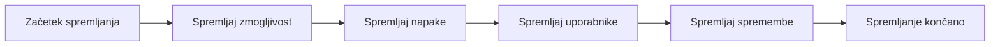

### 2. ANALIZA PODATKOV
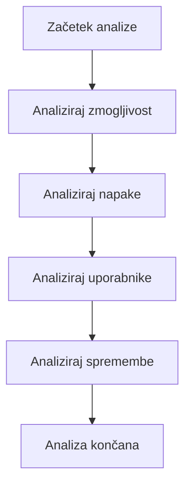

### 3. IDENTIFIKACIJA PROBLEMOV
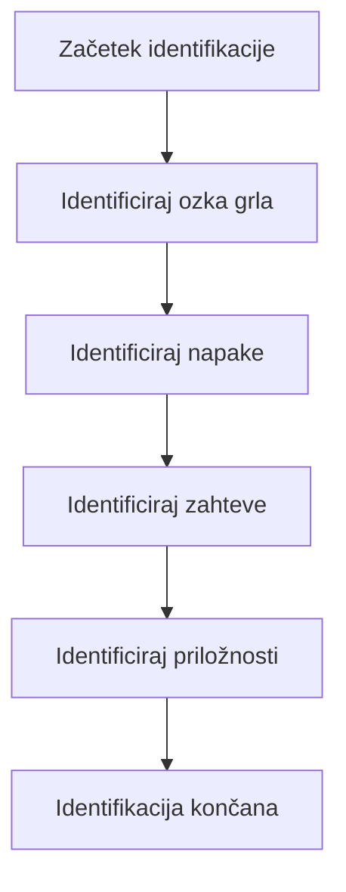

### 4. NAČRTOVANJE VZDRŽEVANJA
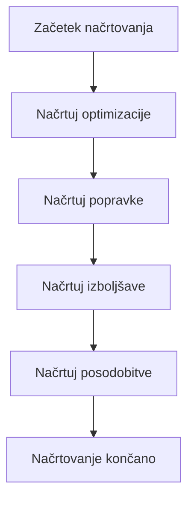

### 5. IMPLEMENTACIJA SPREMEMB
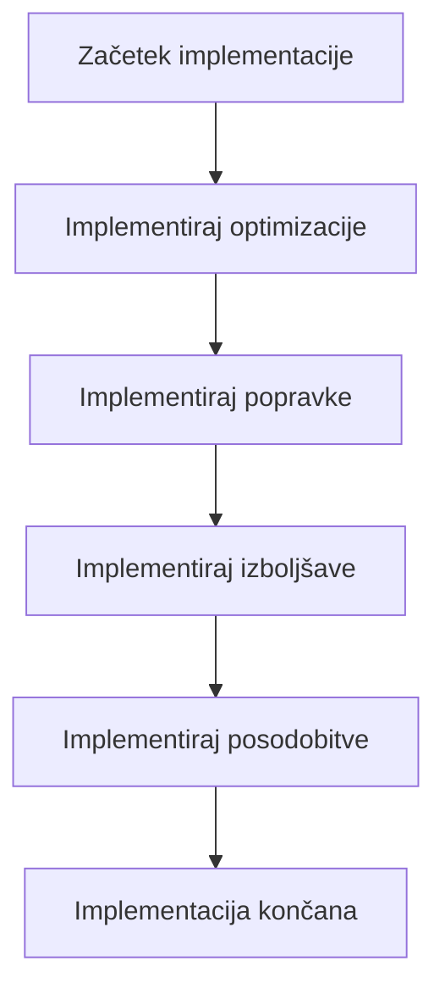

### 6. TESTIRANJE SPREMEMB
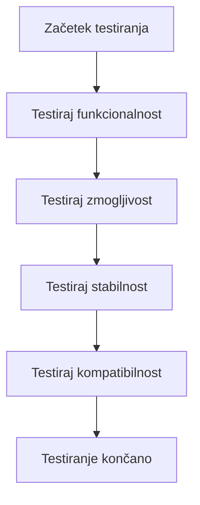

### 7. DEPLOY SPREMEMB
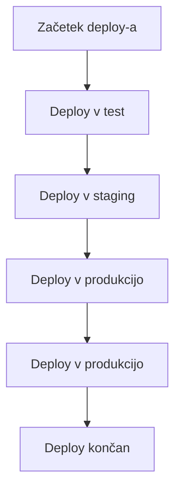

### 8. PREVERJANJE SPREMEMB
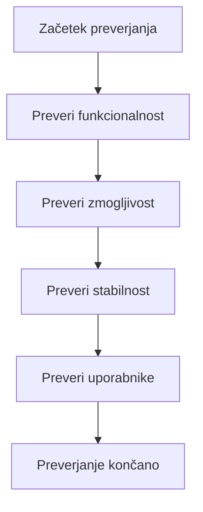

### 9. DOKUMENTIRANJE SPREMEMB
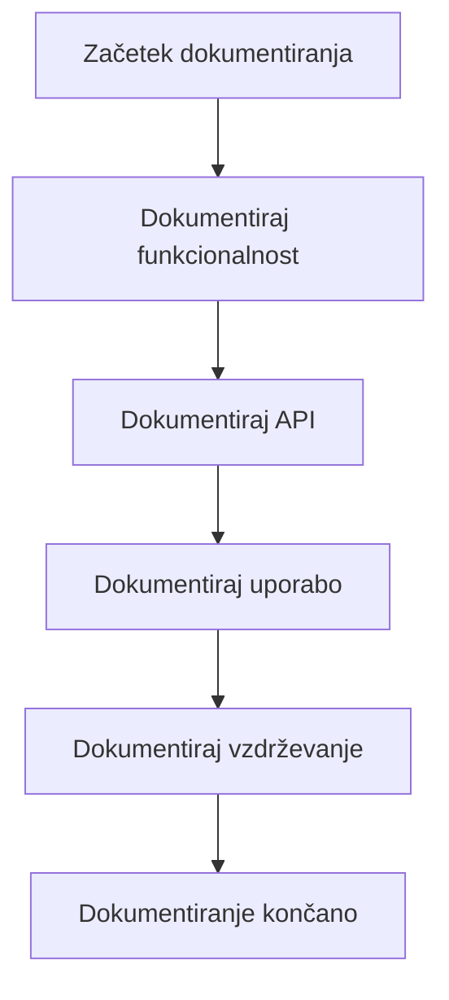

### 10. OBVEŠČANJE UPORABNIKOV
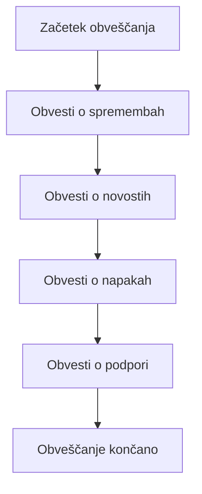

### 11. NAČRTOVANJE NASLEDNJEGA VZDRŽEVANJA
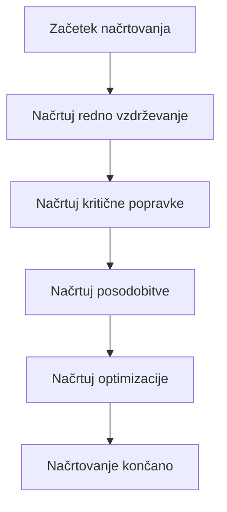

## Ključne funkcije vzdrževanja

### 1. Spremljanje zmogljivosti
```r
# monitoring.R
monitor_performance <- function() {
  # Spremljaj hitrost filtriranja
  start_time <- Sys.time()
  result <- apply_filtering(data, method, params)
  duration <- Sys.time() - start_time
  
  # Spremljaj porabo pomnilnika
  mem_before <- gc()
  result <- apply_filtering(data, method, params)
  mem_after <- gc()
  mem_used <- mem_after$used - mem_before$used
  
  # Spremljaj uspešnost
  success_rate <- calculate_success_rate()
  
  # Shrani metrike
  save_metrics(list(
    duration = duration,
    memory_used = mem_used,
    success_rate = success_rate,
    timestamp = Sys.time()
  ))
  
  return(list(
    duration = duration,
    memory_used = mem_used,
    success_rate = success_rate
  ))
}
```

### 2. Spremljanje napak
```r
# error_monitoring.R
monitor_errors <- function() {
  # Spremljaj napake v filtriranju
  errors <- get_recent_errors()
  
  # Analiziraj vzroke napak
  error_analysis <- analyze_errors(errors)
  
  # Identificiraj pogoste napake
  common_errors <- identify_common_errors(error_analysis)
  
  # Predlagaj rešitve
  solutions <- suggest_solutions(common_errors)
  
  # Shrani analizo
  save_error_analysis(list(
    errors = errors,
    analysis = error_analysis,
    common_errors = common_errors,
    solutions = solutions,
    timestamp = Sys.time()
  ))
  
  return(list(
    error_count = length(errors),
    common_errors = common_errors,
    solutions = solutions
  ))
}
```

### 3. Spremljanje uporabnikov
```r
# user_monitoring.R
monitor_users <- function() {
  # Spremljaj uporabniško aktivnost
  user_activity <- get_user_activity()
  
  # Analiziraj uporabniške vzorce
  usage_patterns <- analyze_usage_patterns(user_activity)
  
  # Identificiraj probleme uporabnikov
  user_issues <- identify_user_issues(usage_patterns)
  
  # Predlagaj izboljšave
  improvements <- suggest_improvements(user_issues)
  
  # Shrani analizo
  save_user_analysis(list(
    activity = user_activity,
    patterns = usage_patterns,
    issues = user_issues,
    improvements = improvements,
    timestamp = Sys.time()
  ))
  
  return(list(
    active_users = length(unique(user_activity$user_id)),
    usage_patterns = usage_patterns,
    user_issues = user_issues,
    improvements = improvements
  ))
}
```

### 4. Spremljanje sprememb
```r
# change_monitoring.R
monitor_changes <- function() {
  # Spremljaj spremembe v kodi
  code_changes <- get_code_changes()
  
  # Spremljaj spremembe v podatkih
  data_changes <- get_data_changes()
  
  # Spremljaj spremembe v konfiguraciji
  config_changes <- get_config_changes()
  
  # Analiziraj vpliv sprememb
  impact_analysis <- analyze_change_impact(code_changes, data_changes, config_changes)
  
  # Predlagaj akcije
  actions <- suggest_actions(impact_analysis)
  
  # Shrani analizo
  save_change_analysis(list(
    code_changes = code_changes,
    data_changes = data_changes,
    config_changes = config_changes,
    impact = impact_analysis,
    actions = actions,
    timestamp = Sys.time()
  ))
  
  return(list(
    code_changes = length(code_changes),
    data_changes = length(data_changes),
    config_changes = length(config_changes),
    impact = impact_analysis,
    actions = actions
  ))
}
```

### 5. Analiza zmogljivosti
```r
# performance_analysis.R
analyze_performance <- function() {
  # Analiziraj hitrost filtriranja
  speed_analysis <- analyze_filtering_speed()
  
  # Analiziraj porabo pomnilnika
  memory_analysis <- analyze_memory_usage()
  
  # Analiziraj uspešnost
  success_analysis <- analyze_success_rate()
  
  # Identificiraj ozka grla
  bottlenecks <- identify_bottlenecks(speed_analysis, memory_analysis, success_analysis)
  
  # Predlagaj optimizacije
  optimizations <- suggest_optimizations(bottlenecks)
  
  # Shrani analizo
  save_performance_analysis(list(
    speed = speed_analysis,
    memory = memory_analysis,
    success = success_analysis,
    bottlenecks = bottlenecks,
    optimizations = optimizations,
    timestamp = Sys.time()
  ))
  
  return(list(
    speed_analysis = speed_analysis,
    memory_analysis = memory_analysis,
    success_analysis = success_analysis,
    bottlenecks = bottlenecks,
    optimizations = optimizations
  ))
}
```

### 6. Analiza napak
```r
# error_analysis.R
analyze_errors <- function() {
  # Analiziraj vzorce napak
  error_patterns <- analyze_error_patterns()
  
  # Analiziraj vzroke napak
  error_causes <- analyze_error_causes()
  
  # Analiziraj vpliv napak
  error_impact <- analyze_error_impact()
  
  # Predlagaj rešitve
  solutions <- suggest_error_solutions(error_patterns, error_causes, error_impact)
  
  # Shrani analizo
  save_error_analysis(list(
    patterns = error_patterns,
    causes = error_causes,
    impact = error_impact,
    solutions = solutions,
    timestamp = Sys.time()
  ))
  
  return(list(
    error_patterns = error_patterns,
    error_causes = error_causes,
    error_impact = error_impact,
    solutions = solutions
  ))
}
```

### 7. Analiza uporabnikov
```r
# user_analysis.R
analyze_users <- function() {
  # Analiziraj uporabniške vzorce
  usage_patterns <- analyze_usage_patterns()
  
  # Analiziraj uporabniške potrebe
  user_needs <- analyze_user_needs()
  
  # Analiziraj uporabniške probleme
  user_problems <- analyze_user_problems()
  
  # Predlagaj izboljšave
  improvements <- suggest_user_improvements(usage_patterns, user_needs, user_problems)
  
  # Shrani analizo
  save_user_analysis(list(
    patterns = usage_patterns,
    needs = user_needs,
    problems = user_problems,
    improvements = improvements,
    timestamp = Sys.time()
  ))
  
  return(list(
    usage_patterns = usage_patterns,
    user_needs = user_needs,
    user_problems = user_problems,
    improvements = improvements
  ))
}
```

### 8. Analiza sprememb
```r
# change_analysis.R
analyze_changes <- function() {
  # Analiziraj spremembe v kodi
  code_analysis <- analyze_code_changes()
  
  # Analiziraj spremembe v podatkih
  data_analysis <- analyze_data_changes()
  
  # Analiziraj spremembe v konfiguraciji
  config_analysis <- analyze_config_changes()
  
  # Analiziraj vpliv sprememb
  impact_analysis <- analyze_change_impact(code_analysis, data_analysis, config_analysis)
  
  # Predlagaj akcije
  actions <- suggest_change_actions(impact_analysis)
  
  # Shrani analizo
  save_change_analysis(list(
    code = code_analysis,
    data = data_analysis,
    config = config_analysis,
    impact = impact_analysis,
    actions = actions,
    timestamp = Sys.time()
  ))
  
  return(list(
    code_analysis = code_analysis,
    data_analysis = data_analysis,
    config_analysis = config_analysis,
    impact_analysis = impact_analysis,
    actions = actions
  ))
}
```

### 9. Načrtovanje vzdrževanja
```r
# maintenance_planning.R
plan_maintenance <- function() {
  # Načrtuj redno vzdrževanje
  regular_maintenance <- plan_regular_maintenance()
  
  # Načrtuj kritične popravke
  critical_fixes <- plan_critical_fixes()
  
  # Načrtuj posodobitve
  updates <- plan_updates()
  
  # Načrtuj optimizacije
  optimizations <- plan_optimizations()
  
  # Ustvari vzdrževalni načrt
  maintenance_plan <- create_maintenance_plan(
    regular_maintenance,
    critical_fixes,
    updates,
    optimizations
  )
  
  # Shrani načrt
  save_maintenance_plan(maintenance_plan)
  
  return(maintenance_plan)
}
```

### 10. Implementacija vzdrževanja
```r
# maintenance_implementation.R
implement_maintenance <- function(plan) {
  # Implementiraj redno vzdrževanje
  implement_regular_maintenance(plan$regular_maintenance)
  
  # Implementiraj kritične popravke
  implement_critical_fixes(plan$critical_fixes)
  
  # Implementiraj posodobitve
  implement_updates(plan$updates)
  
  # Implementiraj optimizacije
  implement_optimizations(plan$optimizations)
  
  # Preveri implementacijo
  verify_implementation(plan)
  
  # Shrani rezultate
  save_implementation_results(plan)
  
  return(plan)
}
```

## Prednosti vzdrževanja

1. **Zanesljivost**: Sistem deluje zanesljivo
2. **Zmogljivost**: Optimalna zmogljivost
3. **Stabilnost**: Stabilno delovanje
4. **Uporabnost**: Dober uporabniški izkušnji
5. **Varnost**: Varno delovanje

## Uporaba flowchart-a

- **Razumevanje**: Sledite korakom za razumevanje vzdrževanja
- **Implementacija**: Implementirajte vzdrževanje po vzoru
- **Optimizacija**: Optimizirajte proces vzdrževanja
- **Avtomatizacija**: Avtomatizirajte vzdrževanje
- **Monitoring**: Spremljajte vzdrževanje
