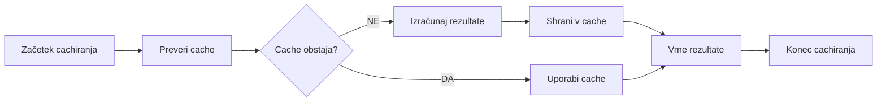
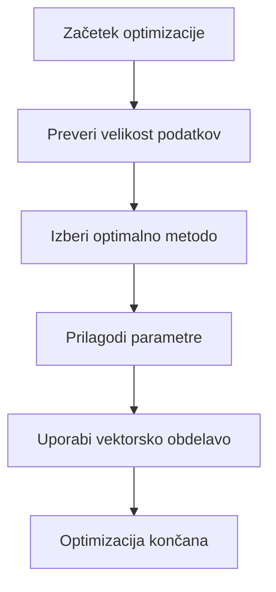

# VIDTERNARY - OPTIMIZACIJA FILTRIRANJA

## Kompletni proces z optimizacijo

```mermaid
flowchart TD
    START([Začetek filtriranja]) --> INPUT[Prejmi vhodne podatke]
    INPUT --> CACHE[Preveri cache]
    CACHE --> CACHE1{Cache obstaja?}
    CACHE1 -->|DA| CACHE2[Uporabi cache]
    CACHE1 -->|NE| VALIDATE[Preveri vhodne podatke]
    
    CACHE2 --> FILTER_TYPE{Metoda filtriranja}
    VALIDATE --> FILTER_TYPE
    
    VALIDATE --> VALIDATE1[Preveri data.frame]
    VALIDATE1 --> VALIDATE2[Preveri selected_columns]
    VALIDATE2 --> VALIDATE3[Preveri filter_params]
    VALIDATE3 --> VALIDATE4[Preveri numeričnost stolpcev]
    
    VALIDATE4 --> OPTIMIZE[Optimiziraj podatke]
    OPTIMIZE --> OPTIMIZE1[Preveri velikost podatkov]
    OPTIMIZE1 --> OPTIMIZE2[Izberi optimalno metodo]
    OPTIMIZE2 --> OPTIMIZE3[Prilagodi parametre]
    OPTIMIZE3 --> OPTIMIZE4[Uporabi vektorsko obdelavo]
    
    OPTIMIZE4 --> FILTER_TYPE
    
    %% Elementno filtriranje
    FILTER_TYPE -->|Elementno| ELEM[Elementno filtriranje]
    ELEM --> ELEM1[apply_individual_filters]
    ELEM1 --> ELEM2[Preveri element A]
    ELEM2 --> ELEM3[Preveri element B]
    ELEM3 --> ELEM4[Preveri element C]
    
    ELEM4 --> ELEM5{Posamezni filtri?}
    ELEM5 -->|DA| ELEM6[Uporabi individual_filters]
    ELEM5 -->|NE| ELEM7[Uporabi element$filter]
    
    ELEM6 --> ELEM8[apply_filter za vsak element]
    ELEM7 --> ELEM8
    ELEM8 --> ELEM9[Preveri operatorje]
    ELEM9 --> ELEM10[Pretvori v numerične vrednosti]
    ELEM10 --> ELEM11[Uporabi vektorsko filtriranje]
    ELEM11 --> ELEM12[Vrne filtrirane podatke]
    
    %% Multivariatna analiza
    FILTER_TYPE -->|Multivariatna| MULTI[Multivariatna analiza]
    MULTI --> MULTI1[validate_multivariate_data]
    MULTI1 --> MULTI2[Preveri stolpce]
    MULTI2 --> MULTI3[Preveri opazovanja]
    MULTI3 --> MULTI4[Preveri korelacije]
    MULTI4 --> MULTI5[Preveri numerično stabilnost]
    
    MULTI5 --> MULTI_METHOD{Metoda}
    MULTI_METHOD -->|Mahalanobis| MAH[compute_mahalanobis_distance]
    MULTI_METHOD -->|Robust Mahalanobis| ROB[compute_robust_mahalanobis]
    MULTI_METHOD -->|Isolation Forest| ISO[compute_isolation_forest]
    
    MAH --> MAH1[Izračunaj kovarianco]
    MAH1 --> MAH2[Preveri singularnost]
    MAH2 --> MAH3[Izračunaj razdalje vektorsko]
    MAH3 --> MAH4[Nastavi prag]
    MAH4 --> MAH5[Označi outlierje]
    
    ROB --> ROB1[Uporabi MCD/MVE]
    ROB1 --> ROB2[Robustna kovarianca]
    ROB2 --> ROB3[Robustne razdalje vektorsko]
    ROB3 --> ROB4[Robustni prag]
    ROB4 --> ROB5[Označi outlierje]
    
    ISO --> ISO1[Nastavi parametre]
    ISO1 --> ISO2[Treniraj model]
    ISO2 --> ISO3[Izračunaj score vektorsko]
    ISO3 --> ISO4[Nastavi prag]
    ISO4 --> ISO5[Označi outlierje]
    
    MAH5 --> MULTI_RES[Rezultati multivariatne analize]
    ROB5 --> MULTI_RES
    ISO5 --> MULTI_RES
    
    %% Statistično filtriranje
    FILTER_TYPE -->|Statistično| STAT[Statistično filtriranje]
    STAT --> STAT_METHOD{Statistična metoda}
    
    STAT_METHOD -->|IQR| IQR[apply_iqr_filter]
    STAT_METHOD -->|Z-score| ZSC[apply_zscore_filter]
    STAT_METHOD -->|MAD| MAD[apply_mad_filter]
    
    IQR --> IQR1[Izračunaj Q1, Q3 vektorsko]
    IQR1 --> IQR2[Izračunaj IQR]
    IQR2 --> IQR3[Nastavi meje]
    IQR3 --> IQR4[Označi outlierje vektorsko]
    
    ZSC --> ZSC1[Izračunaj povprečje, std vektorsko]
    ZSC1 --> ZSC2[Izračunaj Z-score vektorsko]
    ZSC2 --> ZSC3[Preveri prag vektorsko]
    ZSC3 --> ZSC4[Označi outlierje vektorsko]
    
    MAD --> MAD1[Izračunaj mediano vektorsko]
    MAD1 --> MAD2[Izračunaj MAD vektorsko]
    MAD2 --> MAD3[Nastavi meje]
    MAD3 --> MAD4[Označi outlierje vektorsko]
    
    IQR4 --> STAT_RES[Rezultati statističnega filtriranja]
    ZSC4 --> STAT_RES
    MAD4 --> STAT_RES
    
    %% Kombiniranje rezultatov
    ELEM12 --> COMBINE[Kombiniraj rezultate]
    MULTI_RES --> COMBINE
    STAT_RES --> COMBINE
    
    COMBINE --> COMBINE1[Združi outlier_indices vektorsko]
    COMBINE1 --> COMBINE2[Združi scores vektorsko]
    COMBINE2 --> COMBINE3[Združi thresholds vektorsko]
    COMBINE3 --> COMBINE4[Združi metode]
    
    COMBINE4 --> FINAL_CHOICE{Obdrži outlierje?}
    FINAL_CHOICE -->|DA| KEEP[Obdrži samo outlierje]
    FINAL_CHOICE -->|NE| REMOVE[Odstrani outlierje]
    
    KEEP --> FINAL_DATA[Končni filtrirani podatki]
    REMOVE --> FINAL_DATA
    
    FINAL_DATA --> CACHE_SAVE[Shrani v cache]
    CACHE_SAVE --> CACHE_SAVE1[Izračunaj hash podatkov]
    CACHE_SAVE1 --> CACHE_SAVE2[Shrani rezultate]
    CACHE_SAVE2 --> CACHE_SAVE3[Nastavi čas poteka]
    
    CACHE_SAVE3 --> RETURN[Vrne rezultate]
    RETURN --> RETURN1[outlier_indices]
    RETURN --> RETURN2[scores]
    RETURN --> RETURN3[thresholds]
    RETURN --> RETURN4[methods]
    RETURN --> RETURN5[filtered_data]
    RETURN --> RETURN6[cache_info]
    
    RETURN1 --> END([Konec])
    RETURN2 --> END
    RETURN3 --> END
    RETURN4 --> END
    RETURN5 --> END
    RETURN6 --> END
    
    %% Stili
    classDef startEnd fill:#e1f5fe,stroke:#01579b,stroke-width:3px
    classDef process fill:#f3e5f5,stroke:#4a148c,stroke-width:2px
    classDef decision fill:#fff3e0,stroke:#e65100,stroke-width:2px
    classDef element fill:#fce4ec,stroke:#c2185b,stroke-width:2px
    classDef multivariate fill:#e8f5e8,stroke:#2e7d32,stroke-width:2px
    classDef statistical fill:#fff8e1,stroke:#f57f17,stroke-width:2px
    classDef cache fill:#f3e5f5,stroke:#7b1fa2,stroke-width:2px
    classDef optimize fill:#e8f5e8,stroke:#2e7d32,stroke-width:2px
    classDef result fill:#f3e5f5,stroke:#7b1fa2,stroke-width:2px
    
    class START,END startEnd
    class INPUT,VALIDATE,VALIDATE1,VALIDATE2,VALIDATE3,VALIDATE4,COMBINE,COMBINE1,COMBINE2,COMBINE3,COMBINE4,FINAL_DATA,RETURN,RETURN1,RETURN2,RETURN3,RETURN4,RETURN5,RETURN6 process
    class CACHE1,FILTER_TYPE,ELEM5,MULTI_METHOD,STAT_METHOD,FINAL_CHOICE decision
    class ELEM,ELEM1,ELEM2,ELEM3,ELEM4,ELEM6,ELEM7,ELEM8,ELEM9,ELEM10,ELEM11,ELEM12 element
    class MULTI,MULTI1,MULTI2,MULTI3,MULTI4,MULTI5,MAH,ROB,ISO,MAH1,MAH2,MAH3,MAH4,MAH5,ROB1,ROB2,ROB3,ROB4,ROB5,ISO1,ISO2,ISO3,ISO4,ISO5,MULTI_RES multivariate
    class STAT,IQR,ZSC,MAD,IQR1,IQR2,IQR3,IQR4,ZSC1,ZSC2,ZSC3,ZSC4,MAD1,MAD2,MAD3,MAD4,STAT_RES statistical
    class CACHE,CACHE1,CACHE2,CACHE_SAVE,CACHE_SAVE1,CACHE_SAVE2,CACHE_SAVE3 cache
    class OPTIMIZE,OPTIMIZE1,OPTIMIZE2,OPTIMIZE3,OPTIMIZE4 optimize
    class KEEP,REMOVE result
```



## Podroben opis optimizacije

### 1. CACHIRANJE REZULTATOV


### 2. OPTIMIZACIJA PODATKOV


### 3. VEKTORSKA OBDELAVA


## Ključne optimizacije v kodi

### 1. Cachiranje rezultatov
```r
# cache.R
cache_results <- function(data_hash, method, params, results) {
  cache_key <- paste(data_hash, method, digest(params), sep = "_")
  
  if (exists(cache_key, envir = .GlobalEnv)) {
    return(get(cache_key, envir = .GlobalEnv))
  }
  
  # Shrani rezultate v cache
  assign(cache_key, results, envir = .GlobalEnv)
  
  # Nastavi čas poteka
  assign(paste0(cache_key, "_time"), Sys.time(), envir = .GlobalEnv)
  
  return(results)
}

get_cached_results <- function(data_hash, method, params) {
  cache_key <- paste(data_hash, method, digest(params), sep = "_")
  
  if (exists(cache_key, envir = .GlobalEnv)) {
    # Preveri, ali je cache še veljaven (npr. 1 uro)
    cache_time <- get(paste0(cache_key, "_time"), envir = .GlobalEnv)
    if (difftime(Sys.time(), cache_time, units = "hours") < 1) {
      return(get(cache_key, envir = .GlobalEnv))
    }
  }
  
  return(NULL)
}
```

### 2. Vektorska obdelava
```r
# Vektorsko filtriranje namesto zank
apply_vectorized_filtering <- function(data, filters) {
  # Uporabi vektorske funkcije
  keep_rows <- rep(TRUE, nrow(data))
  
  for (col in names(filters)) {
    if (col %in% colnames(data)) {
      filter_expr <- filters[[col]]
      if (grepl("^[><=!]+", filter_expr)) {
        operator <- gsub("^([><=!]+).*", "\\1", filter_expr)
        value_str <- gsub("^([><=!]+)\\s*", "", filter_expr)
        value <- as.numeric(value_str)
        
        # Vektorsko filtriranje
        col_filter <- switch(operator,
          ">" = data[[col]] > value,
          "<" = data[[col]] < value,
          ">=" = data[[col]] >= value,
          "<=" = data[[col]] <= value,
          "==" = data[[col]] == value,
          "!=" = data[[col]] != value
        )
        
        keep_rows <- keep_rows & col_filter
      }
    }
  }
  
  return(data[keep_rows, , drop = FALSE])
}
```

### 3. Optimizacija multivariatne analize
```r
# Optimizirana Mahalanobis razdalja
compute_optimized_mahalanobis <- function(data1, data2, selected_columns) {
  # Preveri velikost podatkov
  n_obs1 <- nrow(data1)
  n_obs2 <- nrow(data2)
  n_vars <- length(selected_columns)
  
  # Izberi optimalno metodo glede na velikost
  if (n_obs2 > 1000 && n_vars > 5) {
    # Uporabi robustno metodo za velike podatke
    return(compute_robust_mahalanobis(data1, data2, selected_columns))
  } else if (n_obs2 < 100 && n_vars < 3) {
    # Uporabi standardno metodo za majhne podatke
    return(compute_mahalanobis_distance(data1, data2, selected_columns))
  } else {
    # Uporabi Isolation Forest za srednje podatke
    return(compute_isolation_forest(data1, data2, selected_columns))
  }
}
```

### 4. Optimizacija Isolation Forest
```r
# Optimizirani parametri za Isolation Forest
get_optimal_iso_params <- function(n_obs, n_vars) {
  # Prilagodi parametre glede na velikost podatkov
  if (n_obs < 100) {
    return(list(ntrees = 50, sample_size = min(32, n_obs)))
  } else if (n_obs < 1000) {
    return(list(ntrees = 100, sample_size = min(64, n_obs)))
  } else if (n_obs < 10000) {
    return(list(ntrees = 200, sample_size = min(256, n_obs)))
  } else {
    return(list(ntrees = 500, sample_size = min(512, n_obs)))
  }
}
```

### 5. Optimizacija statističnega filtriranja
```r
# Vektorsko statistično filtriranje
apply_vectorized_statistical_filtering <- function(data, method, params) {
  # Uporabi vektorske funkcije za hitrejše izračune
  switch(method,
    "IQR" = {
      # Vektorski izračun IQR
      q1 <- apply(data, 2, quantile, 0.25, na.rm = TRUE)
      q3 <- apply(data, 2, quantile, 0.75, na.rm = TRUE)
      iqr <- q3 - q1
      lower_bound <- q1 - params$multiplier * iqr
      upper_bound <- q3 + params$multiplier * iqr
      
      # Vektorsko označevanje outlierjev
      outlier_matrix <- data < lower_bound | data > upper_bound
      outlier_indices <- rowSums(outlier_matrix) > 0
      
      return(data[!outlier_indices, , drop = FALSE])
    },
    "Z-score" = {
      # Vektorski izračun Z-score
      means <- colMeans(data, na.rm = TRUE)
      sds <- apply(data, 2, sd, na.rm = TRUE)
      z_scores <- abs((data - means) / sds)
      
      # Vektorsko označevanje outlierjev
      outlier_matrix <- z_scores > params$threshold
      outlier_indices <- rowSums(outlier_matrix) > 0
      
      return(data[!outlier_indices, , drop = FALSE])
    },
    "MAD" = {
      # Vektorski izračun MAD
      medians <- apply(data, 2, median, na.rm = TRUE)
      mads <- apply(data, 2, mad, na.rm = TRUE)
      lower_bound <- medians - params$threshold * mads
      upper_bound <- medians + params$threshold * mads
      
      # Vektorsko označevanje outlierjev
      outlier_matrix <- data < lower_bound | data > upper_bound
      outlier_indices <- rowSums(outlier_matrix) > 0
      
      return(data[!outlier_indices, , drop = FALSE])
    }
  )
}
```

### 6. Optimizacija pomnilnika
```r
# Optimizacija pomnilnika
optimize_memory_usage <- function(data) {
  # Preveri tip podatkov
  for (col in colnames(data)) {
    if (is.numeric(data[[col]])) {
      # Uporabi integer namesto double, če je možno
      if (all(data[[col]] == as.integer(data[[col]]), na.rm = TRUE)) {
        data[[col]] <- as.integer(data[[col]])
      }
    } else if (is.character(data[[col]])) {
      # Uporabi factor namesto character, če je možno
      if (length(unique(data[[col]])) < length(data[[col]]) {
        data[[col]] <- as.factor(data[[col]])
      }
    }
  }
  
  return(data)
}
```

## Prednosti optimizacije

1. **Hitrost**: Hitrejša obdelava podatkov
2. **Pomnilnik**: Manjša poraba pomnilnika
3. **Cachiranje**: Ponovna uporaba rezultatov
4. **Vektorska obdelava**: Hitrejše izračune
5. **Prilagodljivost**: Optimalni parametri za različne velikosti podatkov

## Uporaba flowchart-a

- **Razumevanje**: Sledite korakom za razumevanje optimizacije
- **Debugiranje**: Identificirajte, kje se pojavi problem z hitrostjo
- **Razvoj**: Dodajte nove optimizacije po vzoru obstoječih
- **Testiranje**: Preverite hitrost različnih metod
- **Dokumentacija**: Uporabite za razlago uporabnikom
