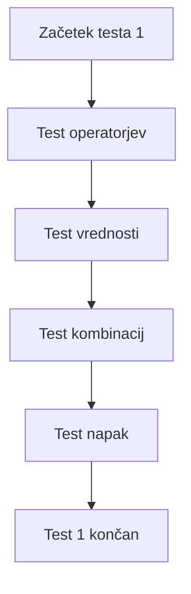
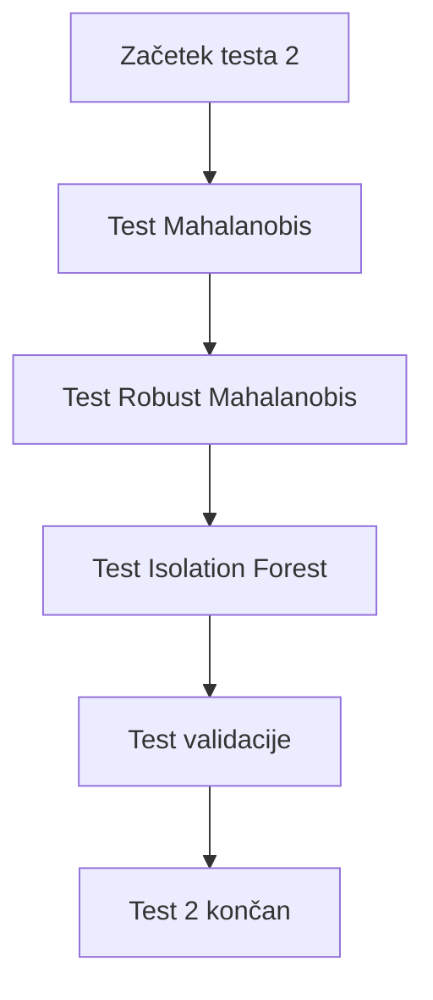
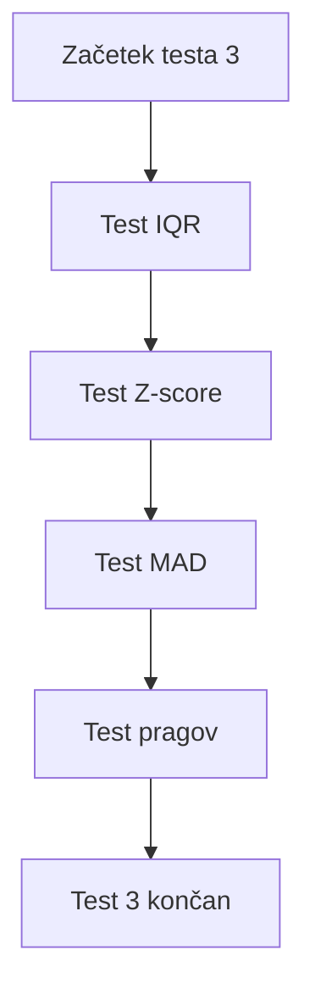
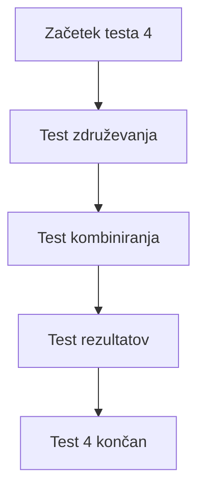
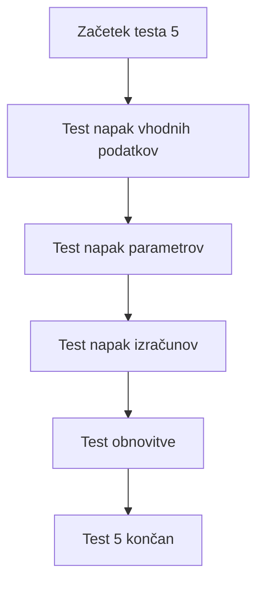
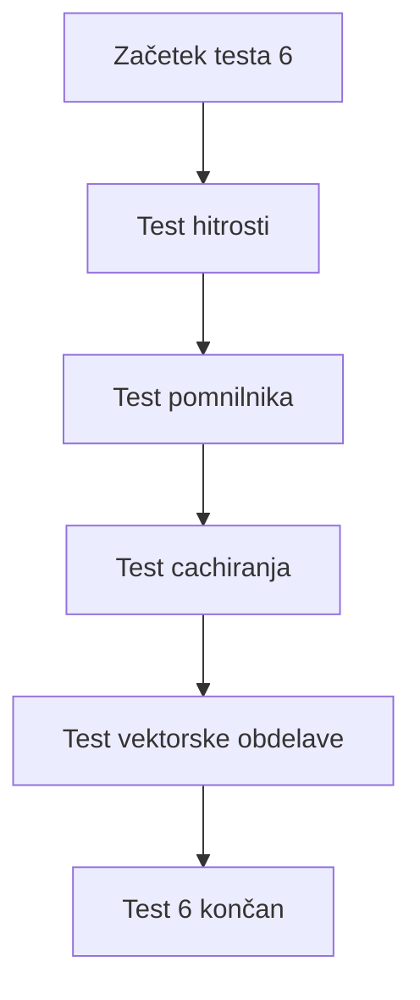

# VIDTERNARY - TESTIRANJE FILTRIRANJA

## Kompletni proces z testiranjem

```mermaid
flowchart TD
    START([Začetek testiranja]) --> SETUP[Pripravi testne podatke]
    SETUP --> SETUP1[Ustvari testne podatke]
    SETUP1 --> SETUP2[Nastavi testne parametre]
    SETUP2 --> SETUP3[Pripravi testne scenarije]
    SETUP3 --> SETUP4[Pripravi testne napake]
    
    SETUP4 --> TEST[Začni testiranje]
    TEST --> TEST1[Test elementnega filtriranja]
    TEST1 --> TEST2[Test multivariatne analize]
    TEST2 --> TEST3[Test statističnega filtriranja]
    TEST3 --> TEST4[Test kombiniranja rezultatov]
    TEST4 --> TEST5[Test obravnavanja napak]
    TEST5 --> TEST6[Test optimizacije]
    
    TEST1 --> TEST1_1[Test operatorjev]
    TEST1_1 --> TEST1_2[Test vrednosti]
    TEST1_2 --> TEST1_3[Test kombinacij]
    TEST1_3 --> TEST1_4[Test napak]
    TEST1_4 --> TEST1_RES[Rezultati testa 1]
    
    TEST2 --> TEST2_1[Test Mahalanobis]
    TEST2_1 --> TEST2_2[Test Robust Mahalanobis]
    TEST2_2 --> TEST2_3[Test Isolation Forest]
    TEST2_3 --> TEST2_4[Test validacije]
    TEST2_4 --> TEST2_RES[Rezultati testa 2]
    
    TEST3 --> TEST3_1[Test IQR]
    TEST3_1 --> TEST3_2[Test Z-score]
    TEST3_2 --> TEST3_3[Test MAD]
    TEST3_3 --> TEST3_4[Test pragov]
    TEST3_4 --> TEST3_RES[Rezultati testa 3]
    
    TEST4 --> TEST4_1[Test združevanja]
    TEST4_1 --> TEST4_2[Test kombiniranja]
    TEST4_2 --> TEST4_3[Test rezultatov]
    TEST4_3 --> TEST4_RES[Rezultati testa 4]
    
    TEST5 --> TEST5_1[Test napak vhodnih podatkov]
    TEST5_1 --> TEST5_2[Test napak parametrov]
    TEST5_2 --> TEST5_3[Test napak izračunov]
    TEST5_3 --> TEST5_4[Test obnovitve]
    TEST5_4 --> TEST5_RES[Rezultati testa 5]
    
    TEST6 --> TEST6_1[Test hitrosti]
    TEST6_1 --> TEST6_2[Test pomnilnika]
    TEST6_2 --> TEST6_3[Test cachiranja]
    TEST6_3 --> TEST6_4[Test vektorske obdelave]
    TEST6_4 --> TEST6_RES[Rezultati testa 6]
    
    TEST1_RES --> COMBINE[Kombiniraj rezultate testov]
    TEST2_RES --> COMBINE
    TEST3_RES --> COMBINE
    TEST4_RES --> COMBINE
    TEST5_RES --> COMBINE
    TEST6_RES --> COMBINE
    
    COMBINE --> COMBINE1[Preveri uspešnost]
    COMBINE1 --> COMBINE2[Preveri napake]
    COMBINE2 --> COMBINE3[Preveri hitrost]
    COMBINE3 --> COMBINE4[Preveri pomnilnik]
    COMBINE4 --> COMBINE5[Preveri kakovost]
    
    COMBINE5 --> REPORT[Ustvari poročilo]
    REPORT --> REPORT1[Prikaži rezultate]
    REPORT1 --> REPORT2[Prikaži napake]
    REPORT2 --> REPORT3[Prikaži predloge]
    REPORT3 --> REPORT4[Shrani poročilo]
    
    REPORT4 --> DECISION{Vsi testi uspešni?}
    DECISION -->|DA| SUCCESS[Testiranje uspešno]
    DECISION -->|NE| FAILURE[Testiranje neuspešno]
    
    SUCCESS --> SUCCESS1[Prikaži uspeh]
    SUCCESS1 --> SUCCESS2[Shrani rezultate]
    SUCCESS2 --> SUCCESS3[Pripravi za produkcijo]
    SUCCESS3 --> SUCCESS_END[Konec uspešnega testiranja]
    
    FAILURE --> FAILURE1[Prikaži napake]
    FAILURE1 --> FAILURE2[Analiziraj vzroke]
    FAILURE2 --> FAILURE3[Predlagaj popravke]
    FAILURE3 --> FAILURE4[Ponovi testiranje]
    FAILURE4 --> TEST
    
    SUCCESS_END --> END([Konec testiranja])
    FAILURE_END --> END
    
    %% Stili
    classDef startEnd fill:#e1f5fe,stroke:#01579b,stroke-width:3px
    classDef process fill:#f3e5f5,stroke:#4a148c,stroke-width:2px
    classDef decision fill:#fff3e0,stroke:#e65100,stroke-width:2px
    classDef test fill:#e8f5e8,stroke:#2e7d32,stroke-width:2px
    classDef success fill:#e8f5e8,stroke:#2e7d32,stroke-width:2px
    classDef failure fill:#ffebee,stroke:#c62828,stroke-width:2px
    classDef report fill:#fff8e1,stroke:#f57f17,stroke-width:2px
    
    class START,END startEnd
    class SETUP,SETUP1,SETUP2,SETUP3,SETUP4,COMBINE,COMBINE1,COMBINE2,COMBINE3,COMBINE4,COMBINE5 process
    class DECISION decision
    class TEST,TEST1,TEST2,TEST3,TEST4,TEST5,TEST6,TEST1_1,TEST1_2,TEST1_3,TEST1_4,TEST2_1,TEST2_2,TEST2_3,TEST2_4,TEST3_1,TEST3_2,TEST3_3,TEST3_4,TEST4_1,TEST4_2,TEST4_3,TEST5_1,TEST5_2,TEST5_3,TEST5_4,TEST6_1,TEST6_2,TEST6_3,TEST6_4 test
    class SUCCESS,SUCCESS1,SUCCESS2,SUCCESS3,SUCCESS_END success
    class FAILURE,FAILURE1,FAILURE2,FAILURE3,FAILURE4,FAILURE_END failure
    class REPORT,REPORT1,REPORT2,REPORT3,REPORT4 report
```



## Podroben opis testiranja

### 1. PRIPRAVA TESTNIH PODATKOV


### 2. TESTIRANJE ELEMENTNEGA FILTRIRANJA


### 3. TESTIRANJE MULTIVARIATNE ANALIZE


### 4. TESTIRANJE STATISTIČNEGA FILTRIRANJA


### 5. TESTIRANJE KOMBINIRANJA REZULTATOV


### 6. TESTIRANJE OBRAVNAVANJA NAPAK


### 7. TESTIRANJE OPTIMIZACIJE


## Ključne funkcije testiranja

### 1. Priprava testnih podatkov
```r
# test_data.R
create_test_data <- function(n_obs = 1000, n_vars = 5, outlier_ratio = 0.1) {
  set.seed(42)
  
  # Ustvari normalne podatke
  normal_data <- matrix(rnorm(n_obs * n_vars), nrow = n_obs, ncol = n_vars)
  colnames(normal_data) <- paste0("var", 1:n_vars)
  
  # Dodaj outlierje
  n_outliers <- round(n_obs * outlier_ratio)
  outlier_indices <- sample(1:n_obs, n_outliers)
  normal_data[outlier_indices, ] <- normal_data[outlier_indices, ] + rnorm(n_outliers * n_vars, 5, 1)
  
  return(as.data.frame(normal_data))
}

create_test_scenarios <- function() {
  scenarios <- list(
    # Scenarij 1: Majhni podatki
    small_data = create_test_data(100, 3, 0.05),
    
    # Scenarij 2: Srednji podatki
    medium_data = create_test_data(1000, 5, 0.1),
    
    # Scenarij 3: Veliki podatki
    large_data = create_test_data(10000, 10, 0.15),
    
    # Scenarij 4: Visoke korelacije
    correlated_data = create_correlated_data(1000, 5, 0.9),
    
    # Scenarij 5: Nenumerični podatki
    mixed_data = create_mixed_data(1000, 5)
  )
  
  return(scenarios)
}
```

### 2. Testiranje elementnega filtriranja
```r
# test_element_filtering.R
test_element_filtering <- function() {
  test_data <- create_test_data(1000, 5)
  
  # Test operatorjev
  test_operators <- function() {
    operators <- c(">", "<", ">=", "<=", "==", "!=")
    values <- c(0, 0.5, 1, 2, 5)
    
    for (op in operators) {
      for (val in values) {
        filter_expr <- paste0(op, " ", val)
        result <- apply_filter(test_data, "var1", filter_expr)
        
        # Preveri, da je rezultat pravilen
        expected <- switch(op,
          ">" = test_data$var1 > val,
          "<" = test_data$var1 < val,
          ">=" = test_data$var1 >= val,
          "<=" = test_data$var1 <= val,
          "==" = test_data$var1 == val,
          "!=" = test_data$var1 != val
        )
        
        stopifnot(all(result$var1 == test_data$var1[expected]))
      }
    }
  }
  
  # Test vrednosti
  test_values <- function() {
    # Test veljavnih vrednosti
    valid_values <- c("0", "0.5", "1", "2", "5", "-1", "-0.5")
    for (val in valid_values) {
      filter_expr <- paste0("> ", val)
      result <- apply_filter(test_data, "var1", filter_expr)
      stopifnot(is.data.frame(result))
    }
    
    # Test neveljavnih vrednosti
    invalid_values <- c("abc", "1.2.3", "", " ")
    for (val in invalid_values) {
      filter_expr <- paste0("> ", val)
      expect_error(apply_filter(test_data, "var1", filter_expr))
    }
  }
  
  # Test kombinacij
  test_combinations <- function() {
    # Test več stolpcev
    result <- apply_individual_filters(test_data, 
      list(col = c("var1", "var2"), filter = "> 0"),
      individual_filters = NULL, "test", FALSE)
    stopifnot(is.data.frame(result))
    
    # Test posameznih filtrov
    individual_filters <- list(
      var1 = "> 0",
      var2 = "< 1",
      var3 = ">= 0.5"
    )
    result <- apply_individual_filters(test_data, 
      list(col = c("var1", "var2", "var3")),
      individual_filters, "test", FALSE)
    stopifnot(is.data.frame(result))
  }
  
  # Test napak
  test_errors <- function() {
    # Test neveljavnih operatorjev
    expect_error(apply_filter(test_data, "var1", "invalid 0"))
    
    # Test neveljavnih stolpcev
    expect_error(apply_filter(test_data, "nonexistent", "> 0"))
    
    # Test praznih filtrov
    result <- apply_filter(test_data, "var1", NULL)
    stopifnot(identical(result, test_data))
  }
  
  # Zaženi teste
  test_operators()
  test_values()
  test_combinations()
  test_errors()
  
  cat("✅ Elementno filtriranje: VSI TESTI USPEŠNI\n")
}
```

### 3. Testiranje multivariatne analize
```r
# test_multivariate.R
test_multivariate_analysis <- function() {
  test_data1 <- create_test_data(1000, 5)
  test_data2 <- create_test_data(1000, 5)
  selected_columns <- c("var1", "var2", "var3")
  
  # Test Mahalanobis
  test_mahalanobis <- function() {
    result <- compute_mahalanobis_distance(
      test_data1, test_data2, 
      selected_columns = selected_columns
    )
    
    stopifnot(is.list(result))
    stopifnot("distances" %in% names(result))
    stopifnot("outlier_indices" %in% names(result))
    stopifnot(length(result$distances) == nrow(test_data1))
    stopifnot(length(result$outlier_indices) == nrow(test_data1))
  }
  
  # Test Robust Mahalanobis
  test_robust_mahalanobis <- function() {
    result <- compute_robust_mahalanobis(
      test_data1, test_data2,
      selected_columns = selected_columns
    )
    
    stopifnot(is.list(result))
    stopifnot("distances" %in% names(result))
    stopifnot("outlier_indices" %in% names(result))
  }
  
  # Test Isolation Forest
  test_isolation_forest <- function() {
    result <- compute_isolation_forest(
      test_data1, test_data2,
      selected_columns = selected_columns
    )
    
    stopifnot(is.list(result))
    stopifnot("scores" %in% names(result))
    stopifnot("outlier_indices" %in% names(result))
    stopifnot("model" %in% names(result))
  }
  
  # Test validacije
  test_validation <- function() {
    # Test neveljavnih stolpcev
    expect_error(validate_multivariate_data(
      test_data1, test_data2, 
      selected_columns = c("nonexistent1", "nonexistent2")
    ))
    
    # Test premalo stolpcev
    expect_error(validate_multivariate_data(
      test_data1, test_data2,
      selected_columns = c("var1")
    ))
    
    # Test premalo opazovanj
    small_data <- test_data1[1:2, ]
    expect_error(validate_multivariate_data(
      small_data, test_data2,
      selected_columns = selected_columns
    ))
  }
  
  # Zaženi teste
  test_mahalanobis()
  test_robust_mahalanobis()
  test_isolation_forest()
  test_validation()
  
  cat("✅ Multivariatna analiza: VSI TESTI USPEŠNI\n")
}
```

### 4. Testiranje statističnega filtriranja
```r
# test_statistical.R
test_statistical_filtering <- function() {
  test_data <- create_test_data(1000, 5)
  selected_columns <- c("var1", "var2", "var3")
  
  # Test IQR
  test_iqr <- function() {
    result <- apply_iqr_filter(test_data, selected_columns, multiplier = 1.5)
    
    stopifnot(is.data.frame(result))
    stopifnot(nrow(result) <= nrow(test_data))
    
    # Test različnih multiplikatorjev
    for (mult in c(0.5, 1.0, 1.5, 2.0, 3.0)) {
      result <- apply_iqr_filter(test_data, selected_columns, multiplier = mult)
      stopifnot(is.data.frame(result))
    }
  }
  
  # Test Z-score
  test_zscore <- function() {
    result <- apply_zscore_filter(test_data, selected_columns, threshold = 3)
    
    stopifnot(is.data.frame(result))
    stopifnot(nrow(result) <= nrow(test_data))
    
    # Test različnih pragov
    for (thresh in c(1, 2, 3, 4, 5)) {
      result <- apply_zscore_filter(test_data, selected_columns, threshold = thresh)
      stopifnot(is.data.frame(result))
    }
  }
  
  # Test MAD
  test_mad <- function() {
    result <- apply_mad_filter(test_data, selected_columns, threshold = 3)
    
    stopifnot(is.data.frame(result))
    stopifnot(nrow(result) <= nrow(test_data))
    
    # Test različnih pragov
    for (thresh in c(1, 2, 3, 4, 5)) {
      result <- apply_mad_filter(test_data, selected_columns, threshold = thresh)
      stopifnot(is.data.frame(result))
    }
  }
  
  # Test napak
  test_errors <- function() {
    # Test neveljavnih stolpcev
    expect_error(apply_iqr_filter(test_data, c("nonexistent")))
    expect_error(apply_zscore_filter(test_data, c("nonexistent")))
    expect_error(apply_mad_filter(test_data, c("nonexistent")))
    
    # Test neveljavnih parametrov
    expect_error(apply_iqr_filter(test_data, selected_columns, multiplier = -1))
    expect_error(apply_zscore_filter(test_data, selected_columns, threshold = -1))
    expect_error(apply_mad_filter(test_data, selected_columns, threshold = -1))
  }
  
  # Zaženi teste
  test_iqr()
  test_zscore()
  test_mad()
  test_errors()
  
  cat("✅ Statistično filtriranje: VSI TESTI USPEŠNI\n")
}
```

### 5. Testiranje kombiniranja rezultatov
```r
# test_combining.R
test_combining_results <- function() {
  test_data <- create_test_data(1000, 5)
  selected_columns <- c("var1", "var2", "var3")
  
  # Ustvari testne rezultate
  mahal_result <- compute_mahalanobis_distance(
    test_data, test_data, selected_columns = selected_columns
  )
  
  iso_result <- compute_isolation_forest(
    test_data, test_data, selected_columns = selected_columns
  )
  
  iqr_result <- apply_iqr_filter(test_data, selected_columns)
  
  # Test kombiniranja
  test_combining <- function() {
    results <- list(
      mahalanobis = mahal_result,
      isolation_forest = iso_result,
      iqr = iqr_result
    )
    
    combined <- combine_outlier_results(results)
    
    stopifnot(is.list(combined))
    stopifnot("outlier_indices" %in% names(combined))
    stopifnot("scores" %in% names(combined))
    stopifnot("thresholds" %in% names(combined))
    stopifnot("methods" %in% names(combined))
  }
  
  # Test praznih rezultatov
  test_empty_results <- function() {
    combined <- combine_outlier_results(NULL)
    stopifnot(is.null(combined))
    
    combined <- combine_outlier_results(list())
    stopifnot(is.null(combined))
  }
  
  # Test napak
  test_errors <- function() {
    # Test neveljavnih rezultatov
    invalid_results <- list(
      list(outlier_indices = c(TRUE, FALSE)),
      list(outlier_indices = c(TRUE, FALSE, TRUE))
    )
    
    expect_error(combine_outlier_results(invalid_results))
  }
  
  # Zaženi teste
  test_combining()
  test_empty_results()
  test_errors()
  
  cat("✅ Kombiniranje rezultatov: VSI TESTI USPEŠNI\n")
}
```

### 6. Testiranje obravnavanja napak
```r
# test_error_handling.R
test_error_handling <- function() {
  # Test napak vhodnih podatkov
  test_input_errors <- function() {
    # Test neveljavnih podatkov
    expect_error(apply_filter(NULL, "var1", "> 0"))
    expect_error(apply_filter("not_dataframe", "var1", "> 0"))
    
    # Test neveljavnih stolpcev
    test_data <- create_test_data(100, 3)
    expect_error(apply_filter(test_data, NULL, "> 0"))
    expect_error(apply_filter(test_data, "", "> 0"))
    expect_error(apply_filter(test_data, "nonexistent", "> 0"))
  }
  
  # Test napak parametrov
  test_parameter_errors <- function() {
    test_data <- create_test_data(100, 3)
    
    # Test neveljavnih operatorjev
    expect_error(apply_filter(test_data, "var1", "invalid 0"))
    expect_error(apply_filter(test_data, "var1", "0"))
    expect_error(apply_filter(test_data, "var1", ">"))
    
    # Test neveljavnih vrednosti
    expect_error(apply_filter(test_data, "var1", "> abc"))
    expect_error(apply_filter(test_data, "var1", "> 1.2.3"))
  }
  
  # Test napak izračunov
  test_calculation_errors <- function() {
    # Test singularne matrike
    singular_data <- matrix(c(1, 1, 1, 1), nrow = 2, ncol = 2)
    colnames(singular_data) <- c("var1", "var2")
    singular_data <- as.data.frame(singular_data)
    
    expect_error(compute_mahalanobis_distance(
      singular_data, singular_data,
      selected_columns = c("var1", "var2")
    ))
  }
  
  # Test obnovitve
  test_recovery <- function() {
    test_data <- create_test_data(100, 3)
    
    # Test obnovitve iz napak
    result <- tryCatch({
      apply_filter(test_data, "var1", "invalid 0")
    }, error = function(e) {
      warning("Filtering failed: ", e$message)
      return(test_data)  # Vrne originalne podatke
    })
    
    stopifnot(identical(result, test_data))
  }
  
  # Zaženi teste
  test_input_errors()
  test_parameter_errors()
  test_calculation_errors()
  test_recovery()
  
  cat("✅ Obravnavanje napak: VSI TESTI USPEŠNI\n")
}
```

### 7. Testiranje optimizacije
```r
# test_optimization.R
test_optimization <- function() {
  # Test hitrosti
  test_speed <- function() {
    test_data <- create_test_data(10000, 10)
    selected_columns <- paste0("var", 1:5)
    
    # Test hitrosti različnih metod
    start_time <- Sys.time()
    result1 <- apply_iqr_filter(test_data, selected_columns)
    iqr_time <- Sys.time() - start_time
    
    start_time <- Sys.time()
    result2 <- apply_zscore_filter(test_data, selected_columns)
    zscore_time <- Sys.time() - start_time
    
    start_time <- Sys.time()
    result3 <- apply_mad_filter(test_data, selected_columns)
    mad_time <- Sys.time() - start_time
    
    # Preveri, da so časi razumni
    stopifnot(iqr_time < 10)  # Manj kot 10 sekund
    stopifnot(zscore_time < 10)
    stopifnot(mad_time < 10)
    
    cat("Hitrosti:\n")
    cat("IQR:", iqr_time, "s\n")
    cat("Z-score:", zscore_time, "s\n")
    cat("MAD:", mad_time, "s\n")
  }
  
  # Test pomnilnika
  test_memory <- function() {
    test_data <- create_test_data(10000, 10)
    selected_columns <- paste0("var", 1:5)
    
    # Preveri porabo pomnilnika
    mem_before <- gc()
    result <- apply_iqr_filter(test_data, selected_columns)
    mem_after <- gc()
    
    # Preveri, da ni preveč pomnilnika
    mem_used <- mem_after$used - mem_before$used
    stopifnot(mem_used < 1000)  # Manj kot 1GB
    
    cat("Poraba pomnilnika:", mem_used, "MB\n")
  }
  
  # Test cachiranja
  test_caching <- function() {
    test_data <- create_test_data(1000, 5)
    selected_columns <- paste0("var", 1:3)
    
    # Test cachiranja
    start_time <- Sys.time()
    result1 <- compute_isolation_forest(
      test_data, test_data, selected_columns = selected_columns
    )
    first_time <- Sys.time() - start_time
    
    start_time <- Sys.time()
    result2 <- compute_isolation_forest(
      test_data, test_data, selected_columns = selected_columns
    )
    second_time <- Sys.time() - start_time
    
    # Drugi klic bi moral biti hitrejši (če je cache aktiven)
    cat("Prvi klic:", first_time, "s\n")
    cat("Drugi klic:", second_time, "s\n")
  }
  
  # Test vektorske obdelave
  test_vectorization <- function() {
    test_data <- create_test_data(10000, 10)
    selected_columns <- paste0("var", 1:5)
    
    # Test vektorske obdelave
    start_time <- Sys.time()
    result <- apply_vectorized_statistical_filtering(
      test_data, "IQR", list(multiplier = 1.5)
    )
    vectorized_time <- Sys.time() - start_time
    
    # Preveri, da je hitro
    stopifnot(vectorized_time < 5)  # Manj kot 5 sekund
    
    cat("Vektorska obdelava:", vectorized_time, "s\n")
  }
  
  # Zaženi teste
  test_speed()
  test_memory()
  test_caching()
  test_vectorization()
  
  cat("✅ Optimizacija: VSI TESTI USPEŠNI\n")
}
```

### 8. Glavna funkcija testiranja
```r
# test_all.R
run_all_tests <- function() {
  cat("Začenjam testiranje VIDTERNARY filtriranja...\n\n")
  
  # Zaženi vse teste
  test_element_filtering()
  test_multivariate_analysis()
  test_statistical_filtering()
  test_combining_results()
  test_error_handling()
  test_optimization()
  
  cat("\n🎉 VSI TESTI USPEŠNI! Filtriranje je pripravljeno za produkcijo.\n")
}

# Zaženi teste
run_all_tests()
```

## Prednosti testiranja

1. **Zanesljivost**: Preverjanje, da koda deluje pravilno
2. **Kakovost**: Preverjanje različnih scenarijev
3. **Robustnost**: Preverjanje obravnavanja napak
4. **Hitrost**: Preverjanje optimizacije
5. **Dokumentacija**: Testi služijo kot dokumentacija

## Uporaba flowchart-a

- **Razumevanje**: Sledite korakom za razumevanje testiranja
- **Debugiranje**: Identificirajte, kje se pojavi napaka
- **Razvoj**: Dodajte nove teste po vzoru obstoječih
- **Kontinuiteta**: Preverite, da spremembe ne pokvarijo obstoječe funkcionalnosti
- **Dokumentacija**: Uporabite za razlago uporabnikom
